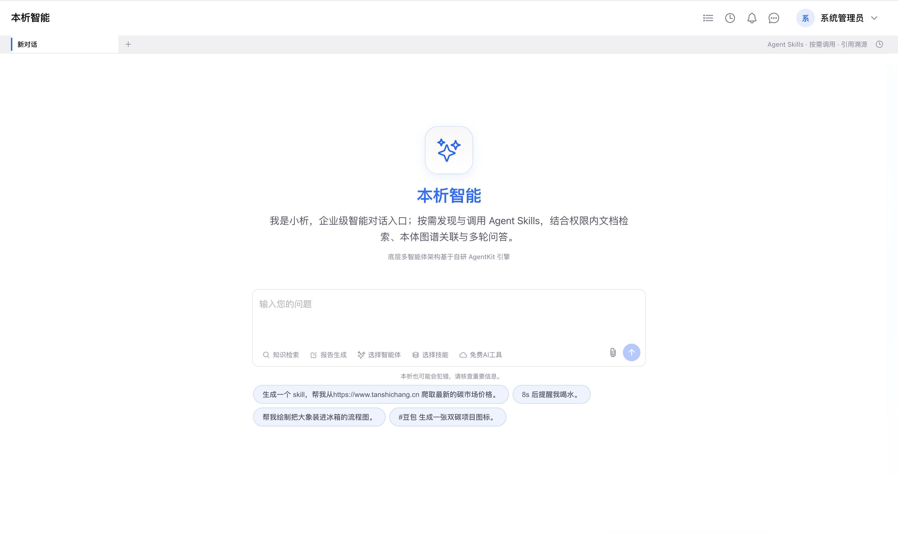
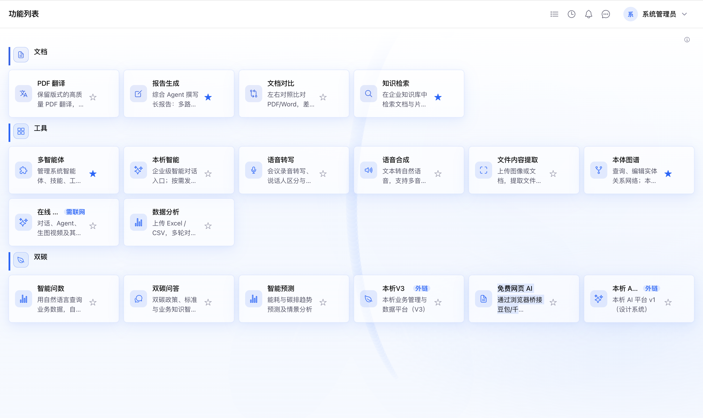
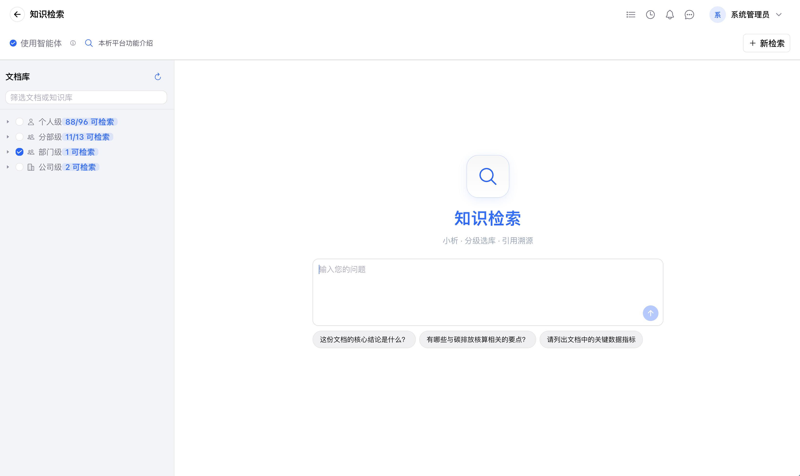
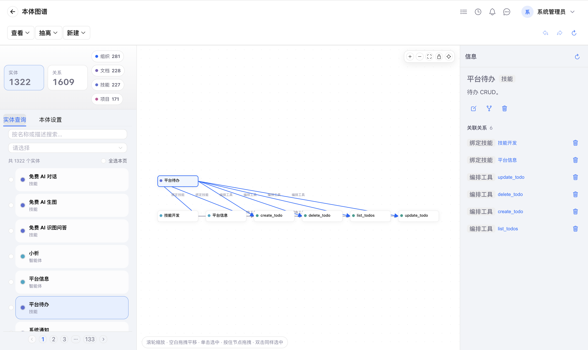

# 本析平台 (Benxi)

> 企业级 AI 知识库平台 — 入库 · 析清 · 用起来

[](LICENSE)
[]()
[]()

**本析平台**是一个全栈开源的企业级 AI 知识管理平台，将 PDF 翻译、知识库构建、智能检索、报告生成等能力整合为统一闭环。

- **在线体验**: [http://36.151.146.71:40005/ai/](http://36.151.146.71:40005/ai/)
- **GitHub**: [https://github.com/zhibinQiu/benxi](https://github.com/zhibinQiu/benxi)
- **AgentKit** <sup>[¹](#设计哲学)</sup>: [https://github.com/zhibinQiu/Agentkit](https://github.com/zhibinQiu/Agentkit)
- **文档站点**: [https://zhibinQiu.github.io/benxi/](https://zhibinQiu.github.io/benxi/)
- **版本**: v4.8.6（见根目录 `VERSION`）

---

## 👀 界面预览

<div align="center">
  <table>
    <tr>
      <td align="center"></td>
      <td align="center"></td>
    </tr>
    <tr>
      <td align="center"><strong>智能首页</strong> — 平台入口与概览</td>
      <td align="center"><strong>功能列表</strong> — 全功能导航</td>
    </tr>
    <tr>
      <td align="center"></td>
      <td align="center"></td>
    </tr>
    <tr>
      <td align="center"><strong>知识检索</strong> — 语义检索与智能问答</td>
      <td align="center"><strong>本体图谱</strong> — 领域知识图谱</td>
    </tr>
  </table>
</div>

> 更多截图与演示请访问 [在线体验](http://36.151.146.71:40005/ai/)

---

## ✨ 核心功能

| 功能 | 说明 |
|------|------|
| 📄 **PDF 翻译** | 科学文献全格式翻译，保留排版 |
| 🧠 **AI 知识库** | 文档入库、语义检索、智能问答 |
| 🔗 **本体构建** | 自动抽取实体关系，构建领域知识图谱 |
| 🤖 **AgentKit** <sup>[¹](#设计哲学)</sup> | 多智能体编排框架，支持工具注册与子 Agent |
| 📊 **报告生成** | 基于知识库的自动报告与对比分析 |
| 🔐 **权限体系** | 组织架构 + 角色权限 + 字段级管控 |
| 🌐 **多语言** | 中英文界面，国际化支持 |

---

## 🏗 项目结构

```
pdf_trans/
├── backend/             # FastAPI 后端（API / 认证 / 文档 / 知识库 / AgentKit）
│   └── app/agentkit/    # AgentKit 智能体工具箱（内置，无需额外安装）
├── frontend/            # Vue 3 + Naive UI 前端
├── compose.yaml         # Docker Compose
└── VERSION              # 版本号
```

---

## 🚀 快速启动

### 前提条件

- Docker & Docker Compose
- 或 Python 3.12+ + Node.js 18+

### Docker 方式（推荐）

```bash
cp .env.stack.example .env
cp backend/.env.example backend/.env    # 按需编辑

# 启动全栈
./scripts/dev.sh docker --profile knowflow
```

| 模式 | Web | API |
|------|-----|-----|
| Docker 开发 | http://127.0.0.1:40005 | http://127.0.0.1:18000 |
| 本机开发 | http://127.0.0.1:40005 | http://127.0.0.1:8000 |

停止：`./scripts/dev.sh stop`

---

## 🔧 AgentKit — 多智能体框架 <sup>[¹](#设计哲学)</sup>

AgentKit <sup>[¹](#设计哲学)</sup> 是本析平台的多智能体架构 Python 工具包，提供从路由、编排、通信到执行的全链路组件。

```bash
# AgentKit 已内置在 backend/app/agentkit/ 中，无需额外安装
# 直接启动后端即可：cd backend && pip install -e . && doc-platform
```

> 详细文档见 [AgentKit 仓库](https://github.com/zhibinQiu/Agentkit) 或 [AgentKit 开发者指南](https://zhibinQiu.github.io/benxi/)。

---

## 📚 文档

| 文档 | 说明 |
|------|------|
| [产品文档](https://zhibinQiu.github.io/benxi/) | 在线文档 — 使用指南与最佳实践 |
| [AgentKit 开发者指南](https://github.com/zhibinQiu/Agentkit) | AgentKit 开发文档 |
| [API 参考](https://github.com/zhibinQiu/benxi/tree/main/backend) | 后端 API 说明 |
| [运维部署指南](https://zhibinQiu.github.io/benxi/operations/README/) | 部署、配置、升级 |

---

## 🤝 贡献

欢迎提交 Issue 和 Pull Request！

1. Fork 本仓库
2. 创建特性分支 (`git checkout -b feature/amazing`)
3. 提交更改 (`git commit -m 'feat: add amazing feature'`)
4. 推送 (`git push origin feature/amazing`)
5. 提交 Pull Request

## 📖 设计哲学

[¹](#设计哲学): 关于 AgentKit 的设计理念，请参阅 [我的智能体设计哲学](my-agent-philosophy.md) —— 深入理解 Tool、Skill、子智能体、专精智能体等核心概念的由来与取舍。

---

## 📄 许可

[AGPL v3](LICENSE) — 开源自由软件，请遵守协议条款。
