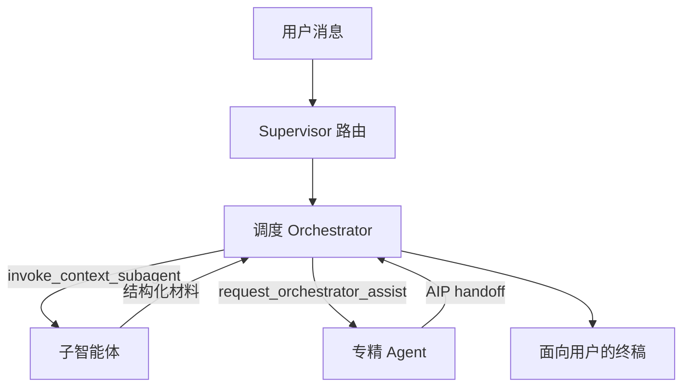
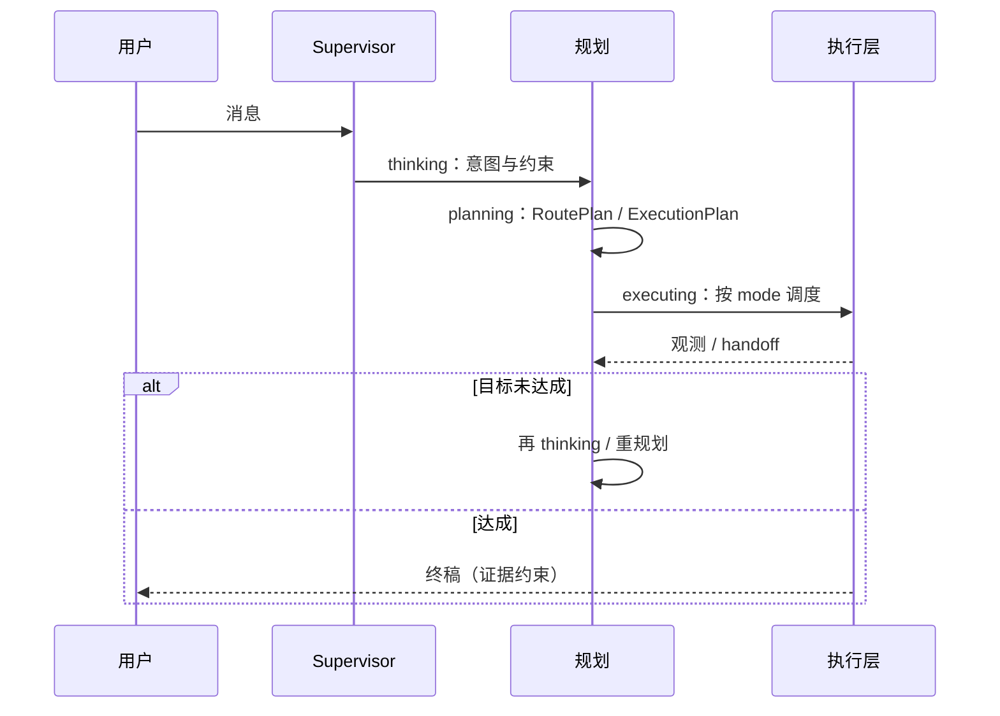
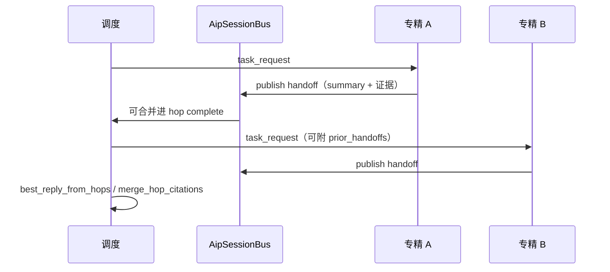
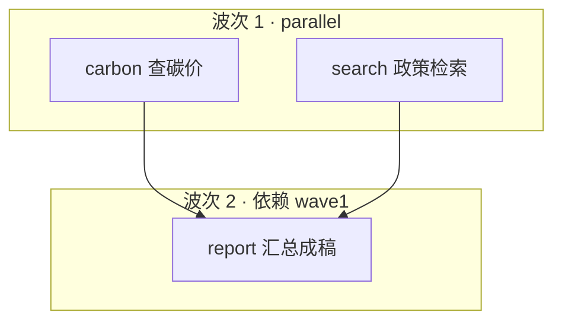

# Agent 架构

> **本析-企业级 AI 智能体平台** 的多智能体现状：分层、通信、Plan-and-Execute、并行编排与代码落点。  
> 取舍见 [设计哲学](agent-philosophy.md)；通俗长文见 [my-agent-philosophy.md](../../my-agent-philosophy.md)。

---

## 1. 三层实体

| 层 | 角色 | 面向谁 | 做什么 |
|----|------|--------|--------|
| **调度（Orchestrator）** | 小析 | 用户 | 理解意图 → 委托 → 验收汇总；**不直执**原子工具 |
| **专精（Specialist）** | platform / report / skill-dev / carbon / power-economy / stock | 用户（经 hop） | 领域 tool loop + Skill；**AIP handoff** 回调度 |
| **子智能体（Subagent）** | `search` / `use` / `execute` | 父 Agent | 隔离上下文的独立 LLM 循环；只交**材料**，不写终稿 |



**决策口诀**：常识直答；检索/步骤执行 → 子智能体；领域操作 → 专精。

---

## 2. Plan-and-Execute（思考 → 规划 → 执行）

对外工作流阶段（`app.agent.orchestrate.protocol`）：

```
thinking → planning → executing →（未完成则再进入 thinking / planning / executing）…
```

| stage | 含义 | 典型 phase |
|-------|------|------------|
| **thinking** | 理解目标、读上下文 | `workflow_started` / `agent_thinking` / `llm_thinking` |
| **planning** | 产出路由或执行计划 | `plan_tasks` / `agent_plan` / `llm_decision` |
| **executing** | 跑工具 / 子任务 / 专精 hop | `task_started` / `tool_call` / `tool_result` / `task_done` |

OpenAI 兼容层把 stage 映射为 reasoning 前缀：`[thinking]` / `[planning]` / `[executing]`；多任务同时 running 时为 `[executing:parallel]`。

### 2.1 两层「计划」

| 计划 | 产出物 | 作用 |
|------|--------|------|
| **路由计划** `AgentRoutePlan` | `mode` + 若干 `AgentRoute` | Supervisor：派谁、单路还是串/并 |
| **执行计划** `AgentExecutionPlan` | intent、allowed/blocked tools、steps… | 单 Agent 六相 loop 内：怎么干 |



规划开启由 `agent_planning_enabled` 控制；执行计划经 `build_agent_instruction_from_plan` 注入 loop 契约，终稿只引用**目标 + 计划 + 观测证据**。

---

## 3. 对话主流程

```
API（ai_chat / openai_compat / aip）
  → 准备 AgentToolPlan
  → iter_supervised_agent_loop
      → resolve_agent_route_plan          # agent_md/routing/
      → mode: single | sequential | parallel
      → 单 hop 或 TaskDAG / 并行波次
      → iter_builtin_specialist_hop
          ├─ orchestrator → 六相 tool loop
          └─ specialist  → 领域执行 → AIP handoff
  → best_reply_from_hops + 合并引用 → SSE
```

### 3.1 六相 Tool Loop（单 Agent 执行核）

宿主：`app/services/agent_tool_loop.py`。

| 相 | 做什么 |
|----|--------|
| 1 输入捕获 | 用户消息、意图、`AgentExecutionPlan` |
| 2 上下文组装 | 检索块、已执行工具、预算裁剪 |
| 3 模型推理 | tool_calls 或准备终稿 |
| 4 动作执行 | Tool / Skill / 子智能体；指纹去重 |
| 5 观测校验 | 目标是否满足、是否自适应重规划 |
| 6 记忆更新 | `LoopState` → 回相 2，或 exit |

### 3.2 调度可调 / 不可调

| 可调（编排入口） | 不可直执 |
|------------------|----------|
| `invoke_context_subagent` | `web_search`、`knowledge_retrieve`、browser_* … |
| `request_orchestrator_assist` | `invoke_skill` / `run_skill_script` |
| `ask_user_choice` / `find_skills` / `describe_tool` / `search_tools` | 通知、待办、文档 CRUD 等 |

---

## 4. 智能体通信（AIP）

通信实现位于 `app.agent.aip`，对齐 GB/Z 185 系列精简子集：**消息 / 任务 / handoff / 会话总线**。

### 4.1 消息与任务

| 类型 | 方向 | 用途 |
|------|------|------|
| `task_request` | 请求方 → 服务方 | 下发子任务（可带 prior_handoffs） |
| `task_response` | 服务方 → 请求方 | 完成结论（handoff） |
| `task_error` | 服务方 → 请求方 | 失败如实回传 |
| `work_artifact` | 可选 | 中间产物 |

`AipMessage` 关键字段：`senderRole`（request/service）、`senderId` / `targetId`、`sessionId`、`taskId`、`dataItems`（如 `handoff_summary`、工具结论）。

### 4.2 Handoff 与会话总线



- **专精完成**：`build_specialist_handoff_message` → `attach_handoff_to_complete`
- **串行下发**：`build_sequential_task_request` 把先前 handoff 列表写入下一条请求，避免后继 Agent「失忆」
- **多 hop 合并**：`best_reply_from_hops`、`merge_hop_citations`

对外还可经 `api/aip`（discover / interact / stream）与外部 Agent 互操作。

### 4.3 语言约定

- Agent↔Agent、注入 LLM 的 system/tool 描述：**英文**
- 对用户终稿：跟随用户语言；正文不出现「ROUTE」；禁止编造执行结果

---

## 5. 多智能体并行与 DAG

路由模式（`RouteMode`）：

| mode | 行为 | 上限（默认配置） |
|------|------|------------------|
| **single** | 一个 Agent / 一条路径 | 1 |
| **sequential** | 按序 handoff，后者可见 prior | `max_sequential_handoffs`（默认 3） |
| **parallel** | 同波次多专精并行 | `max_parallel_handoffs`（默认 2） |

复合任务可建 **TaskDAG**（`app.agent.orchestrate.dag`）：节点带依赖，无环；`iter_dag_wave_events` 按拓扑层取 ready 节点，层内用 `iter_parallel_task_events` 并行（`max_parallel` 默认 3）。



规划事件 `workflow_plan_tasks` 在 `mode=parallel|dag` 且多任务时，前端可展示并行进度；执行中多条 `status=running` 即真正并行。

**选用原则**：无依赖可并行；有先后/共享上下文用 sequential；复杂依赖用 DAG。成本与 token 由 `cap_routes` 截断保护。

---

## 6. 代码分层

| 层 | 路径 | 职责 |
|----|------|------|
| 可抽离库 | `backend/app/agent/` | 路由、DAG、AIP、loop 终稿、子智能体、泛型 Skill/Tool |
| 宿主循环 | `app/services/agent_tool_loop.py` | 六相与流式事件 |
| Supervisor | `app/services/agent_supervisor.py` | 路由、多 hop、DAG |
| 配置 | `agent_config.py` / `agent_profiles.py` | 指令与注册表 |
| MD 偏好 | `backend/agent_md/` | agents / routing / tools / skills |
| Tool / Skill | `app/tools/` · `app/skills/` | 全局注册与执行 |

### 6.1 `app.agent` 子包

| 子包 | 用途 |
|------|------|
| `route` | `build_route_plan` / `infer_route_mode` / `cap_routes` |
| `orchestrate` | TaskDAG、波次调度、parallel、workflow stage、assist、验收 |
| `aip` | 消息、handoff、会话总线、多 hop 合并 |
| `loop` | `AgentExecutionPlan`、exit prompt、`LoopState` |
| `subagent` | 隔离上下文子 Agent |
| `interrupt` | HITL / checkpoint |
| `message` / `mcp` / `skills` / `tools` | 消息、MCP、泛型框架 |

### 6.2 `agent_md/`

```
backend/agent_md/
├── agents/     # 各 Agent 指令
├── routing/    # agents.md / skills.md — 调度只读偏好源
├── tools/      # 原子工具 description
└── skills/     # 示例 Skill 包
```

---

## 7. 其它交互要点

- **工具**：校验 → 执行 → 压缩 → 指纹缓存  
- **Skill**：固化路径；多步自主推理用子智能体  
- **子智能体**：`search` 调研 · `use` 跑 Skill · `execute` 按 steps（浏览器等）  
- **HITL**：危险工具经 Redis interrupt，确认后 checkpoint 续跑  
- **Prompt 优先级**：当前对话设定 → Skill → Style → Memory → 默认 AGENT.md  

---

## 8. 关键配置

| 项 | 说明 |
|----|------|
| `agent_max_tool_rounds` | 单轮最大工具循环 |
| `agent_planning_enabled` | 是否启用规划阶段 |
| `agent_skill_script_*` / `sandbox_base_url` | 脚本 Skill 与沙箱 |
| `hitl_confirm_tools` | 需人工确认的工具 |

---

## 9. 相关文档

| 文档 | 内容 |
|------|------|
| [设计哲学](agent-philosophy.md) | 分层与决策矩阵 |
| [Agent Skills](implementation/agent-skills-implementation.md) | Skill 调用链 |
| [浏览器 RPA](implementation/browser-rpa-implementation.md) | `kind=execute` |
| [项目总体架构](development/system-architecture-overview.md) | Monorepo 全景 |
| [组件与数据存储](operations/components-and-storage.md) | DATA_ROOT / backups |
