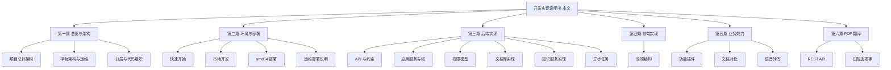

# 企业 AI 知识库平台 — 开发实现说明书

> **文档体系**：本说明书是 Monorepo `pdf_trans` 的**官方开发文档总索引**。  
> **部署与运维（v3.4+ 最新）**：请先阅读 **[运维手册](../operations/README.md)**，再查阅下文实现细节。

---

## 1. 文档地图



---

## 2. 分篇目录（阅读顺序）

### 第一篇 · 总览与架构

理解系统边界、组件关系与工程难点后再写代码。

| 章 | 文档 | 你将学到 |
|----|------|----------|
| 1.1 | [项目总体架构](system-architecture-overview.md) | 上下文图、部署图、核心流程、10 项难点与实现 |
| 1.2 | [平台架构索引](platform-architecture.md) | 指向运维专题：端口、配置、启动命令 |
| 1.3 | [分层与代码组织](layered-architecture.md) | API / domains / services / integrations 职责与调用约定 |

### 第二篇 · 环境与部署

| 章 | 文档 | 你将学到 |
|----|------|----------|
| 2.1 | [快速开始](../getting-started.md) | 一键 `dev.sh`、默认账号、可选 KnowFlow/语音 |
| 2.2 | [运维部署指南](../../../运维部署指南.md) §6 | 全 Docker dev、remote-dev + `local-dev` |
| 2.3 | [部署指南](../operations/deployment.md) | 生产 up、amd64/arm64 镜像 push |
| 2.4 | [知识库实现](../implementation/knowledge-implementation.md) | KnowFlow 集成、上传同步、构建要点 |
| 2.5 | [Stack 命令速查](stack-deployment.md) | `stack.sh` save/load、备份 |
| — | [脚本索引](../../scripts/README.md) | `dev.sh` / `stack.sh` / `deploy.sh` |

### 第三篇 · 后端实现

| 章 | 文档 | 你将学到 |
|----|------|----------|
| 3.1 | [API 与约定](../implementation/api-conventions.md) | 路由前缀、鉴权 Depends、`ApiResponse`、异常与中文文案 |
| 3.2 | [应用服务与域](../implementation/backend-implementation.md) | `main.py` 启动、schema 迁移、服务分包、KnowledgeGateway |
| 3.3 | [权限模型](../platform/permission-model.md) | RBAC、文档 scope、grant/deny、判定顺序 |
| 3.4 | [文档库实现](../implementation/documents-implementation.md) | 上传、版本、文件夹、回收站、同步知识库 API |
| 3.5 | [知识服务实现](../implementation/knowledge-implementation.md) | RAGFlow vs KnowFlow、开户、dataset、镜像与 KB ACL |
| 3.6 | [异步任务](../implementation/async-and-jobs.md) | Celery、翻译监控、对比 BackgroundTasks、文档删除 |
| 3.7 | [Agent Skills 实现](../implementation/agent-skills-implementation.md) | Discovery / Activation、tool loop、上传包与内置 Skill |
| 3.8 | [浏览器 RPA 实现](../implementation/browser-rpa-implementation.md) | Playwright 会话、`browser_*` 工具、录制固化 Skill |
| 3.9 | [报告生成实现](../implementation/report-generation-implementation.md) | 长报告流式生成、多路召回与章节扩写 |

### 第四篇 · 前端实现

| 章 | 文档 | 你将学到 |
|----|------|----------|
| 4.1 | [前端结构](../implementation/frontend-implementation.md) | 路由、布局、api 层、composables、功能页与插件对齐 |

### 第五篇 · 业务能力（插件域）

| 章 | 文档 | 你将学到 |
|----|------|----------|
| 5.1 | [功能插件](../platform/feature-plugins.md) | 四步接入新功能、权限码、`require_feature` |
| 5.2 | [文档对比](../platform/doc-compare-product-design.md) | 双模式产品、ACL 白名单检索、异步 job |
| 5.3 | [语音转写](../platform/speech-models.md) | FunASR 镜像、DeepSeek 总结、环境变量 |

### 第六篇 · PDF 翻译（pdf2zh_next）

| 章 | 文档 | 你将学到 |
|----|------|----------|
| 6.1 | [REST API](rest-api.md) | pdf2zh HTTP 接口（平台 `PDF2ZH_API_URL` 调用） |
| 6.2 | [进阶选项](../advanced/advanced.md) | CLI 参数、配置 tom |
| 6.3 | [语言代码](../advanced/Language-Codes.md) | 语种代码 |
| 6.4 | [翻译服务](../advanced/Documentation-of-Translation-Services.md) | 第三方翻译引擎配置 |

### 附录

| 文档 | 说明 |
|------|------|
| [常见问题](../FAQ.md) | 排错汇总 |
| [支持语言](../supported_languages.md) | pdf2zh 语种列表 |

---

## 3. 推荐阅读路径

### 3.1 新成员（3 天）

| 天 | 任务 | 文档 |
|----|------|------|
| D1 | 跑通环境 | [快速开始](../getting-started.md) → [运维部署指南](../../../运维部署指南.md) §6 |
| D2 | 理解架构 | [项目总体架构](system-architecture-overview.md) → [分层架构](layered-architecture.md) |
| D3 | 改一个小需求 | [API 与约定](../implementation/api-conventions.md) + [功能插件](../platform/feature-plugins.md) |

### 3.2 后端开发

[权限模型](../platform/permission-model.md) → [文档库实现](../implementation/documents-implementation.md) → [知识服务实现](../implementation/knowledge-implementation.md) → [异步任务](../implementation/async-and-jobs.md)

### 3.3 前端开发

[前端结构](../implementation/frontend-implementation.md) → [功能插件](../platform/feature-plugins.md) → 对照 `platform-frontend/src/router/index.js`

### 3.4 运维 / 发布

[部署指南](../operations/deployment.md) → [配置说明](../operations/configuration.md) → `platform/.env.example`

---

## 4. 仓库与职责速查

```
pdf_trans/
├── platform/                 # FastAPI 控制面
│   ├── app/api/              # HTTP 路由（薄）
│   ├── app/services/         # 业务编排
│   ├── app/domains/          # Facade（如 knowledge）
│   ├── app/integrations/     # 外部 HTTP 客户端
│   ├── app/features/builtin/ # 功能插件注册
│   └── workers/              # Celery
├── platform-frontend/        # Vue 3 管理端
├── pdf2zh_next/              # PDF 翻译引擎
├── scripts/                  # dev.sh / deploy.sh
└── docs/zh/                  # 本文档体系
```

| 需求类型 | 优先修改 | 必读章节 |
|----------|----------|----------|
| 新系统功能页 | `features/builtin/*.py` + `views/` + `router` | 5.1、4.1 |
| 文档库行为 | `services/documents/*`、`api/documents.py` | 3.3、3.4 |
| 知识库同步/问答 | `domains/knowledge`、`ragflow_*` | 3.5、1.1 §8 |
| 权限/分级 | `core/permissions.py`、`document_scope.py` | 3.3 |
| 部署/端口 | `scripts/`、`docker-compose*.yml` | 2.3、1.2 |
| PDF 翻译 | `pdf2zh_next/`、`api/jobs` | 第六篇 |

---

## 5. 核心设计原则（实现时必须遵守）

1. **平台 ACL 是文档权限的唯一真相**；KnowFlow/RAGFlow 只做解析、检索与 UI，检索前必须先算 `allowed_document_ids`（见 [知识服务实现](../implementation/knowledge-implementation.md)）。
2. **API 薄、服务厚**；新 HTTP 接口不写复杂 ORM 编排，放 `services/` 或 `domains/`（见 [分层架构](layered-architecture.md)）。
3. **知识能力走 `KnowledgeGateway`**；禁止在新代码中散落 `from app.services.ragflow_sync_service import ...`（见 [应用服务与域](../implementation/backend-implementation.md)）。
4. **功能入口走插件**；不在 `MainLayout` 硬编码业务菜单（见 [功能插件](../platform/feature-plugins.md)）。
5. **统一响应与中文错误**；`ApiResponse` + `AppError` + 前端 `parseResponse` / `sanitizeUserFacingMessage`（见 [API 与约定](../implementation/api-conventions.md)）。
6. **大文件与长任务异步化**；上传走 MinIO presigned；翻译/对比/删文档走 Celery 或 BackgroundTasks（见 [异步任务](../implementation/async-and-jobs.md)）。

---

## 6. 配置与环境变量索引

完整列表见 `platform/.env.example` 与 [配置说明](../operations/configuration.md)。高频项：

| 变量 | 用途 |
|------|------|
| `DATABASE_URL` / `REDIS_URL` / `MINIO_*` | 基础设施 |
| `JWT_SECRET` | 生产必换 |
| `PDF2ZH_API_URL` | 翻译服务地址 |
| `KNOWFLOW_ENABLED` | 是否集成知识栈 |
| `RAGFLOW_API_URL` / `KNOWFLOW_BACKEND_URL` | RAGFlow UI/API 与 KnowFlow 扩展 API |
| `RAGFLOW_ACCOUNT_MODE` | `mapped`（推荐）/ `shared` |
| `RAGFLOW_SYNC_ON_LOGIN` / `RAGFLOW_SYNC_ON_EMBED` | 同步时机 |
| `DEEPSEEK_*` | 摘要、会议总结 |
| `SPEECH_SERVICE_URL` | 语音转写 |

---

## 7. 文档维护规范

| 变更类型 | 更新文档 |
|----------|----------|
| 新外部服务或跨模块流程 | [项目总体架构](system-architecture-overview.md) §5–§8 |
| 新 API 约定或错误码 | [API 与约定](../implementation/api-conventions.md) |
| 文档库/权限行为变更 | [文档库实现](../implementation/documents-implementation.md)、[权限模型](../platform/permission-model.md) |
| 新功能插件 | [功能插件](../platform/feature-plugins.md) + 插件内 docstring |
| 部署/compose 变更 | [部署指南](../operations/deployment.md)、[脚本索引](../../scripts/README.md) |
| 仅改端口/版本号 | [配置说明](../operations/configuration.md)、[运维部署指南](../../../运维部署指南.md) |

**不要删除** `platform/third_party/KnowFlow/`（Docker 构建依赖）。

---

## 8. 版本与许可

- 平台版本：根目录 `VERSION` 与 `GET /api/v1/system/version`
- 许可：仓库根目录 [AGPL v3](../../../LICENSE)

---

## 9. 旧文档对照

以下文档已纳入本说明书体系，**内容保留、导航重组**，不作为废弃：

| 原独立文档 | 说明书位置 |
|------------|------------|
| platform-architecture.md | 第一篇 1.2（索引 → operations/） |
| system-architecture-overview.md | 第一篇 1.1 |
| layered-architecture.md | 第一篇 1.3 |
| stack-deployment.md | 第二篇 2.5（stack 命令速查） |
| 已删除的 local-development / deploy-amd64 / doc-platform | 合并至 [运维部署指南](../../../运维部署指南.md) 与 [operations/](../operations/README.md) |
| permission-model / feature-plugins 等 | 第三、五篇 |

若 MkDocs 侧边栏与本文目录不一致，以 **`mkdocs.yml` 中「开发实现说明书」节点** 为准。
