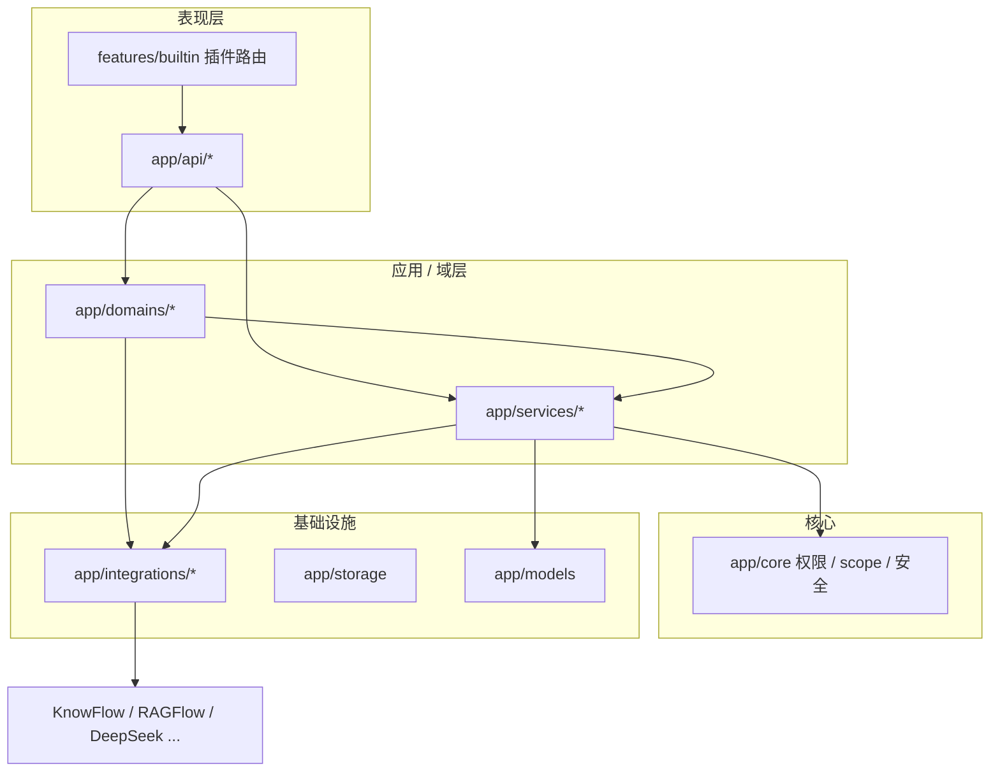

# 分层架构与代码组织

> **开发实现说明书 · 第一篇 §1.3** · [说明书总览](implementation-manual.md)  
> 与 [系统架构](../operations/architecture.md) 配套：本文说明**自有代码**应如何分层、各层职责及推荐调用方向。

---

## 1. 目标

- **API 薄、域清晰**：路由只做参数校验与 `ApiResponse` 组装。
- **知识能力单入口**：KnowFlow/RAGFlow 经 `KnowledgeGateway`，避免 `ragflow_*` 四处 import。
- **集成与编排分离**：`integrations/` 只连外部 HTTP/SDK；`domains/` / `services/` 做业务编排。
- **前端按域拆 API**：`api/http.js` + `api/documents.js` 等，禁止继续膨胀单文件 `client.js`。

---

## 2. 后端分层



| 层 | 目录 | 职责 | 禁止 |
|----|------|------|------|
| **表现层** | `app/api/` | HTTP 路由、Depends、Schema 出入 | 复杂业务、httpx 探活、直接 ORM 事务编排 |
| **域层** | `app/domains/` | 跨模块 Facade、子域元数据（如 embed meta） | 直接 SQL、重复 integrations 逻辑 |
| **应用服务** | `app/services/`、`app/services/documents/` | 单聚合根编排；文档域已拆为 listing/crud/acl/lifecycle/content | API 层私有符号 `_foo` |
| **核心** | `app/core/` | 权限、文档 scope、身份 | 依赖 integrations |
| **集成** | `app/integrations/` | 外部客户端、协议适配 | 依赖 services（防环） |
| **模型** | `app/models/`、`schemas/` | ORM / Pydantic | 业务分支 |

### 2.1 知识域（已实现）

```
app/domains/knowledge/
  gateway.py      # KnowledgeGateway / knowledge 单例（Facade）
  meta_service.py # /knowledge/meta 探活与载荷
  background_sync.py
```

**调用约定**：

```python
from app.domains.knowledge import knowledge

# 栈是否可用（已含 knowflow_enabled 判断，勿再写双重条件）
knowledge.stack_reachable()

# 用户级 KnowFlow 客户端
kf = knowledge.client_for_user(db, user)

# 文档同步 / ACL
knowledge.sync_document(db, user, doc, force=True)
knowledge.sync_kb_grants(db, doc)
```

**解析器 / 索引栈规则**（勿在 service 内重复实现）：

```python
from app.services.knowledge_parser_service import (
    reindex_parser_id_raw,
    resolve_job_parser_id,
    assert_index_stack_ready,
    index_stack_block_reason,
)
```

详见 [知识服务实现](../implementation/knowledge-implementation.md) §3。

**用户可见错误**（API、Job、SSE 统一）：

```python
from app.core.user_messages import (
    sanitize_user_message,
    http_exception_message,
    background_job_error_message,
)
```

旧路径 `app/services/ragflow_*` 仍保留实现细节，**新代码请经 `knowledge` 与上述入口**。

### 2.2 功能插件

- 插件 = **路由挂载 + 权限码 + 系统功能卡片**（`FeaturePlugin`）。
- 插件内 API 仍应遵守薄控制器；复杂逻辑放 `domains/` 或 `services/`。
- 核心 IAM（auth、users、documents）暂保留在 `main.py` 显式挂载；后续可逐步迁入 `domains/iam/`。

---

## 3. 前端分层

```
platform-frontend/src/
  api/
    http.js        # fetch、Token、parseResponse、api()
    documents.js   # 文档库 REST
    rag.js         # 知识问答 / 嵌入
    client.js      # 聚合 re-export（兼容旧 import）
  views/           # 页面，只调 api/* 与 composables
  composables/     # 跨页状态（useAuth、useDocumentReindex、usePlatformUi）
  components/      # 纯 UI
```

| 层 | 职责 |
|----|------|
| `api/*` | 请求封装，无 UI 状态 |
| `composables/` | 可复用逻辑 + 少量 UI 副作用 |
| `views/` | 路由页，组合 composable |

**约定**：同一用户操作只弹**一条**结果提示；统一使用 `usePlatformUi`；页面内 `n-alert` 与 `message` 不重复报错（见 `utils/uiMessage.js`）。

---

## 4. 迁移清单（逐步）

| 优先级 | 项 | 状态 |
|--------|-----|------|
| P0 | `KnowledgeGateway` + `rag.py` 瘦身 | 已完成 |
| P0 | `documents.py` 经 gateway 同步 KB | 已完成 |
| P1 | 前端 `api/http` + `auth` + `documents` + `rag` 拆分 | 已完成 |
| P1 | `document_service` → `services/documents/` 子包 | 已完成 |
| P2 | `auth`/`users` 经 `knowledge` 网关 | 已完成 |
| P2 | 删除遗留 `smart_data_query.py`（v1） | 已完成 |
| P2 | 知识 parser / 错误文案 / KnowFlow 探活收敛 | 已完成 |
| P2 | LLM JSON 解析与文本截断收敛至 `app/core/llm_parse`、`text_utils` | 已完成 |
| P3 | 前端路由与 `/system/features` 插件 id 对齐表 | 待办 |

---

## 5. 设计模式对照

| 模式 | 落点 |
|------|------|
| **Facade** | `KnowledgeGateway` |
| **规则集中** | `knowledge_parser_service`（parser / 栈校验）；`llm_parse` / `text_utils`（LLM 输出与截断） |
| **Strategy** | `KnowflowClient` / `LocalKnowflowClient` |
| **Plugin Registry** | `features/registry.py` |
| **Repository**（轻量） | `services/*` + SQLAlchemy，未单独抽象类 |
| **Adapter** | `integrations/*_client.py` |

---

## 6. 相关文档

- [开发实现说明书总览](implementation-manual.md)
- [系统架构](../operations/architecture.md)
- [应用服务与域](../implementation/backend-implementation.md)
- [知识服务实现](../implementation/knowledge-implementation.md)
- [异步任务](../implementation/async-and-jobs.md)
- [功能插件](../platform/feature-plugins.md)
- [权限模型](../platform/permission-model.md)
