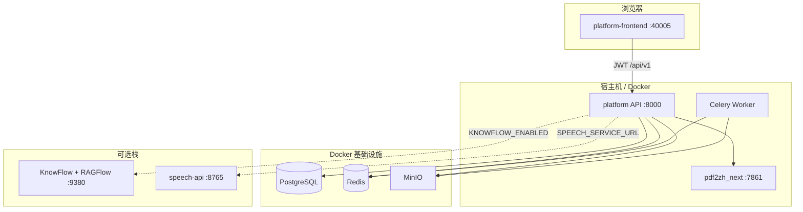
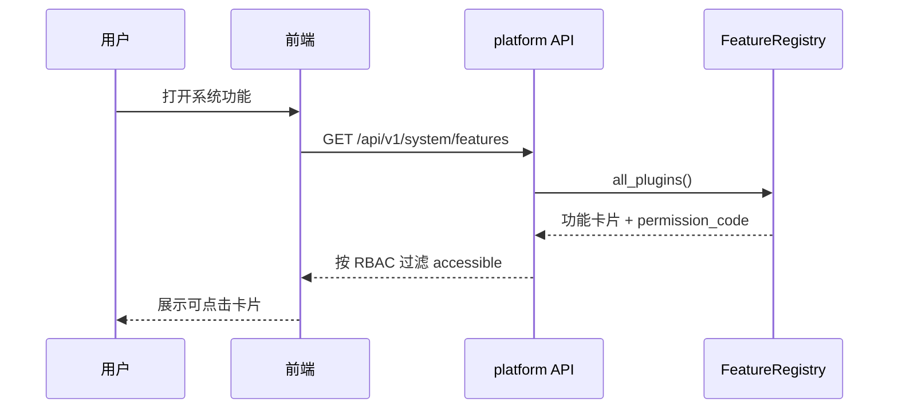
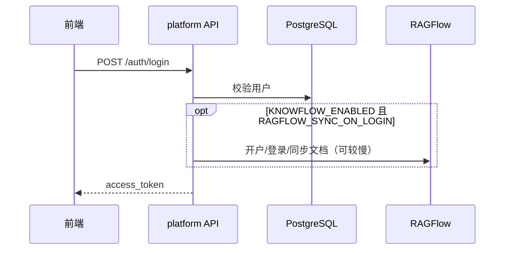
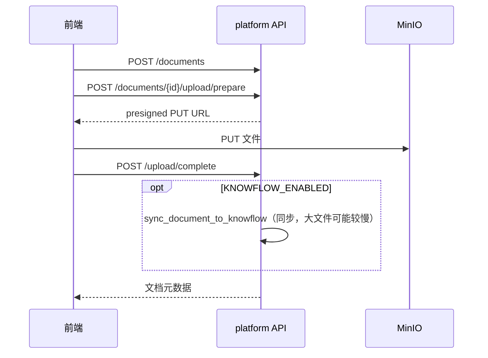
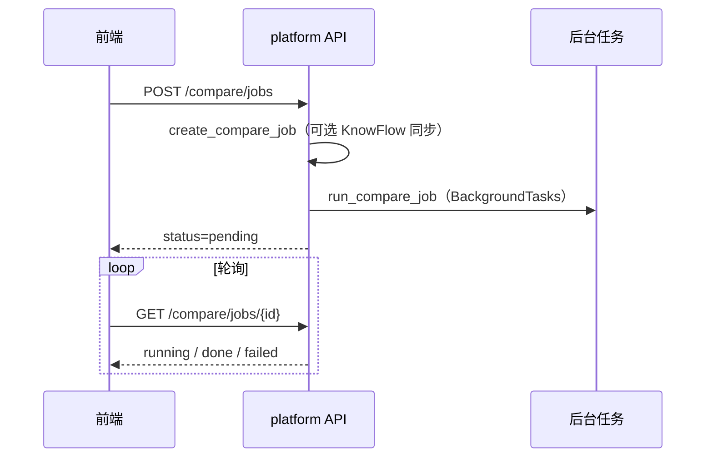
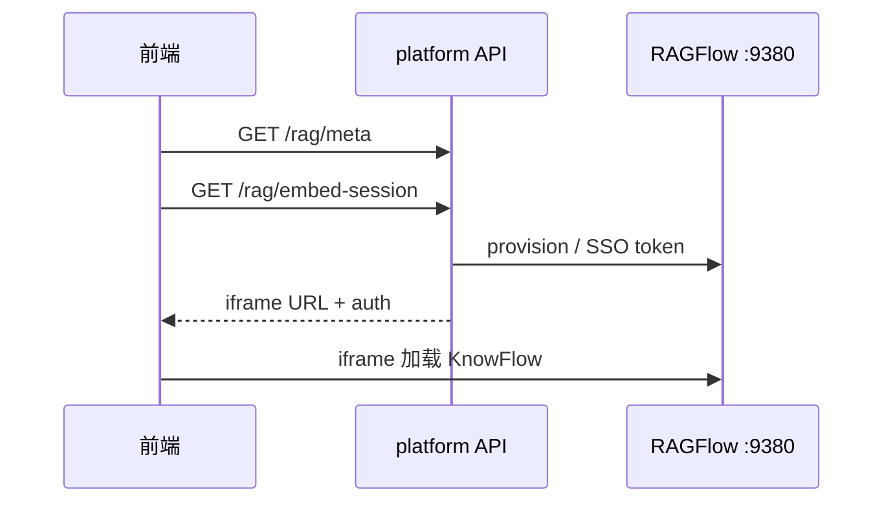

# 智碳平台AI系统 — 架构与开发手册

> **开发实现说明书 · 第一篇 §1.2** · 总索引见 [说明书总览](implementation-manual.md)  
> 版本：**2.1.0**（标签 `v2.1.0`） · 展示名：**智碳平台AI系统**  
> 本文档描述**平台自有代码**（`platform/`、`platform-frontend/`、`scripts/`），不包含 `platform/third_party/KnowFlow` 内部实现细节。

---

## 1. 仓库结构

```
pdf_trans/                          #  monorepo 根目录
├── VERSION                         #  平台版本号 2.1.0
├── scripts/                        #  一键启动、KnowFlow/语音构建脚本
├── platform/                       #  FastAPI 控制面 + Celery Worker
│   ├── app/
│   │   ├── api/                    #  REST 路由（auth、documents、compare、rag…）
│   │   ├── features/builtin/       #  系统功能插件注册
│   │   ├── integrations/           #  KnowFlow、RAGFlow、DeepSeek、语音等
│   │   ├── services/               #  业务编排
│   │   ├── models/                 #  SQLAlchemy ORM
│   │   └── core/                   #  权限、异常、文档范围
│   ├── speech-service/             #  FunASR 转写微服务（Docker）
│   ├── third_party/KnowFlow/       #  上游 KnowFlow/RAGFlow 源码（勿随意删改）
│   ├── docker-compose*.yml
│   └── .env                        #  运行时配置（勿提交密钥）
├── platform-frontend/              #  Vue 3 + Vite + Naive UI
│   └── src/
│       ├── views/                  #  业务页面
│       ├── layouts/MainLayout.vue  #  侧栏与顶栏
│       ├── api/client.js           #  API 封装与错误解析
│       └── constants/platform.js   #  品牌与版本常量
├── pdf2zh_next/                    #  PDF 翻译引擎（独立服务 :7861）
└── docs/zh/                        #  MkDocs 中文文档
```

---

## 2. 逻辑架构



| 组件 | 职责 |
|------|------|
| **platform API** | 认证、IAM、文档 ACL、任务、通知、功能清单、代理 |
| **Celery Worker** | 异步任务（如 PDF 翻译、文档删除） |
| **platform-frontend** | 管理端 UI；功能入口由 `/system/features` 驱动 |
| **pdf2zh_next** | 版式保留 PDF 翻译 |
| **KnowFlow/RAGFlow** | 知识库、语义检索、知识问答 iframe |
| **speech-service** | 会议录音转写 |

---

## 3. 分层与代码组织

后端采用 **API → domains/services → integrations** 分层；KnowFlow/RAGFlow 统一经 `app.domains.knowledge.KnowledgeGateway`（Facade）访问。详见 [分层架构](./layered-architecture.md)。

---

## 4. 功能插件机制

系统功能页（`/system/functions`）**不硬编码**路由列表，而由后端插件注册：



- 插件定义：`platform/app/features/builtin/*.py`
- 启用且有权时：`route` 可跳转（如 `/system/compare`）
- `enabled=false`：仅展示占位（如减碳策略、文档生成）
- 详见 [功能插件](../platform/feature-plugins.md)

---

## 5. 核心时序

### 4.1 登录与 KnowFlow 账号



**性能建议**：生产环境可将 `RAGFLOW_SYNC_ON_LOGIN=false`，仅在进入「知识问答」时同步（`RAGFLOW_SYNC_ON_EMBED`）。

### 4.2 文档上传



### 4.3 文档对比（v2.0 起异步）



右侧「检索」可走 `POST /compare/search`，无需先完成段落 diff。

### 4.4 知识问答（内嵌 UI）



---

## 6. 数据与权限

- **平台库（PostgreSQL）**：用户、部门、角色、文档、版本、ACL、任务、通知、对比任务、RAG 会话（遗留 API）等。
- **对象存储（MinIO）**：文档二进制。
- **文档范围**：`company` / `department` / `personal`，见 [权限模型](../platform/permission-model.md)。
- **KnowFlow**：模型供应商配置在 RAGFlow MySQL `tenant_llm`；平台通过 `ragflow_llm_template` 从模板账号同步到各用户。

---

## 7. 启动方式

| 命令 | 说明 |
|------|------|
| `bash scripts/zhitan.sh` | 默认：基础设施 Docker + 本地 API/Worker/前端 |
| `bash scripts/zhitan.sh knowflow` | 上述 + KnowFlow/RAGFlow 栈 |
| `bash scripts/zhitan.sh speech` | 上述 + 语音转写 Docker |
| `bash scripts/zhitan.sh stop` | 停止（**会 down KnowFlow**，慎用 `-v`） |

| 地址 | 服务 |
|------|------|
| http://127.0.0.1:40005 | 平台前端 |
| http://127.0.0.1:8000 | 平台 API（Swagger `/docs`） |
| http://127.0.0.1:8000/api/v1/system/version | 版本信息 |
| http://127.0.0.1:7861 | pdf2zh API |
| http://127.0.0.1:9380 | RAGFlow Web UI（knowflow 模式） |
| http://127.0.0.1:5001 | KnowFlow Backend |
| http://127.0.0.1:8765 | 语音转写 API |

默认管理员：`admin` / `admin123`（`platform/.env` 中 `BOOTSTRAP_ADMIN_*`）。

---

## 8. 配置要点（`platform/.env`）

| 变量 | 说明 |
|------|------|
| `APP_NAME` / `PLATFORM_VERSION` | 展示名与版本（API `/system/version`） |
| `DATABASE_URL` | PostgreSQL |
| `REDIS_URL` | Celery / 缓存 |
| `MINIO_*` | 对象存储 |
| `JWT_SECRET` | 生产必须更换 |
| `PDF2ZH_API_URL` | 翻译服务 |
| `KNOWFLOW_ENABLED` | 是否集成 KnowFlow |
| `KNOWFLOW_UI_URL` / `KNOWFLOW_UI_PROXY_PREFIX` | 知识问答 iframe |
| `RAGFLOW_ACCOUNT_MODE` | `mapped`（推荐）或 `shared` |
| `RAGFLOW_SYNC_ON_LOGIN` | 登录时同步文档（关闭可加快登录） |
| `RAGFLOW_LLM_SHARED_FROM_TEMPLATE` | 从模板账号复制模型 API 配置 |
| `DEEPSEEK_*` | 会议总结 / 辅助写作 |
| `SPEECH_SERVICE_URL` | 语音转写 |

完整示例见 `platform/.env.example`。

---

## 9. API 与错误响应

- 统一前缀：`/api/v1`
- 成功：`{ "code": 0, "message": "ok", "data": ... }`
- 业务错误（`AppError`）：`{ "code": 4xx, "message": "中文说明" }`
- 参数校验失败：`422` + 中文字段说明
- 未捕获异常：`500` +「服务器内部错误，请稍后重试」

前端在 `platform-frontend/src/api/client.js` 的 `parseResponse` 中解析上述格式。

**已清理的重复接口**（v2.0）：

- 删除 `GET /audit/logs`（请用 `GET /monitor/audit-logs`）
- 智能问数请用 `GET /system/features/{id}/embed-meta`，勿用重复的 `smart-data-query/meta`

**遗留但无前端调用的 API**（保留供集成或后续使用）：

- `POST/GET /rag/sessions` — 平台内问答已改为 KnowFlow iframe

---

## 10. 代码清理说明（v2.0）

| 类别 | 处理 |
|------|------|
| 重复审计路由 | 已删除 `app/api/audit.py` |
| 未使用前端 API | 已删除 `fetchSmartDataQueryMeta` |
| 文档对比阻塞 | 改为后台执行 + 前端轮询 |
| MkDocs 断链图片 | logo 改为 `icon/yezi.svg`；上游 PDF 配图目录已移除 |
| 脚本与部署文档 | 见仓库根目录 `scripts/README.md`、`development/deploy-amd64.md` |
| OCR / 占位功能 | 保留为 `enabled=false` 产品占位，非死代码 |

**请勿删除**：`platform/third_party/KnowFlow/`（Docker 构建依赖）。

---

## 11. 本地开发命令

```bash
# 基础设施
cd platform && docker compose -f docker-compose.yml -f docker-compose.local.yml up -d postgres redis minio

# 后端
cd platform && source .venv/bin/activate
uvicorn app.main:app --reload --host 127.0.0.1 --port 8000
celery -A workers.celery_app worker --loglevel=info

# 前端
cd platform-frontend && npm run dev -- --host 127.0.0.1 --port 40005

# 翻译（可选）
pdf2zh_next --api --api-port 7861
```

---

## 12. 相关文档

- [开发实现说明书总览](implementation-manual.md)
- [项目总体架构](system-architecture-overview.md)（架构图、核心流程、难点与实现）
- [分层架构](layered-architecture.md)
- [智碳平台AI系统快速上手](doc-platform.md)
- [本地开发](local-development.md)
- [REST API](rest-api.md)
- [功能插件](../platform/feature-plugins.md)
- [权限模型](../platform/permission-model.md)
- [语音转写部署](../platform/speech-models.md)
