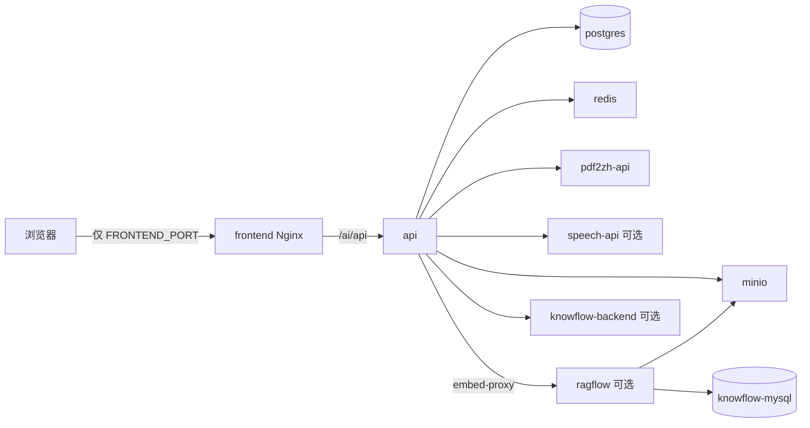

# 统一容器栈部署指南（v3.4+）

> **完整运维说明已迁移至 [运维手册](../operations/README.md)**（架构、容器、网络、配置、升级、安全）。  
> 本文保留 `stack.sh` 命令速查。

> **决策落地**：仓库根 `compose.yaml` · 镜像本地 build/save/load · 全 Docker · 对外仅 `FRONTEND_PORT`

---

## 1. 架构一览



| 项 | 说明 |
|----|------|
| 入口文件 | 仓库根 `compose.yaml` + `deploy/knowflow.yml`（profile `knowflow`） |
| 数据 | `${DATA_ROOT}` 默认 `./data/`（绑定挂载，可整体拷贝） |
| 镜像 | `zhitan-api` / `zhitan-frontend` / `zhitan-pdf2zh` / `zhitan-speech` + KnowFlow 镜像 |
| 对外端口 | **仅** `FRONTEND_PORT`（默认 40005） |
| 语音 | profile `speech`，模型目录 `data/speech-models`（首次启动自动下载） |

---

## 2. 首次准备（本机）

```bash
cd /path/to/pdf_trans
bash scripts/setup-stack-env.sh   # 生成 .env（或 cp .env.stack.example .env）
```

默认启用 **`compose.mirror.yaml`**：`docker.1ms.run` 拉基础镜像，构建使用清华 PyPI / npmmirror。关闭：`STACK_USE_MIRROR=0`。

# 或: cp .env.stack.example .env 后手工编辑

pip install -r docs/requirements-docs.txt   # 可选，仅文档站

一键启动（等同 `bash scripts/zhitan.sh`）：

```bash
bash scripts/zhitan.sh              # stack up，默认 knowflow + speech profiles
bash scripts/zhitan.sh dev          # 开发：挂载源码
bash scripts/zhitan.sh stack build  # 显式调用 stack 子命令
```

### 2.1 构建镜像（本地一次）

```bash
# 核心栈
bash scripts/stack.sh build

# 含知识库 + 语音（KnowFlow arm64 首次较慢，可改用 amd64 预构建镜像见 .env）
bash scripts/stack.sh build --profile knowflow --profile speech
```

### 2.2 导出镜像包

```bash
bash scripts/stack.sh save
# 生成 images/zhitan-3.4.0-arm64.tar.gz 或 amd64
```

### 2.3 启动（本机全 Docker）

```bash
# 仅核心
bash scripts/stack.sh up

# 核心 + 知识库 + 语音
bash scripts/stack.sh up --profile knowflow --profile speech
```

访问：**http://127.0.0.1:40005/ai/**（API 经 Nginx `/ai/api`，勿再暴露 8000）

### 2.4 开发模式（方便改代码）

```bash
bash scripts/stack.sh dev-up
# API --reload 挂载 platform/app；前端 Vite 挂载 platform-frontend
```

---

## 3. 服务器部署（无代码 rsync）

### 3.1 流程

```text
本机 build → save → rsync 镜像包 + 配置 → 服务器 load → up
```

```bash
# 本机
bash scripts/stack.sh build --profile knowflow --profile speech
bash scripts/stack.sh save

# 推送镜像与编排（不推送源码）
bash scripts/deploy.sh stack push

# 或手动：
rsync -avz images/zhitan-3.4.0-amd64.tar.gz compose.yaml deploy/ scripts/stack.sh .env \
  user@server:/opt/zhitan/
ssh user@server 'cd /opt/zhitan && bash scripts/stack.sh load images/zhitan-3.4.0-amd64.tar.gz && \
  bash scripts/stack.sh up --profile knowflow --profile speech'
```

### 3.2 amd64 上 KnowFlow 预构建镜像

在服务器 `.env` 中设置（无需源码 build）：

```env
RAGFLOW_PLATFORM=linux/amd64
RAGFLOW_IMAGE=zxwei/knowflow:v2.1.8
KNOWFLOW_SERVER_IMAGE=zxwei/knowflow-server:v2.1.8
KNOWFLOW_ENABLED=true
```

保存镜像前在本机 pull 并打入 tar：

```bash
docker pull zxwei/knowflow:v2.1.8 zxwei/knowflow-server:v2.1.8
bash scripts/stack.sh save   # 需已设置 COMPOSE_PROFILES 或手动 docker save 追加
```

### 3.3 数据迁移

**整机迁移**（推荐）：

```bash
bash scripts/stack.sh down
tar -czf zhitan-data.tar.gz data/
# 传到新机后解压，同版本 stack.sh up
```

**逻辑备份**：

```bash
bash scripts/stack.sh backup    # → backups/<时间戳>/
bash scripts/stack.sh restore backups/<时间戳>
```

---

## 4. 快速升级（迭代）

仅换应用版本，**不** rsync 代码：

```bash
# 本机
export ZHITAN_VERSION=3.4.1   # .env
bash scripts/stack.sh build
bash scripts/stack.sh save

# 服务器
bash scripts/stack.sh load images/zhitan-3.4.1-amd64.tar.gz
bash scripts/stack.sh up --profile knowflow --profile speech
```

数据库结构由 API 启动时 `schema_migrate` 自动升级。

---

## 5. 语音服务说明

| 项 | 说明 |
|----|------|
| 镜像 | 自建 `zhitan-speech:${ZHITAN_VERSION}`（`platform/speech-service/Dockerfile`） |
| 基础镜像 | 构建时使用 Docker Hub 官方 Python 等 **在线拉取** |
| 模型 | 首次启动写入 `data/speech-models`（持久化，随 data/ 迁移） |
| 通信 | 平台 `SPEECH_SERVICE_URL=http://speech-api:8765`（容器内 DNS） |
| 启用 | `bash scripts/stack.sh up --profile speech` |

---

## 6. 配置要点（`.env`）

| 变量 | 说明 |
|------|------|
| `ZHITAN_VERSION` | 镜像 tag，升级时修改 |
| `DATA_ROOT` | 数据根目录，默认 `./data` |
| `FRONTEND_PORT` | **唯一**对外 Web 端口 |
| `KNOWFLOW_ENABLED` | 是否启用知识能力（API 侧） |
| `KNOWFLOW_UI_PUBLIC_URL` | 建议 `http://<主机>:40005/ragflow-ui/`（走 Nginx 反代） |
| `MINIO_ROOT_*` | 与 KnowFlow 一致时可改为 `rag_flow` / `infini_rag_flow` |

---

## 7. 与旧脚本关系

| 旧方式 | 新方式 |
|--------|--------|
| `zhitan.sh` 宿主机进程 | `stack.sh up` 或 `dev-up` |
| `deploy.sh` rsync 全仓库 + 远程 build | `deploy.sh stack push` 仅镜像+编排 |
| 多 compose 文件手动叠加 | 根目录 `compose.yaml` + `deploy/knowflow.yml` |
| 暴露 8000/9380/5001… | 仅 `FRONTEND_PORT`（调试可临时 `docker compose port`） |

旧 `deploy.sh local full` 仍可用，逐步迁移至 `stack.sh`。

---

## 8. 故障排查

| 现象 | 处理 |
|------|------|
| KnowFlow 连不上 MinIO | 检查 `.env` 中 `MINIO_ROOT_*` 与 RAGFlow 配置一致 |
| `network zhitan not found` | 先 `stack.sh up` 核心栈创建网络，再启 knowflow profile |
| 语音模型慢 | 首次下载 FunASR 模型到 `data/speech-models`，属正常 |
| M 系 Mac KnowFlow 构建久 | amd64 服务器用预构建镜像；Mac 本地 save 后传服务器 load |

---

## 9. 相关文件

| 文件 | 说明 |
|------|------|
| `compose.yaml` | 核心服务 |
| `deploy/knowflow.yml` | profile knowflow |
| `compose.dev.yaml` | 开发覆盖 |
| `scripts/stack.sh` | 构建/启停/save/load/备份 |
| `.env.stack.example` | 配置模板 |
