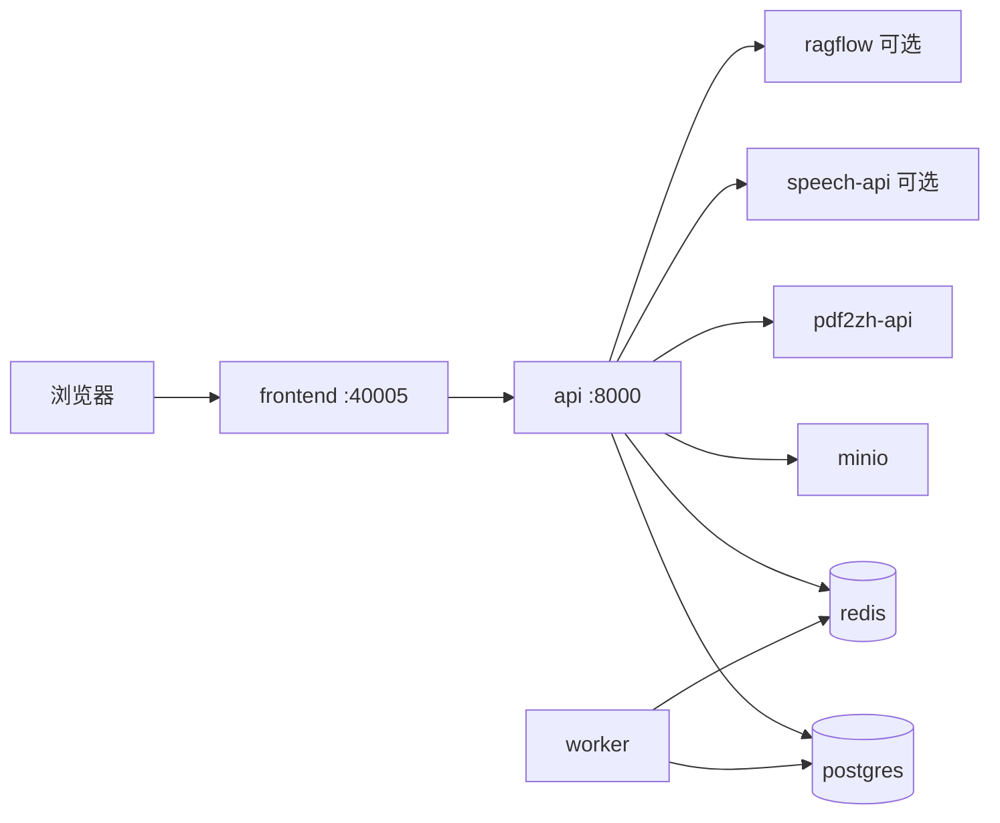

# 统一栈操作（索引）

> **完整说明已合并至 [运维手册](../operations/README.md)** 与 [部署指南](../operations/deployment.md)。  
> 本文仅保留 `stack.sh` 命令速查；架构图见 [系统架构](../operations/architecture.md)。

## 常用命令

```bash
bash scripts/stack.sh init-env          # 合并 platform/.env → 根 .env
bash scripts/stack.sh build [--profile knowflow] [--profile speech]
bash scripts/stack.sh up [--profile knowflow] [--profile speech]
bash scripts/stack.sh dev-up            # 开发：热重载 + Vite
bash scripts/stack.sh down
bash scripts/stack.sh ps
bash scripts/stack.sh logs api
bash scripts/stack.sh save              # 导出 images/benxi-*.tar.gz
bash scripts/stack.sh load images/…tar.gz
bash scripts/stack.sh backup
bash scripts/stack.sh restore backups/…
```

等价入口：`./dev.sh`（up）、`./dev.sh docker`（dev-up）、`./dev.sh stack …`（透传）。

## 远程依赖 + 本机开发

```bash
REMOTE_HOST=服务器IP ./dev.sh remote-dev
bash scripts/verify-remote-deps.sh
./dev.sh local
```

详见 [server-deps](../operations/server-deps.md) 与 [根目录运维部署指南](../../../运维部署指南.md) §6.5。

## 架构简图


