# 企业 AI 知识库平台 — 项目总体架构

> **开发实现说明书 · 第一篇 §1.1** · [说明书总览](implementation-manual.md)  
> **文档性质**：项目级架构总览（含架构图、核心流程、难点与实现方式）。  
> **版本对齐**：平台 **v4.8.6** · Monorepo `pdf_trans/`  
> **运维架构（推荐）**：[系统架构](../operations/architecture.md) · [运维手册](../operations/README.md)

---

## 1. 系统定位

本仓库是一个 **Monorepo**，包含两类能力：

| 能力域 | 说明 | 主要交付 |
|--------|------|----------|
| **企业控制面** | 身份、组织、文档库、权限、任务、系统功能插件 | `platform` API + `platform-frontend` |
| **文档智能** | 版式保留 PDF 翻译、知识库问答、文档对比、录音转写、网站收藏等 | `pdf2zh_next`、KnowFlow/RAGFlow、speech-service |

设计目标：**平台是权限与元数据的唯一真相**；重计算与 RAG 能力通过独立服务或可选栈接入，避免把业务逻辑绑死在单一进程里。

---

## 2. 系统上下文（C4 简化）

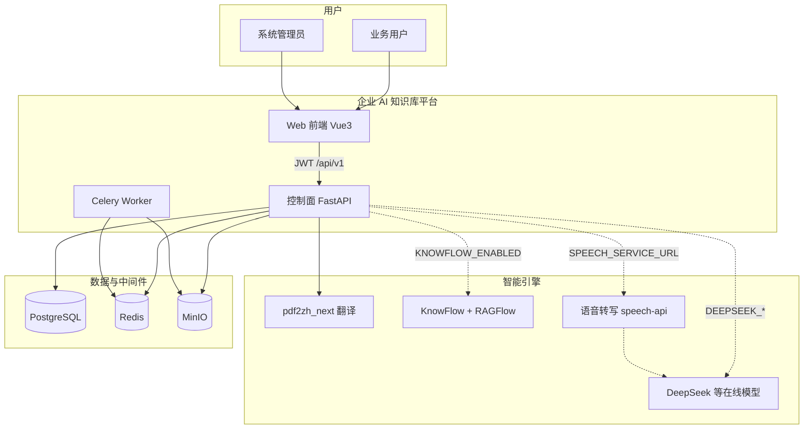

---

## 3. 物理部署架构

### 3.1 本地开发（默认）

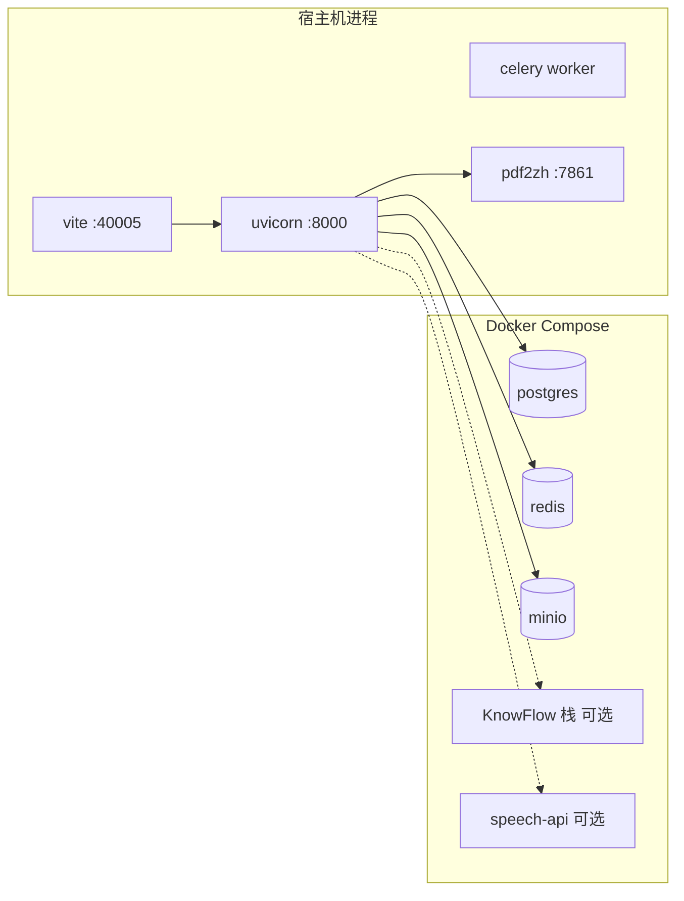

启动入口：`./dev.sh`（基础设施 Docker + 应用宿主机）；KnowFlow / 语音为附加 profile。

### 3.2 生产（amd64 全 Docker）

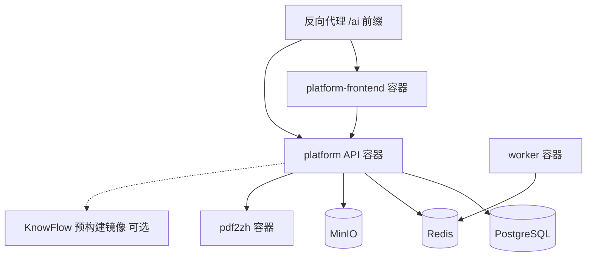

详见 [部署指南](../operations/deployment.md)。Apple Silicon 上 KnowFlow 需从 `third_party/KnowFlow` **源码构建** arm64 镜像。

### 3.3 服务端口一览

| 端口 | 组件 | 职责 |
|------|------|------|
| 40005 | platform-frontend | 管理端 UI（`/ai/` 前缀可配置） |
| 8000 | platform API | REST、`/docs` Swagger |
| 7861 | pdf2zh_next | PDF 翻译 REST |
| 9380 | RAGFlow Web | 知识问答 iframe、文档解析 UI |
| 5001 | KnowFlow Backend | RBAC、知识库 ACL 等扩展 API |
| 8765 | speech-api | FunASR 转写 + 说话人分离 |

---

## 4. 应用逻辑架构

### 4.1 后端分层

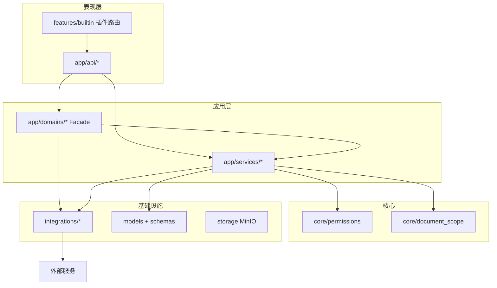

| 层 | 目录 | 职责 |
|----|------|------|
| API | `app/api/` | 薄控制器、鉴权 Depends、统一 `ApiResponse` |
| 域 | `app/domains/` | 跨模块门面（如 `KnowledgeGateway`） |
| 服务 | `app/services/` | 单业务聚合编排（文档已拆 `services/documents/`） |
| 核心 | `app/core/` | RBAC、文档 scope、异常与文案 |
| 集成 | `app/integrations/` | HTTP 客户端适配，禁止反向依赖 services |

### 4.2 前端结构

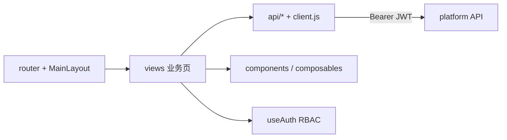

- 系统功能入口由 `GET /system/features` 驱动，**不硬编码**全部路由。
- 知识问答通过 `useKnowflowEmbed` + iframe 加载 RAGFlow UI。

### 4.3 功能插件注册

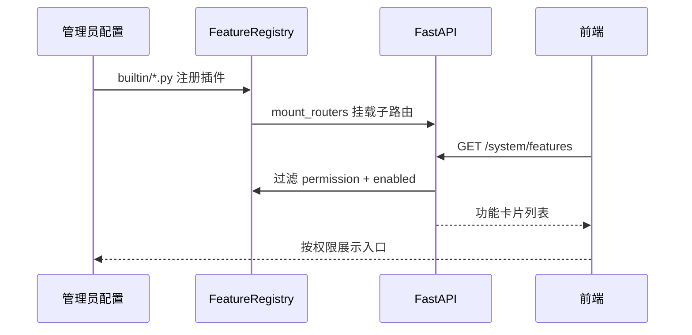

已实现插件示例：`translate`、`compare`、`rag`、`speech`、`agent_skills`、`subscriptions` 等（见 `platform/app/features/builtin/`）。

### 4.4 Agent Skills 与工具循环（v4.8.2）

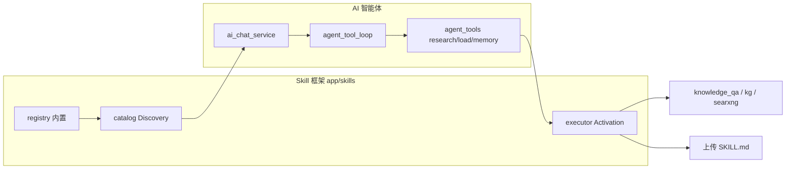

AI 首页对话不再 HTTP 层预检索；LLM 通过 `research` 按需调用内置 handler，通过 `load_uploaded_skill` 激活上传包。v4.4.1 起工具循环采用 **`AgentLoopSession` 短会话**：LLM / 外部 I/O 前释放 PostgreSQL 连接，工具执行前再打开，避免长流式占满连接池。v4.6.0 新增 **AgentKit 包拆分**，将多智能体核心组件拆分为 11 个独立 Python 包。v4.5.0 新增 **AIP 智能体互联**（发现/调用/外部登记）。v4.8.x 将旧 `kg_palantir` 重构为 `ontology`（本体建模）与 `kg`（图探索）双模块，`digital_robot` 数字人功能下线，Neo4j 基础服务提取至 `agentkit.graph` 统一管理。路由 regex 收敛至 `agent_routing_signals`，planner 与 supervisor 共用。详见 [Agent Skills 实现](../implementation/agent-skills-implementation.md) 与 [系统架构](../operations/architecture.md#容量与连接池v460)。

---

## 5. 核心业务域

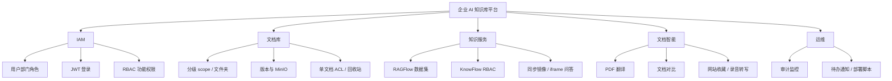

| 域 | 数据主存储 | 外部依赖 |
|----|------------|----------|
| IAM | PostgreSQL | — |
| 文档库 | PostgreSQL + MinIO | KnowFlow（可选同步） |
| 知识服务 | PostgreSQL（link/mirror/scope 登记） | RAGFlow API、KnowFlow Backend |
| PDF 翻译 | PostgreSQL `jobs` | pdf2zh_next |
| 文档对比 | PostgreSQL `compare_jobs` | KnowFlow 检索（可选） |
| 网站收藏 | PostgreSQL `subscriptions` | 网页抓取、DeepSeek 摘要 |
| 语音 | PostgreSQL `meeting_record` | speech-api、DeepSeek 总结 |

---

## 6. 核心流程

### 6.1 认证与会话

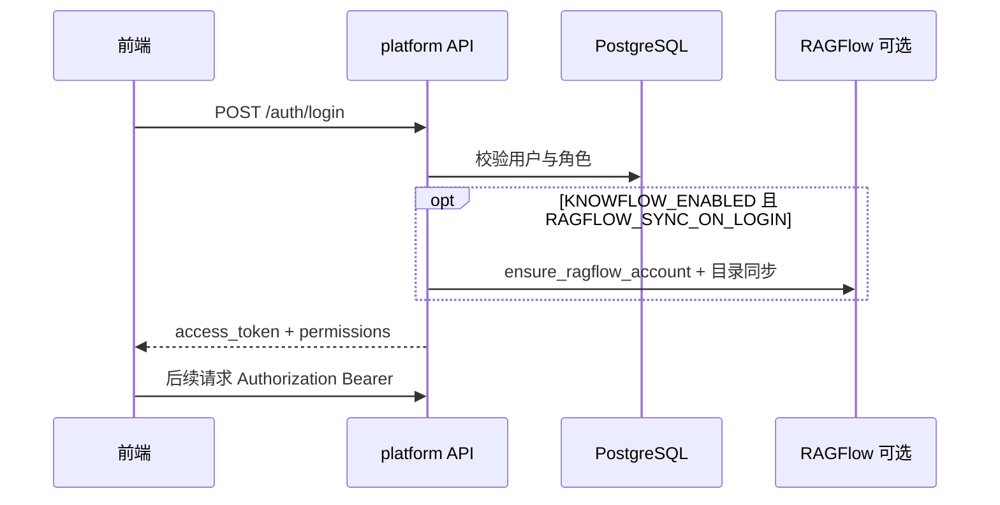

**实现要点**：JWT 无状态；`useAuth` 缓存 `/auth/me` 的 `permissions` 控制菜单与按钮。生产建议 `RAGFLOW_SYNC_ON_LOGIN=false`，改在进入知识问答时 `RAGFLOW_SYNC_ON_EMBED` 或后台 `sync=1` 补同步。

### 6.2 文档上传与版本

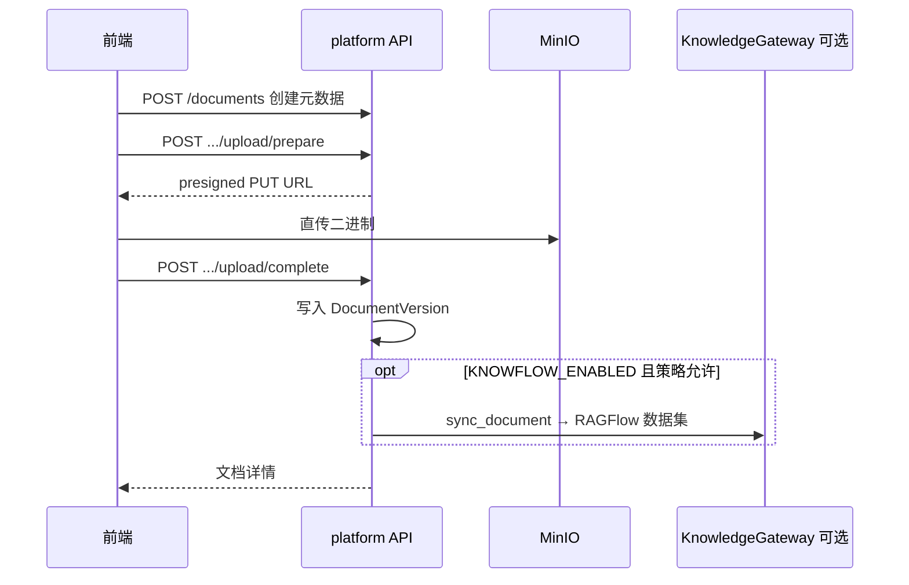

**实现要点**：大文件不经 API  body，降低超时风险；同步知识库可同步执行（大 PDF 会拖慢 complete），也可由用户点击「同步知识库」或 embed 时批量补同步。

### 6.3 文档权限判定（平台侧）

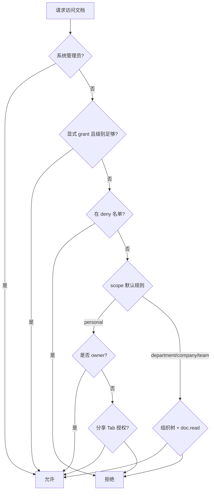

代码：`app/core/permissions.py`、`can_access_document`；与 KnowFlow **解耦**——检索、对比前必须先算平台侧 `allowed_document_ids`。

### 6.4 知识服务：双轨权限与同步

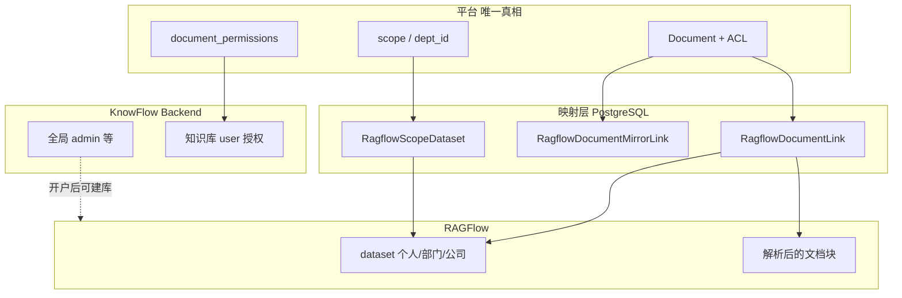

**同步路径**（统一经 `KnowledgeGateway`）：

1. `ensure_user_scope_datasets` — 按用户建立/登记分级 dataset。  
2. `sync_document_to_knowflow` — 上传内容到对应 scope 的 dataset。  
3. `sync_document_kb_grants` — 按平台 ACL 调整 RAGFlow 侧 KB 用户权限（不复制文档）。  
4. `sync_shared_document_mirror` — 他人「可查询及以上」分享 → 镜像到接收者**个人库**。

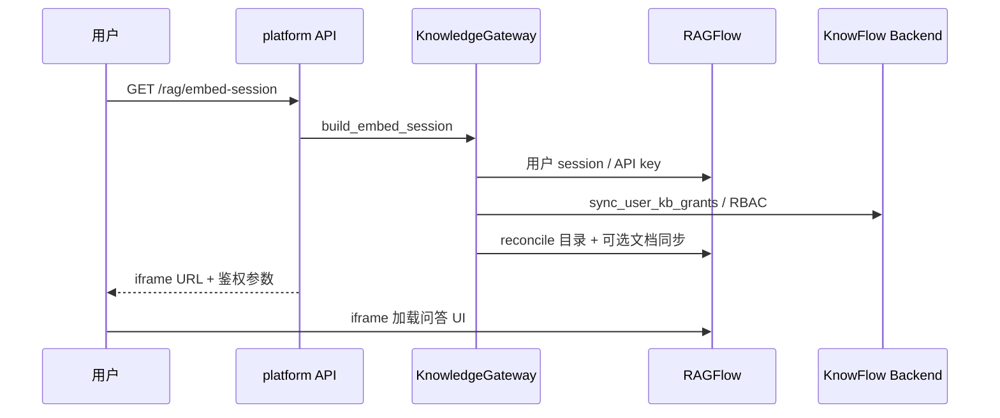

### 6.5 PDF 翻译任务

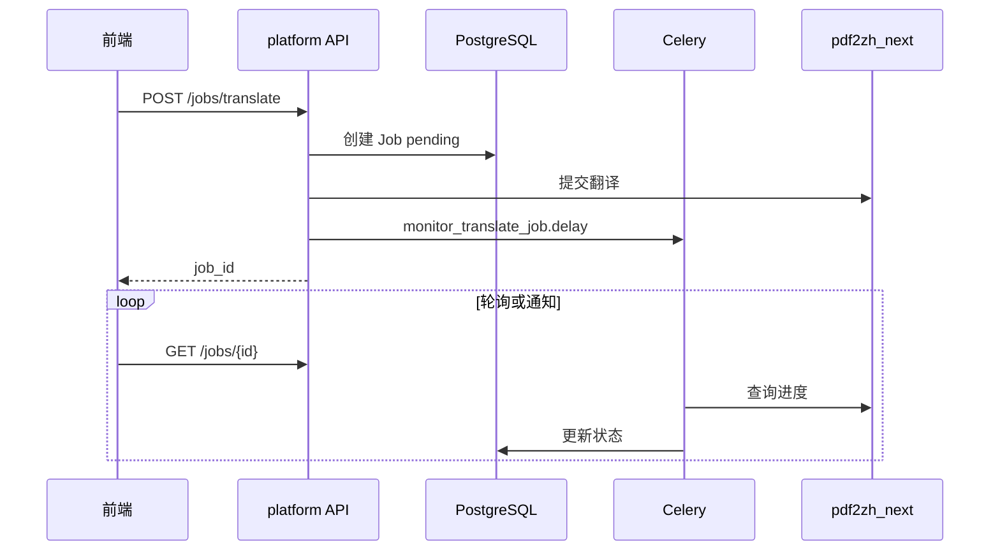

**实现要点**：长任务与 HTTP 请求分离；失败状态持久化在 `jobs` 表供前端展示。

### 6.6 文档对比（异步）

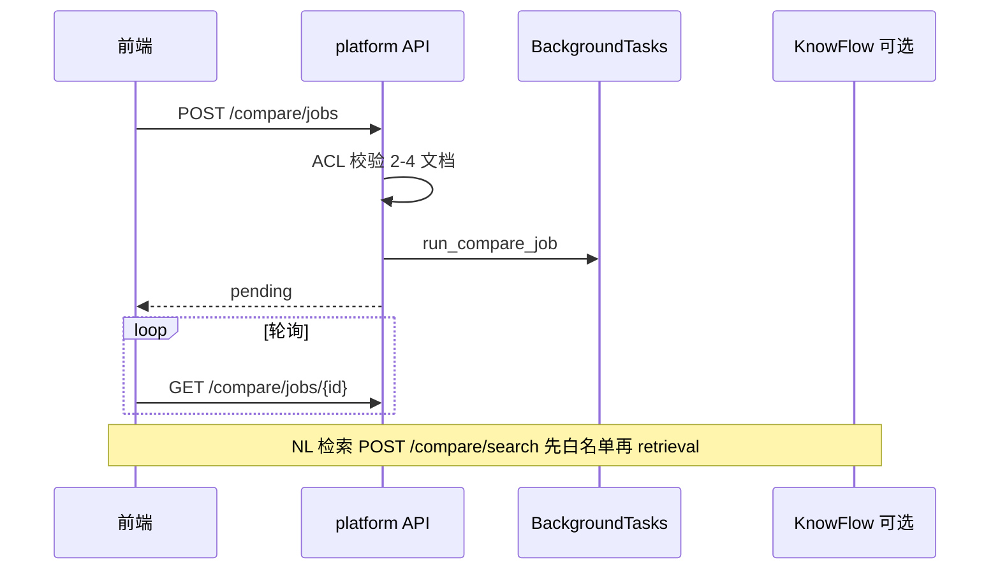

**实现要点**：v2.0 起 diff **不阻塞** HTTP；语义检索与 diff 色系分离，权限仍由平台过滤 `platform_document_id`。

### 6.7 网站收藏与内容导入

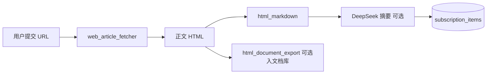

**实现要点**：`document_scope` / `content_import_scope` 约束导入目标分级；摘要写入 `summary` 与正文顶部 HTML，列表页展示。

---

## 7. 数据架构

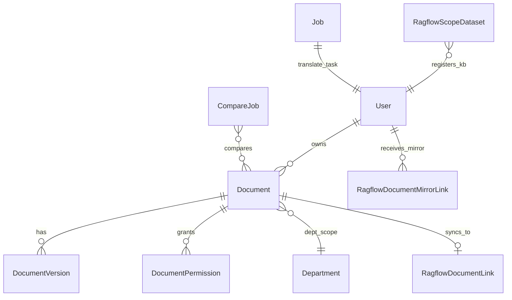

| 存储 | 内容 | 一致性 |
|------|------|--------|
| **PostgreSQL** | 用户、组织、文档元数据、ACL、任务、对比、RAG 链接、订阅 | 事务 + 启动时 schema migrate |
| **PostgreSQL 只读副本** | 同主库 schema（流复制） | 配置 `DATABASE_READ_URL` 后，只读 API 经 `get_read_db` 查询；未配置则与主库合一 |
| **MinIO** | 文档二进制、版本文件 | 与 DB 通过 version 记录关联；删除文档 Celery 异步清理 |
| **Redis** | Celery broker、缓存 | 可丢次要缓存，任务状态以 DB 为准 |
| **RAGFlow MySQL** | KnowFlow 栈内部（租户、LLM 配置） | 平台通过 API/模板账号同步 LLM，不直接当业务库 |

---

## 8. 系统难点与实现方式

本节是架构文档的核心：列出真实工程难点、为何难、以及本仓库的**具体落点**。

### 8.1 双套权限模型（平台 ACL vs RAGFlow 知识库）

| 难点 | 说明 |
|------|------|
| **问题** | RAGFlow 自带用户、dataset、KB 级权限；平台有 scope + 单文档 grant/deny。两套不一致会导致「平台看不见但 RAG 能搜到」或相反。 |
| **原则** | **平台 `can_access_document` 为唯一真相**；KnowFlow 只做解析、检索与 UI，不用其 RBAC 做文档级授权。 |
| **实现** | ① API 层检索/对比先算 `allowed_document_ids`；② `ragflow_scope_service.sync_document_kb_grants` 把平台 ACL 映射到 KB user 权限；③ 个人分享用 `RagflowDocumentMirrorLink` 镜像到接收者个人 dataset；④ 个人库强制 `me` 可见（`enforce_personal_kb_private_for_user`）。 |
| **代码** | `app/core/permissions.py`、`app/services/ragflow_scope_service.py`、`app/services/ragflow_sync_service.py`、`app/domains/knowledge/gateway.py` |

### 8.2 KnowFlow 集成：账号、数据集与同步时机

| 难点 | 说明 |
|------|------|
| **问题** | 每用户独立 RAGFlow 账号（`mapped`）、多 scope 多 dataset、登录全量同步耗时长、栈未启动时前端需友好降级。 |
| **实现** | ① `ragflow_identity_service` 开户与 session；② `knowflow_catalog_service.reconcile_user_knowflow_catalog` 建库+授权+限量同步；③ 配置项拆分：`RAGFLOW_SYNC_ON_LOGIN` / `RAGFLOW_SYNC_ON_EMBED` / `ragflow_sync_doc_limit`；④ `KnowledgeGateway.stack_reachable()` + `LocalKnowflowClient` 回退本地检索；⑤ Facade 统一入口避免散落 import。 |
| **代码** | `integrations/knowflow_client.py`、`services/ragflow_identity_service.py`、`services/knowflow_catalog_service.py` |

### 8.3 大文件上传与知识库同步延迟

| 难点 | 说明 |
|------|------|
| **问题** | 上传若走 API 易超时；同步 KnowFlow 解析大 PDF 阻塞用户感知。 |
| **实现** | ① MinIO presigned 直传；② `upload/complete` 与 sync 解耦，支持详情页「同步知识库」与 embed 时批量补同步；③ 对比/翻译等重任务走 BackgroundTasks 或 Celery。 |
| **代码** | `api/documents.py` upload 流程、`services/ragflow_sync_service.sync_document_to_knowflow` |

### 8.4 文档分级与组织树演进（scope v2）

| 难点 | 说明 |
|------|------|
| **问题** | `company` / `department` / `team` / `personal` 与组织树 depth 绑定；历史数据需迁移；列表 Tab 与文件夹逻辑复杂。 |
| **实现** | ① `document_scope.py` 统一判定；② 启动时 `ensure_document_scope_tier_v2` 等 migrate；③ 前端文档中心按 scope Tab + 文件夹浏览；④ 公司级 scope 与 `scope_key_for_document(db, document)` 供知识库路由（**必须传入 db**，避免运行时 500）。 |
| **代码** | `app/core/document_scope.py`、`app/schema_migrate.py`、`DocumentsView.vue` |

### 8.5 功能插件化与前后端路由对齐

| 难点 | 说明 |
|------|------|
| **问题** | 功能多、权限码细，硬编码菜单难维护；部分功能仅占位 `enabled=false`。 |
| **实现** | ① `FeaturePlugin` + `FeatureRegistry` 注册路由与卡片；② 前端 `MainLayout` / `SystemFunctionsView` 读 `/system/features`；③ 各插件独立 `features/builtin/*.py` 挂载 API。 |
| **待办** | 路由 path 与插件 id 对齐表（见 [分层架构](./layered-architecture.md) P3）。 |

### 8.6 知识问答 iframe 与 SSO

| 难点 | 说明 |
|------|------|
| **问题** | RAGFlow UI 需直连源站以保留溯源、PDF 定位；跨域 cookie / 鉴权复杂。 |
| **实现** | ① `GET /rag/embed-session` 下发 iframe URL 与 auth；② 可选 `KNOWFLOW_UI_PROXY_PREFIX` 同源代理；③ `knowflow-theme` 注入品牌 CSS/JS；④ `useKnowflowEmbed` 封装加载与错误态。 |
| **代码** | `app/domains/knowledge/meta_service.py`、`composables/useKnowflowEmbed.js` |

### 8.7 Monorepo 多运行时与架构差异部署

| 难点 | 说明 |
|------|------|
| **问题** | 开发机 arm64 无法直接用 amd64 预构建 KnowFlow 镜像；生产需全 Docker 与 `.env.docker` 改写。 |
| **实现** | ① `dev.sh` 统一子命令；② `docker-compose.knowflow.yml` 源码构建 + `docker-compose.knowflow.amd64.yml` 预构建；③ `scripts/deploy.sh` 生成 `knowflow.env.docker`、不改密钥只改服务名。 |
| **文档** | [部署指南](../operations/deployment.md)、`scripts/README.md` |

### 8.8 文档对比：异步 diff + 可选语义检索

| 难点 | 说明 |
|------|------|
| **问题** | 多文档 diff CPU 密集；NL 检索需 chunk 与页码；权限必须贯穿。 |
| **实现** | ① `compare` 插件 + `BackgroundTasks` 异步 job；② 前端轮询状态；③ `/compare/search` 独立接口，metadata 带 `platform_document_id` 过滤；④ 产品设计见 [文档对比](../platform/doc-compare-product-design.md)。 |

### 8.9 外部内容管道（网站收藏、公众号 feed）

| 难点 | 说明 |
|------|------|
| **问题** | 网页结构不一、反爬、HTML 噪声；摘要需与权限 scope 一致入库。 |
| **实现** | ① `web_article_fetcher` + `html_markdown` 归一正文；② `subscription_service` / `subscription_summary_service`；③ `content_import_scope` 限制导入分级；④ 与文档库、KnowFlow 同步复用现有文档管道。 |

### 8.10 可观测性与错误体验

| 难点 | 说明 |
|------|------|
| **问题** | 外部栈失败时若暴露原始 500，用户难以理解（如 KnowFlow 未启动）。 |
| **实现** | ① `AppError` + 中文 `user_messages`；② 前端 `parseResponse` 统一解析；③ 同一操作避免 `n-alert` 与 `message` 重复报错（`utils/uiMessage.js`）；④ 审计走 `/monitor/audit-logs`。 |

---

## 9. 难点—实现对照总表

| # | 难点 | 策略 | 主要模块 |
|---|------|------|----------|
| 1 | 双套权限 | 平台 ACL 为准 + KB grant 同步 + 分享镜像 | `ragflow_scope_service`, `permissions` |
| 2 | KnowFlow 开户与同步 | mapped 账号 + 分级 dataset + 可配置同步时机 | `knowflow_catalog_service`, `KnowledgeGateway` |
| 3 | 大文件与阻塞 | presigned 上传 + 异步任务 | documents upload, Celery |
| 4 | scope 演进 | migrate + `document_scope` 单点判定 | `schema_migrate`, `document_scope` |
| 5 | 功能扩展 | FeatureRegistry 插件 | `features/builtin/*` |
| 6 | iframe 问答 | embed-session + 主题代理 | `rag.py`, `useKnowflowEmbed` |
| 7 | 跨架构部署 | compose 分文件 + deploy 脚本 | `scripts/`, `docker-compose.*` |
| 8 | 文档对比 | 异步 job + ACL 白名单检索 | `compare` 插件 |
| 9 | 外部内容 | fetch + markdown + 摘要 | `integrations/web_*`, `subscription_*` |
| 10 | 错误体验 | 统一 ApiResponse + 中文文案 | `core/exceptions`, `client.js` |
| 11 | Agent Skills | Discovery 常驻 + tool loop 按需 Activation | `app/skills/*`, `agent_tool_loop` |

---

## 10. 技术栈摘要

| 层次 | 技术 |
|------|------|
| 前端 | Vue 3、Vite、Naive UI、Vue Router |
| 后端 | FastAPI、SQLAlchemy 2、Pydantic、Celery |
| 数据 | PostgreSQL、Redis、MinIO |
| 翻译 | pdf2zh_next / BabelDOC |
| 知识 | RAGFlow + KnowFlow（可选） |
| 语音 | FunASR Docker、CAM++ 说话人 |
| 文档站 | MkDocs Material |

---

## 11. 相关文档索引

| 主题 | 文档 |
|------|------|
| 运维与端口 | [系统架构](../operations/architecture.md) · [配置说明](../operations/configuration.md) |
| 分层与迁移 | [分层架构](./layered-architecture.md) |
| RBAC 与文档 ACL | [权限模型](../platform/permission-model.md) |
| 功能插件开发 | [功能插件](../platform/feature-plugins.md) |
| Agent Skills | [Agent Skills 实现](../implementation/agent-skills-implementation.md) |
| 文档对比产品 | [文档对比](../platform/doc-compare-product-design.md) |
| 快速上手 | [getting-started.md](../getting-started.md) |
| 部署 | [部署指南](../operations/deployment.md) |

---

## 12. 文档维护说明

- 新增**跨模块**能力（新外部栈、新权限维度）时，应更新本文 **§2、§5、§8** 三节。  
- 仅单模块实现细节变更，优先更新对应专题文档，本文只改摘要表。  
- 架构图使用 Mermaid，需在 MkDocs 中启用 `pymdownx.superfences`（已配置）。
