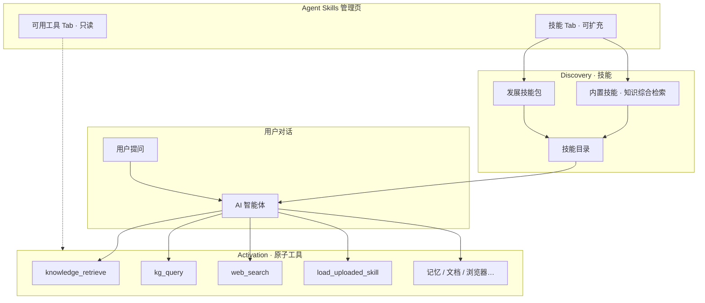
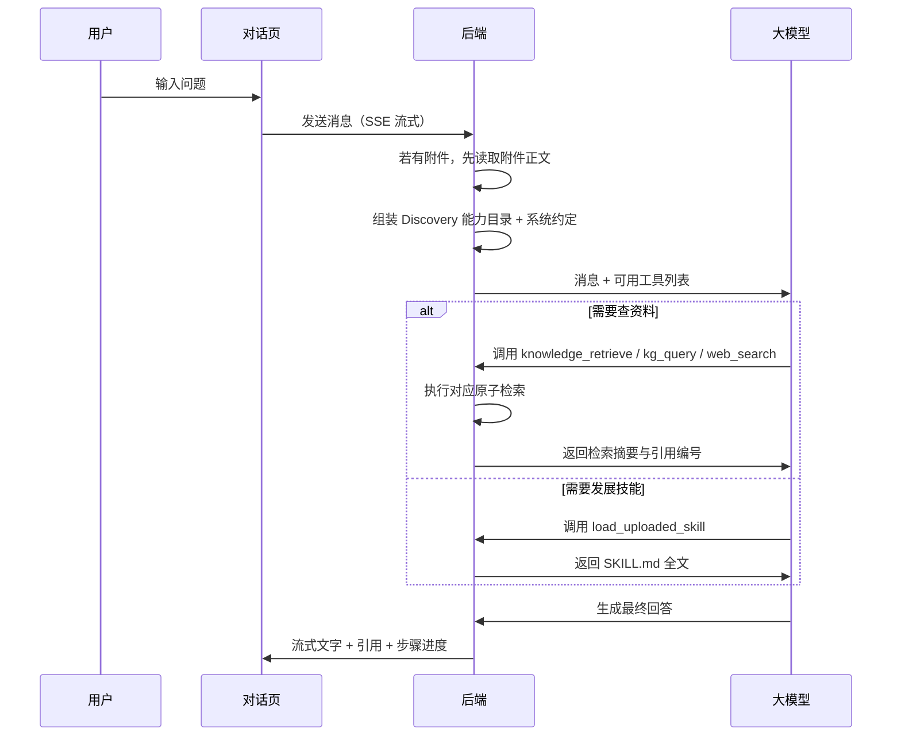

# Agent Skills 实现说明

> **适用读者**：产品经理、运维、后端/前端开发  
> **版本**：v4.5.0 · [开发说明书总览](../development/implementation-manual.md)  
> **配套阅读**：[功能实现说明 §4.8 / §14](../operations/feature-implementation.md)（偏业务视角）

---

## 阅读指南

| 你想了解… | 建议阅读 |
|-----------|----------|
| Agent Skills 是什么、解决什么问题 | [§1 实现总览](#1-实现总览v421) |
| 用户发一条消息时系统做了什么 | [§3 一次对话的完整流程](#3-一次对话的完整流程) |
| 提示词如何组装 | [§10 Prompt 组装](#10-prompt-组装与提示词实现) |
| 核心方法与调用链 | [§11 核心方法](#11-核心方法与调用链) |
| 内置能力与上传包的区别 | [§4 Skills](#4-skills内置与上传) |
| 管理员如何上传、启停 Skill | [§7 管理与配置](#7-管理与配置) |
| 开发如何扩展新能力 | [§9 扩展指南](#9-扩展指南) |
| 源码在哪个目录 | [§8 代码结构](#8-代码结构开发者速查) |

---

## 术语表

| 术语 | 通俗解释 |
|------|----------|
| **Tool / 原子工具** | 平台固定、不可扩充的 function calling 原语：`web_search`、`knowledge_retrieve`、`kg_query`、记忆、文档、浏览器等。 |
| **Skill / 技能** | 对原子工具的编排与选用说明。**内置技能**（平台预置）+ **发展技能**（上传 / Agent 生成，可扩充）。 |
| **内置技能** | 多工具编排说明，当前仅 `knowledge-research`（知识综合检索）。 |
| **原子工具** | `web_search`、`knowledge_retrieve`、`kg_query` 等单能力，在「可用工具」Tab 展示，**不是**技能。 |
| **发展技能** | 上传或 Agent 生成的 `SKILL.md` 包；可编排工具或纯指令。 |
| **Agent Skills 管理页** | Tab：**可用工具**（原子、只读）→ **技能**（内置 + 发展）→ **Agent 记忆**。 |
| **Discovery** | 注入**技能**目录摘要，不含 `SKILL.md` 正文。 |
| **Activation** | 模型调用**原子工具**，或对发展技能 `load_uploaded_skill`。 |
| **Tool Loop** | 模型与工具多轮交互，直到给出最终回答。 |
| **SKILL.md** | 上传型 Skill 核心文件（YAML frontmatter + Markdown 正文）。 |
| **系统功能页** | 翻译、文档对比、报告生成等独立长流程功能——**既非 Tool 也非 Skill**，不出现在 Agent Skills 管理页与 Discovery 目录。 |

---

## 1. 实现总览（v4.5.0）

AI 首页对话采用 **Discovery + Activation** 两阶段：

| 阶段 | 代码入口 | 注入内容 |
|------|----------|----------|
| Discovery | `build_agent_catalog_prompt()` | Skill 名称、描述、选用规则（**不含** `SKILL.md` 正文） |
| Activation | `iter_agent_tool_loop()` + `execute_agent_tool()` | 模型调用原子工具或 `load_uploaded_skill` 加载发展技能 |

入口函数：`ai_chat_service.iter_chat_with_ai_agent_stream()` → 组装 messages → `iter_agent_tool_loop()` 多轮 tool-calling（默认最多 40 轮，`agent_max_tool_rounds`）。

---

## 2. 整体架构（一图读懂）



（已移除 `research` 组合工具；综合检索由内置技能 `knowledge-research` 指导模型依次调用原子工具。）

---

## 3. 一次对话的完整流程



### 3.1 仍由系统自动处理的情况（不经过工具）

| 场景 | 原因 |
|------|------|
| 用户上传了临时附件 | 附件未入库，必须在对话前读入，否则模型看不到 |
| 用户说「请记住…」 | 明确记忆指令，直接写入用户 `MEMORY.md` |
| 问「怎么上传文档」等平台用法 | 注入内置平台说明，无需检索 |

### 3.2 前端看到的「步骤进度」

后端通过 SSE 推送 `workflow` 事件（如「正在检索知识库」），由 `AiChatPanel` + `AgentWorkflowProgress` 展示。复合任务另有 checklist（`plan_tasks` / `task_started` / `task_done`）。过程在 workflow 区可见，回答区仅在全部步骤结束后输出一次最终 Markdown。

### 3.3 Mermaid 富文本渲染

| 模块 | 职责 |
|------|------|
| `markdown.js` | 识别裸 Mermaid 块、升级围栏为 ` ```mermaid ` |
| `mermaidSanitize.js` | LLM 常见语法陷阱清洗（时序图引号、流程图标签等）；失败时激进模式重试 |
| `mermaidRender.js` | 按需 `import('mermaid')`；视口内即时渲染；保留 `<pre>` 占位避免重挂载空白 |
| `richMarkdown.js` | marked 渲染 + `mountRichMediaInElement` 统一挂载 |
| `richContentLifecycle.js` | KeepAlive 失活时 `unmountMermaidInElement` 释放 DOM |

---

## 4. 技能：内置与发展

> **与原子工具区分**：工具在 `agent_tools.py`；技能在 `skills/`。翻译、文档对比等系统功能页不在此列。

### 4.1 内置技能（多工具编排）

仅 **1** 项对外展示；单能力检索（联网 / 知识库 / 图谱）在「可用工具」Tab，不作为技能重复列出。

| 名称 | 含义 | 编排工具 |
|------|------|----------|
| knowledge-research | 知识综合检索 | `knowledge_retrieve` + `kg_query` + `web_search` |

`web-search`、`knowledge-search`、`kg-palantir` 仍保留内部 handler（`catalog_visible=False`），供原子工具 `web_search` / `knowledge_retrieve` / `kg_query` 执行时调用。

### 4.2 发展技能（上传 / Agent 生成）

- **结构**：文件夹至少含 `SKILL.md`（YAML frontmatter + Markdown 正文）；可选 `references/`、`templates/`、Python 入口脚本。  
- **存储**：`agent_skill_service` 写入 MinIO，`scope=system` 全员共享。  
- **典型用途**：输出格式规范（Mermaid 图）、行业话术、检查清单。  
- **示例**：`examples/agent-skills/mermaid-diagram/`

**激活方式**：`build_agent_catalog_prompt()` 在 system 中列出摘要；模型判断任务匹配后调用 `load_uploaded_skill(skill_name)`，服务从对象存储读取 `SKILL.md` 全文注入 tool 结果。含 Python 脚本时可用 `run_skill_script` 在沙箱执行（`skill_script_executor`），仅返回 `conclusion`。

---

## 5. 平台原子工具一览

> 源码：`agent_tools.py`（运行时）+ `agent_tool_registry.py`（管理页）。  
> 已移除组合工具 `research`，改由内置技能指导多工具编排。

| 分类 | 代表工具 | 说明 |
|------|----------|------|
| 联网 | `web_search` | 互联网摘要检索 |
| 知识库 | `knowledge_retrieve` | 权限内文档片段 |
| 图谱 | `kg_query` | 本体实体与关系 |
| 技能管理 | `load_uploaded_skill`、`create_uploaded_skill`、`run_skill_script`… | 发展技能 CRUD / 加载 |
| 记忆 | `read_agent_memory`、`append_agent_memory` | MEMORY.md |
| 文档 | `rename_document`、`move_document`… | 文档库操作 |
| 平台 | `create_todo`、`send_notification`… | 待办与通知 |
| 浏览器 | `browser_navigate`、`browser_snapshot`… | RPA（需开关） |

单轮对话工具调用上限默认 **40** 次（`agent_max_tool_rounds`）。

### 5.1 多路检索如何选通道

模型按内置技能「知识综合检索」编排，依次或按需调用 `knowledge_retrieve` / `kg_query` / `web_search`。各原子工具内部实现：

1. **知识库** → `knowledge_qa_service.retrieve_hits_for_qa`  
2. **本体图谱** → `kg_service.retrieve_kg_context_for_question`  
3. **联网** → `searxng_service`

`agent_intent.py` 可辅助判断是否需要某类检索（寒暄跳过等）。权限与 SearXNG 开关决定哪些原子工具出现在 tool spec 中。

---

## 10. Prompt 组装与提示词实现

### 10.1 system 消息分层

`prompt_budget.build_bounded_chat_messages()` 将下列片段拼入 **单条 system**，再追加 history 与当前 user：

| 层 | 来源 | 内容 |
|----|------|------|
| 常驻骨架 | `agent_resident.build_ai_home_resident_prompt()` | 身份「小析」、记忆优先、工具选用约定、禁止项（短 prompt，细节交给 Skill 目录） |
| 用户记忆 | `agent_memory_service.build_memory_prompt_context()` | 每轮注入 `MEMORY.md`；名称与偏好以记忆为准 |
| 运行时 | `agent_runtime.build_runtime_context()` | 频道、用户 id、会话 id |
| Discovery | `catalog.build_agent_catalog_prompt()` | Skills 目录与选用规则 |
| 平台知识 | `assistant_knowledge.build_platform_knowledge()` | 用户问平台用法时注入（`is_platform_usage_message` 触发） |
| 附件/检索 | `retrieval_context` + `context_instruction` | 临时附件正文或 tool 返回的检索摘要 |

### 10.2 常驻 system 提示词（`agent_resident.py`）

短 prompt 原则：身份 + 边界 + 「够用即停」；各专精域工具列表在 `agent_config.AGENT_INSTRUCTION_BLOCKS`。

核心约定摘录：

```
约定：简体中文；默认自称「小析」，【用户记忆】有名称则以记忆为准。
工具：按会话 Skill 目录选用；够用即停，勿堆砌调用。
禁止：操作用户本地文件；无工具却声称已完成；绕过权限。
```

子任务编排时专精智能体启用 `task_mode`：只调用工具完成操作，面向用户的完整总结由父智能体 `_synthesize_from_task_results` 统一输出。

### 10.2.1 多智能体编排（`agent_orchestrator.py` + `agent_supervisor.py`）

| 组件 | 职责 |
|------|------|
| `tasks_from_routes` | 将 LLM 路由结果转为最小任务清单（一条路由一项） |
| `_execute_orchestrated_tasks` | 顺序执行、规则验收、每任务最多 2 次重试 |
| `workflow_plan_tasks` / `workflow_task_event` | SSE workflow 事件，驱动前端 checklist |
| `_synthesize_from_task_results` | 全部子任务完成后生成唯一最终回答 |

前端 `agentWorkflow.js` 的 `applyTaskPlan` / `upsertTaskPlanItem` 与 `AgentWorkflowProgress.vue` 展示 ○ / 转圈 / ✓ / !。

### 10.2.2 流式回答区

- 工具 loop 与多 hop 专精路径不向客户端推送中间 `replace`
- 收尾顺序：`workflow_finished` → 一次 `replace`（最终 Markdown）→ `done`
- 过程细节仅在 workflow 时间线可见（类似 Cursor Agent）

### 10.3 Discovery 目录提示词（`catalog.build_agent_catalog_prompt`）

常驻目录仅含 **catalog_tier=resident** 的高频 Skill，格式为路由条件而非功能介绍：

```
- `knowledge-research` [builtin] — Use when: … | Don't: … | Output: …
```

加载规则（亦写入 `agent_resident`）：

1. 每次回复前扫描 `available_skills`
2. 明确匹配才加载 SKILL.md；多匹配取最具体；无匹配不加载
3. 一次只加载一个

低频内置能力不在常驻列表；`search_tools` 可返回 extended Skill 路由摘要。

### 10.3.1 工具动态发现（`agent_tool_search.py`）

| 机制 | 说明 |
|------|------|
| `search_tools` | 主 Agent 默认可见；按关键词返回工具定义 + 示例，并解锁工具名 |
| `run_tool_batch` | 批量执行只读/检索工具，中间结果不进 LLM 上下文 |
| `CORE_TOOL_NAMES` | 检索、记忆、run_skill_script 等高频工具默认可用 |
| `TOOL_USE_EXAMPLES` | 各工具 1–5 条真实调用示例，附在 spec.examples |

专精子 Agent 仍使用 `allowed_tool_names` 白名单（工具集较小，不强制 search）。

### 10.3.2 外部写入限速

常驻 system 提示要求：批量写入、避免逐条循环、HTTP 429 等待重试。

### 10.4 附件上下文指令（`agent_intent.py`）

有临时上传且非寒暄时，`plan_agent_tools()` 设 `use_attachment=True`，并注入：

```
以下是用户上传的临时附件正文（未写入知识库），请优先且主要依据附件内容回答。
若附件不足以回答，请明确说明缺口，不要编造附件中不存在的内容。
```

### 10.5 Token 预算（`prompt_budget.py`）

| 配置项 | 默认作用 |
|--------|----------|
| `chat_prompt_max_chars` | 整次请求 messages 总字符上限 |
| `chat_history_max_messages` / `chat_history_max_chars` | 历史轮次裁剪 |
| `chat_context_max_chars` | Discovery + 检索上下文上限 |
| `chat_user_message_max_chars` | 当前用户消息上限 |
| `chat_max_output_tokens` | LLM 输出 token 上限（0=不限制） |

超出预算时 `fit_messages_to_total_budget()` 优先保留 system 骨架、最近 history 与当前 user。

---

## 11. 核心方法与调用链

```mermaid
sequenceDiagram
  participant API as ai_chat.py
  participant SVC as ai_chat_service
  participant CTX as agent_context_service
  participant LOOP as agent_tool_loop
  participant TOOLS as agent_tools
  participant RES as skill_chat_service

  API->>SVC: iter_chat_with_ai_agent_stream
  SVC->>SVC: plan_agent_tools (agent_intent)
  SVC->>CTX: resolve_agent_prompt_layers
  CTX->>CTX: build_agent_catalog_prompt
  SVC->>SVC: build_bounded_chat_messages
  SVC->>LOOP: iter_agent_tool_loop
  LOOP->>TOOLS: chat_completion_message_async + tools
  LOOP->>TOOLS: execute_agent_tool
  TOOLS->>RES: resolve_combined_research_async (research)
  TOOLS->>TOOLS: load_uploaded_skill / memory / CRUD
  LOOP-->>SVC: workflow events + final reply
```

| 方法 | 文件 | 职责 |
|------|------|------|
| `iter_chat_with_ai_agent_stream` | `ai_chat_service.py` | SSE 流式入口：意图计划 → 附件 → 组装 messages → tool loop |
| `plan_agent_tools` | `agent_intent.py` | 决定是否预读附件；检索交给 tool loop |
| `resolve_agent_prompt_layers` | `agent_context_service.py` | 聚合 catalog / platform_knowledge / runtime |
| `build_bounded_chat_messages` | `prompt_budget.py` | system + history + user，受字符预算约束 |
| `iter_agent_tool_loop` | `agent_tool_loop.py` | 多轮 LLM + tool_calls，temperature=0.3 |
| `build_agent_tool_specs` | `agent_tools.py` | 按用户权限过滤可用 OpenAI tools 定义 |
| `execute_agent_tool` | `agent_tools.py` | 分发到 research / load / memory / skill CRUD |
| `resolve_combined_research_async` | `skill_chat_service.py` | KB + KG + Web 并行检索与引用合并 |
| `maybe_write_user_memory` | `agent_context_service.py` | 检测「请记住…」写入 `MEMORY.md` |

### 11.1 对话前系统 Hook（不经 tool）

| 场景 | 实现 |
|------|------|
| 临时附件 | `plan_agent_tools` → `_resolve_attachment_context` → `ai_chat_attachment_service.build_attachment_context` |
| 记忆写入 | `maybe_write_user_memory` → `extract_memory_note` → `append_user_memory` |
| 平台用法 | `build_platform_knowledge(db, user)` 注入 system |

---

## 6. 权限与安全

Skill 是否出现在 Discovery 目录，需同时满足：

1. 管理员未关闭（内置 binding 或上传包 `enabled`）  
2. 对应系统功能插件已启用  
3. 当前用户具备功能权限（如 `feature.knowledge_search`）  

检索时 **文档 ID 会按用户权限过滤**，避免模型引用无权限材料。常驻 system 提示中也包含禁止越权、禁止编造引用等硬性约定（`agent_resident.py`）。

---

## 7. 管理与配置

| 操作 | 入口 / 接口 |
|------|-------------|
| 查看平台工具（只读） | 系统设置 → Agent Skills → **可用工具** |
| 查看 / 启停内置 Skill | 同上 → **Skills** → 内置表格 |
| 上传 ZIP / 文件夹 | 同上 → **Skills** → 上传区 |
| 试调用内置 Skill | 管理端 `POST /admin/agent-skills/invoke` |
| 编辑用户记忆 | Agent Skills → **Agent 记忆** 或 `/ai-chat/agent-memory` |

**API**：

| 接口 | 说明 |
|------|------|
| `GET /admin/agent-skills/tools` | 平台工具目录（只读） |
| `GET /admin/agent-skills/registry` | Skill 注册表（不含系统功能占位） |

**主要配置项**：

| 配置 | 默认 | 说明 |
|------|------|------|
| `agent_max_tool_rounds` | 40 | 单轮最多工具调用次数 |
| `agent_skill_max_zip_mb` | 20 | 上传 ZIP 大小上限 |
| `agent_skill_max_total_mb_per_skill` | 10 | 单个 Skill 总体积上限 |

---

## 8. 代码结构（开发者速查）

| 目录 / 文件 | 职责 |
|-------------|------|
| `app/skills/` | Skill 框架：注册、目录、执行 |
| `app/services/agent_tool_registry.py` | 管理页工具目录（与 Skill 分离） |
| `app/services/agent_intent.py` | 从用户问题推断是否需要检索/联网 |
| `app/services/skill_chat_service.py` | 调用内置 Skill、合并 research 结果 |
| `app/services/agent_tool_loop.py` | 多轮 tool-calling 主循环 |
| `app/services/agent_tools.py` | 运行时工具 spec 与执行 |
| `app/services/ai_chat_service.py` | AI 首页对话入口 |
| `app/services/agent_skill_service.py` | 上传包 CRUD、对象存储 |
| `AgentSkillsView.vue` | 管理界面（工具 / Skills / 记忆三 Tab） |

**与其他功能的关系**：

- **知识检索页**：独立页面，不走 Skill 框架，但共用同一套文档检索服务。  
- **翻译、文档对比、报告生成等**：独立系统功能页，**既非 Tool 也非 Skill**，不出现在 Agent Skills 管理页。

---

## 9. 扩展指南

### 9.1 新增平台 Tool（需写代码）

1. 在 `agent_tools.py` 增加 spec 与 `execute_agent_tool` 分支  
2. 在 `agent_tool_registry.py` 的 `_TOOL_CATEGORIES` 登记分类  
3. 管理页「可用工具」Tab 会自动展示（只读）

### 9.2 新增内置技能（需写代码）

1. 在 `skills/builtin/definitions.py` 注册 `SkillDefinition`，设置 `orchestrated_tools`  
2. 选用规则写入 Discovery；执行由模型按编排调用已有原子工具  
3. **不要**把翻译、报告等独立功能页注册为技能

### 9.3 新增发展技能（无需改代码）

1. 编写 `SKILL.md`（`name`、`description` 要写清**何时该用**）  
2. 管理后台上传并启用  
3. 在对话中验证模型是否会 `load_uploaded_skill`  

---

## 相关文档

- [功能实现说明](../operations/feature-implementation.md)  
- [知识服务实现](knowledge-implementation.md)  
- [组件与数据存储 §3.1.1](../operations/components-and-storage.md)（PostgreSQL 读写分离）  
- [上传示例 README](../../../examples/agent-skills/README.md)
