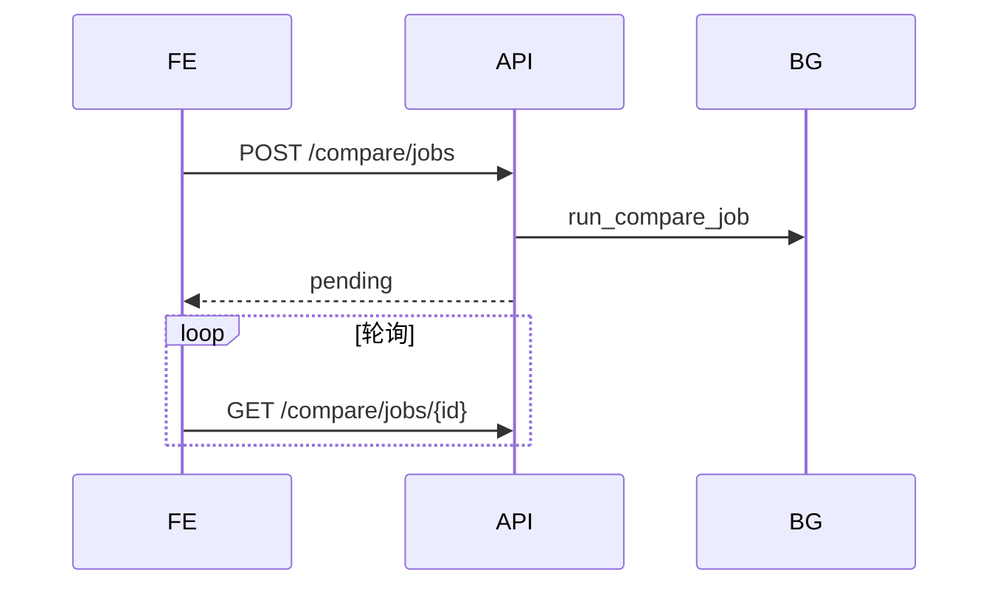

# 异步任务

> 说明书 · 第三篇 §3.6

---

## 1. 总览

| 机制 | 用途 | 配置 |
|------|------|------|
| **Celery** | 翻译进度监控、文档硬删除 | `REDIS_URL` / `celery_broker_url` |
| **FastAPI BackgroundTasks** | 文档对比 diff | 进程内，无需 Worker |
| **同步 HTTP** | 小操作、KnowFlow 单文档 sync | 注意超时 |

Worker 启动：

```bash
cd platform && celery -A workers.celery_app worker --loglevel=info
```

---

## 2. Celery 应用

- 定义：`platform/workers/celery_app.py`  
- 任务模块：`workers/tasks/translate.py`、`workers/tasks/maintenance.py`

### 2.1 翻译任务监控

流程：

1. API `POST /jobs` 创建 `Job`，调用 pdf2zh  
2. `monitor_translate_job.delay(job_id)` 轮询 pdf2zh 状态  
3. 更新 DB 状态，完成后写结果路径  

实现：`app/services/translate_service.py`、`workers/tasks/translate.py`。

### 2.2 文档删除

永久删除或清理时：`delete_document_task.delay(job_id)` 删除 MinIO 对象、KnowFlow 链接、镜像。

---

## 3. 文档对比（后台任务）



- 插件：`app/features/builtin/compare.py`  
- 服务：`app/services/compare_service.py`（或同级）  
- 语义检索：`POST /compare/search`，不等待 diff 完成  

详见 [文档对比产品](../platform/doc-compare-product-design.md)。

---

## 4. 与 HTTP 超时的关系

| 操作 | 建议 |
|------|------|
| 大 PDF 上传 | presigned，complete 可异步触发 sync |
| 全量 KnowFlow 同步 | 不在登录关键路径；用 catalog + limit |
| 对比 diff | 必须异步 + 轮询 |
| 翻译 | Celery 监控 |

---

## 5. 任务状态（Job）

平台 `jobs` 表字段通常含：`status`（pending/running/done/failed）、`error_message`、关联 `user_id`、参数 JSON。

前端翻译页轮询 `GET /api/v1/jobs/{id}` 展示进度。

---

## 6. 相关文档

- [项目总体架构](../development/system-architecture-overview.md) §6.5–6.6  
- [文档对比](../platform/doc-compare-product-design.md)  
- [智碳平台说明](../development/doc-platform.md)
