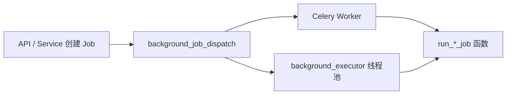

# 异步任务与后台 Job

> 说明书 · 第三篇 §3.6 · [开发实现说明书总览](../development/implementation-manual.md)

---

## 1. 调度架构



**原则**：创建 `Job` 记录后，只通过 `app/services/background_job_dispatch.py` 中的 `dispatch_*` 启动执行，不在业务代码里直接 `Thread(...)` 或 `task.delay()`。

| 函数 | 用途 |
|------|------|
| `dispatch_document_index_job` | 文档 KnowFlow 同步 / 重新索引 / PageIndex 建树 |
| `dispatch_post_upload_processing` | 上传后 checksum、可选知识库调度 |
| `dispatch_parse_watch` | KnowFlow 解析进度轮询 |
| `dispatch_subscription_import_job` | 订阅源批量导入 |
| `submit_light_background` | 登录预热等轻量任务（不占 Celery） |

---

## 2. `dispatch_document_index_job` 实现思路

源码：`platform/app/services/background_job_dispatch.py`

1. **读 Job payload**（短连接 SessionLocal，避免长期占连接）  
2. **`job_payload_uses_pageindex(payload)`** 为真 → 设 `run_inprocess = True`  
   - 原因：PageIndex 依赖本机 workspace、pageindex 包与 LLM；远程 Celery 环境可能不一致  
3. 非 PageIndex 且 `background_jobs_use_celery` → `_try_celery(run_document_index_job_task)`  
4. Celery 不可用或 PageIndex → `submit_background("document-index-{id}", run_document_knowledge_index_job, job_id)`  

`_try_celery` 捕获 broker 异常并打 warning，**静默回落**线程池，保证开发环境无 Redis 时仍可跑通。

---

## 3. 文档索引 Job（`knowledge_sync_job_service.py`）

### 3.1 Job 类型与 payload

| job_type | mode | 说明 |
|----------|------|------|
| `document_index` | 缺省 / `index` | 上传后同步 KnowFlow 并解析 |
| `document_index` | `reindex` | 切换 parser 或 PageIndex 重建 |

典型 reindex payload：

```json
{
  "mode": "reindex",
  "document_id": "...",
  "version_id": "...",
  "parser_id": "pageindex",
  "layout_recognize": "PaddleOCR",
  "resync": false
}
```

### 3.2 `run_document_knowledge_index_job` 实现思路

1. 加载 Job / User / Document，版本已删则 `cancelled`  
2. `resolved_parser = resolve_job_parser_id(payload)`  
3. `pageindex_mode = is_pageindex_reindex(mode, resolved_parser)`  
4. **`index_stack_block_reason(payload.parser_id, reindex=(mode=="reindex"))`**  
   - 非空 → `failed` + error_message，**统一文案入口**  
5. 非 PageIndex：可选 `knowledge.user_auth` + `reconcile_catalog`  
6. `mode == "reindex"` → `execute_document_reindex(..., parser_id=resolved_parser)`  
7. 否则 → 同步 KnowFlow、`parse_documents`、进入 `parse_watch` 链  

### 3.3 异常 → 用户文案

reindex 分支 `except Exception` 使用：

```python
from app.core.user_messages import background_job_error_message
err_text = background_job_error_message(e, fallback="重新索引失败")
```

**实现思路**（见 `user_messages.py`）：

| 异常类型 | 处理 |
|----------|------|
| `KnowflowSyncError` | 取 `.message` 再 sanitize |
| `StorageObjectNotFoundError` | 固定 `STORAGE_FILE_MISSING` |
| `HTTPException` | `http_exception_message` |
| 其它 | `sanitize_user_message(str(e))` |

### 3.4 OCR 失败回退

`_maybe_fallback_plain_text_parse`：

1. 仅现代 OCR layout 失败时触发  
2. 第一次：同 parser + `DeepDOC` 重试  
3. 仍失败：`parser_id=naive` + `Plain Text`（**有意保留**，Plain Text 无页级引用截图）

回退路径用 `resolve_job_parser_id(payload)` 保留 reindex 上下文。

### 3.5 `create_document_reindex_job` 实现思路

- 创建前 `index_stack_block_reason(parser_id, reindex=True)`，不可用返回 `None`  
- payload 中 `parser_id` 写**已解析**字符串（`reindex_parser_id_raw`）  
- 不再无条件要求 `knowledge.enabled()`，以支持仅 PageIndex 场景

---

## 4. 其它 Job 类型（简述）

| 模块 | Job | Runner |
|------|-----|--------|
| `translate_service` | PDF 翻译 | 轮询 pdf2zh API |
| `compare_service` | 版本对比摘要 | LLM / 本地 diff |
| `subscription_import_service` | 订阅导入 | 抓取 + 入库 |

pdf2zh HTTP 统一经 `integrations/pdf2zh_client.py` 工厂方法，避免重复构造 `httpx.Client`。

---

## 5. 服务启动恢复

`recover_interrupted_document_index_jobs()`（`knowflow_enabled` 时）：

- 扫描 `pending` / `running` 的 `document_index` Job  
- 重新 `dispatch_document_index_job`  

PageIndex Job 会再次走 in-process 路径。

---

## 6. 相关文档

- [知识服务实现](knowledge-implementation.md)
- [应用服务与域](backend-implementation.md)
