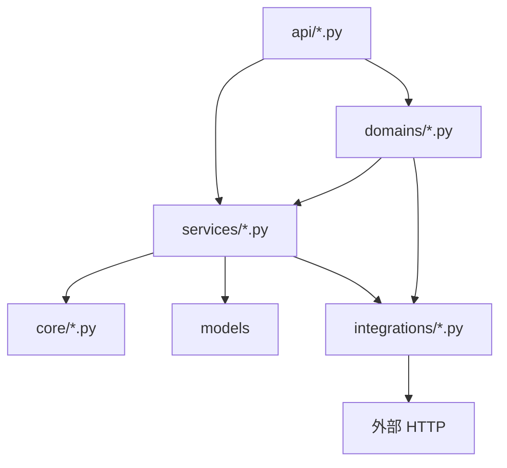

# 应用服务与域

> 说明书 · 第三篇 §3.2

---

## 1. 应用启动生命周期

`app/main.py` 中 `lifespan`：

1. `bootstrap_db()` — 种子角色、权限、内置管理员  
2. 一系列 `ensure_*_schema()` — 轻量 schema 迁移（非 Alembic 全量）  
3. `ensure_plugins_loaded()` + `mount_routers(app)`  
4. 可选调度器（如碳市场同步）

ORM 模型在 `main.py` 中 import 注册，避免遗漏 metadata。

---

## 2. 分层调用规则



| 禁止 | 原因 |
|------|------|
| `integrations` → `services` | 防循环依赖 |
| API 内长事务/复杂查询 | 难测试、难复用 |
| API 直接 httpx 调 KnowFlow | 应经 gateway 或 service |

---

## 3. 文档服务分包

`app/services/documents/`（原单文件 `document_service` 已拆）：

| 模块 | 职责 |
|------|------|
| `listing.py` | 列表、筛选、scope Tab |
| `crud.py` | 创建、更新、元数据 |
| `acl.py` | grant/deny、分享列表 |
| `lifecycle.py` | 软删、恢复、永久删除 |
| `content.py` | 版本、下载、上传完成 |

对外仍可通过 `document_service` 包 `__init__` 聚合导出，API 层保持简短。

---

## 4. 知识域 Facade

```
app/domains/knowledge/
  gateway.py       # KnowledgeGateway、knowledge 单例
  meta_service.py  # /rag/meta、embed 探活
```

推荐调用：

```python
from app.domains.knowledge import knowledge

knowledge.enabled()
knowledge.stack_reachable()
knowledge.sync_document(db, user, doc, force=True)
knowledge.build_embed_session(db, user, sync_catalog=False)
```

底层实现仍在 `services/ragflow_*`、`integrations/knowflow_client.py`；**新功能勿绕过 gateway**。

---

## 5. 功能插件注册

| 文件 | 作用 |
|------|------|
| `features/base.py` | `FeaturePlugin` 数据类 |
| `features/registry.py` | `register()`、`mount_routers()`、`all_plugins()` |
| `features/builtin/__init__.py` | import 各插件模块触发注册 |
| `bootstrap.py` | 权限码写入 DB、`grant_to_roles` |

系统功能列表：`GET /api/v1/system/features` → `app/api/system.py`。

---

## 6. Schema 迁移

`app/schema_migrate.py` 在启动时执行幂等 DDL/数据修复，例如：

- `ensure_document_scope_tier_v2`
- `ensure_ragflow_schema`
- `ensure_document_library_folder_schema`

新增表/列：优先增加 `ensure_*` 函数并在 `lifespan` 调用；复杂迁移可补充 Alembic（若项目启用）。

---

## 7. 存储

| 类型 | 实现 |
|------|------|
| 对象存储 | `app/storage` + MinIO，文档版本 `storage_key` |
| 配置 | `app/config.py` `Settings`，`get_settings()` 缓存 |

---

## 8. 测试

```bash
cd platform && .venv/bin/pytest tests/ -q
```

插件或权限变更时补充 `tests/test_*_api.py`；mock 外部服务用 `unittest.mock` 或 httpx ASGI transport。

---

## 9. 相关文档

- [分层架构](../development/layered-architecture.md)
- [知识服务实现](knowledge-implementation.md)
- [功能插件](../platform/feature-plugins.md)
