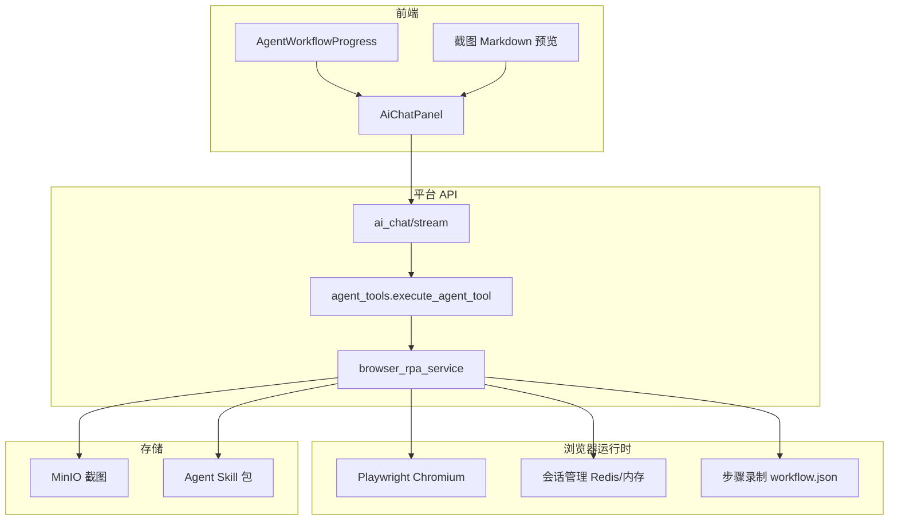
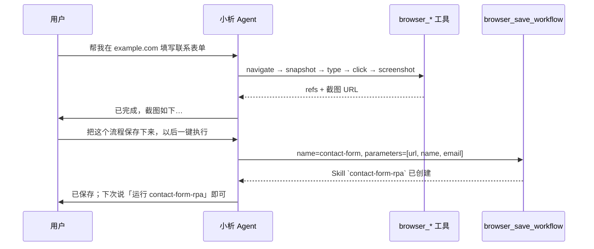

# 浏览器 RPA（网页自动化）实现说明

**状态**：Phase 1 基础设施（内置 Agent 工具 + 会话录制 → Skill 固化）  
**版本**：v4.8.6 · [开发说明书总览](../development/implementation-manual.md)

> **v4.8.6**：独立 `rpa` 专精 Profile 已移除；浏览器自动化由父 Agent 通过 `invoke_context_subagent(kind=execute, steps=...)` 委托执行。本文描述 Playwright 会话与 `browser_*` 工具族实现，仍适用于底层能力。  
**入口**：AI 智能体 `POST /api/v1/ai-chat/stream` → `browser_*` 工具族

---

## 1. 能力定位

与现有 `web-page-insight`（HTTP 拉取 + 静态解析）不同，**浏览器 RPA** 面向：

| 场景 | web-page-insight | 浏览器 RPA |
|------|------------------|------------|
| JavaScript 渲染 / SPA | ❌ | ✅ |
| 点击、填表、下拉、提交 | ❌ | ✅ |
| 登录态 / Cookie 会话 | ❌ | ✅（隔离 Profile） |
| 操作后截图展示 | ❌ | ✅ |
| 对话探索 → 固化流程 | ❌ | ✅（录制 → Skill） |

对标 OpenClaw / ChatGPT Operator 的 **Snapshot → Act → Verify** 循环，但集成在本析平台 Agent Tool Loop 内，而非独立 CLI。

---

## 2. 开源方案调研与选型

| 方案 | 协议 | 语言 | 特点 | 与本析集成方式 |
|------|------|------|------|----------------|
| **[Playwright](https://playwright.dev/python/)** | Apache 2.0 | Python/TS | 工业级浏览器驱动、无障碍树、截图 | **底层引擎（推荐）** |
| **[Playwright MCP](https://github.com/microsoft/playwright-mcp)** | Apache 2.0 | TS | `browser_navigate/click/snapshot` 工具面，无障碍快照省 Token | **工具语义参考**（本析已实现等价 Python 工具） |
| **[browser-use](https://github.com/browser-use/browser-use)** | MIT | Python | 完整 Agent 循环 + 视觉/DOM 双模 | 可选 Phase 2「全自动探索模式」 |
| **[Skyvern](https://github.com/Skyvern-AI/skyvern)** | AGPL-3.0 | Python | 表单填写、登录门户 RPA 专精 | 参考 WRITE 任务 Prompt；AGPL 需法务评估 |
| **[Stagehand](https://github.com/browserbase/stagehand)** | MIT | TS | `act/extract/observe` 混合 API | 若前端 Node 侧扩展可参考 |
| **OpenClaw Browser** | 开源扩展 | — | CDP + ref 编号 + 隔离 Chrome Profile | **交互模型参考**（snapshot ref 驱动） |

### 2.1 推荐架构：Playwright 确定性层 + 本析 Agent 推理层

```
用户对话
   ↓
本析 Agent（Discovery + Tool Loop）
   ↓
browser_snapshot / browser_click / browser_type / browser_screenshot  ← 内置工具
   ↓
Playwright Chromium（headless，隔离 Context）
   ↓
MinIO 截图 · Redis 会话/录制 · 可选固化 upload Skill
```

**不直接嵌入 browser-use 全自动 Agent 的原因**：

1. 本析已有成熟的 40 轮 Tool Loop，重复造 Agent 循环会增加不可控性与 Token 成本。  
2. Playwright 工具层与 OpenClaw / Playwright MCP 同构，模型可稳定遵循「先 snapshot 再 act」。  
3. browser-use 可作为 **Phase 2 可选模式**（`browser_run_task` 一键探索），与确定性录制并存。

---

## 3. 系统架构



### 3.1 与 Skill 体系的关系

| 层级 | 说明 |
|------|------|
| **内置工具** `browser_*` | 系统能力，所有授权用户可通过对话操作网页 |
| **会话录制** | 每次 act 追加到 `workflow_steps`（Redis，TTL 30min） |
| **固化 Skill** `browser_save_workflow` | 将录制步骤生成上传型 Skill（含 `workflow.json` + `SKILL.md` + 可选 `replay.py`） |
| **回放** | Phase 2：`run_skill_script` 执行 `replay.py` 逐步重放（参数化 URL/表单值） |

**重点**：RPA 是平台内置能力；Skill 只是「把探索过的流程保存下来」的载体，类似 OpenClaw 的 browser-automation SKILL 指导循环，而非替代工具层。

---

## 4. 内置 Agent 工具一览

| 工具 | 作用 | OpenClaw 对应 |
|------|------|---------------|
| `browser_navigate` | 打开 URL（SSRF 校验） | `browser open` |
| `browser_snapshot` | 无障碍树 + 交互元素 ref 列表 | `browser snapshot --interactive` |
| `browser_click` | 按 ref 点击 | `browser click <ref>` |
| `browser_type` | 向 ref 输入文本，可选 submit | `browser type` |
| `browser_fill` | 批量填表 `[{ref, value}]` | `browser fill --fields` |
| `browser_screenshot` | 截图上传 MinIO，返回 URL | `browser screenshot` |
| `browser_save_workflow` | 录制步骤 → 创建 upload Skill | （OpenClaw 无等价；本析增强） |

### 4.1 操作循环（写入 `agent_resident` 提示词）

```
1. browser_navigate(url)
2. browser_snapshot() → 阅读 refs 与页面结构
3. browser_click / browser_type / browser_fill（每次只用最新 snapshot 的 ref）
4. 页面变化后必须重新 browser_snapshot
5. 关键步骤后 browser_screenshot，在回复中用 Markdown 图片展示
6. 用户要求「保存流程」→ browser_save_workflow
```

### 4.2 Snapshot 格式（紧凑 ref，省 Token）

```json
{
  "url": "https://example.com/login",
  "title": "登录",
  "refs": [
    {"ref": "e1", "role": "textbox", "name": "用户名", "value": ""},
    {"ref": "e2", "role": "textbox", "name": "密码", "value": ""},
    {"ref": "e3", "role": "button", "name": "登录"}
  ],
  "text_preview": "前 800 字可见文本…"
}
```

ref 在**同一次 snapshot 之后**有效；导航或 DOM 大变后需重新 snapshot（与 OpenClaw 一致）。

---

## 5. 安全与治理

| 项 | 策略 |
|----|------|
| SSRF | 复用 `skill_script_runtime` 内网拦截；仅 http/https |
| 域名白名单 | `AGENT_BROWSER_ALLOWED_DOMAINS`（逗号分隔；空=不限制公网） |
| 会话隔离 | 每 `(user_id, conversation_id)` 独立 BrowserContext |
| 步骤上限 | `AGENT_BROWSER_MAX_STEPS_PER_SESSION` 默认 50 |
| 截图大小 | 压缩 PNG，默认 ≤ 800KB |
| 权限 | `feature.ai_home` + `AGENT_BROWSER_ENABLED=true` |
| 审计 | 工具调用写入现有 workflow SSE；可选扩展 audit_service |

**禁止**：访问内网管理台、读写平台本地文件、持久化用户密码到 Skill（仅参数占位符）。

---

## 6. 配置项

| 环境变量 | 默认 | 说明 |
|----------|------|------|
| `AGENT_BROWSER_ENABLED` | `false` | 总开关 |
| `AGENT_BROWSER_HEADLESS` | `true` | 无头模式 |
| `AGENT_BROWSER_SESSION_TTL_SECONDS` | `1800` | 会话 TTL |
| `AGENT_BROWSER_MAX_STEPS_PER_SESSION` | `50` | 单会话最大操作步数 |
| `AGENT_BROWSER_ALLOWED_DOMAINS` | 空 | 域名白名单 |
| `AGENT_BROWSER_SCREENSHOT_MAX_KB` | `800` | 截图上限 |

### 6.1 依赖安装

```bash
# Python 可选 extra
pip install ".[browser]"
playwright install chromium

# Docker：platform/Dockerfile 需增加 playwright 系统依赖（见 Phase 2 部署清单）
```

---

## 7. 对话 → 固化 Skill 流程



生成的 Skill 包结构：

```text
contact-form-rpa/
├── SKILL.md          # 用途、参数、调用 run_skill_script 说明
├── workflow.json     # 录制的步骤序列（平台生成）
└── replay.py         # Phase 2：参数化回放脚本
```

---

## 8. 前端展示

1. **Workflow 步骤**：`tool_workflow_meta` 映射 `browser.*` 工具中文标题。  
2. **截图**：Agent 在回复中插入 ``；`MarkdownRichContent` 已有图片渲染。  
3. **Phase 2**：SSE `attachments` 事件直传截图缩略图（免模型复述 URL）。

---

## 9. 分阶段交付

| 阶段 | 内容 | 状态 |
|------|------|------|
| **Phase 1** | Playwright 会话、`browser_*` 工具、截图、步骤录制、save_workflow | ✅ 已完成 |
| **Phase 2** | Docker 镜像集成 Chromium、`replay.py` 回放、域名策略 UI、SSE 截图 | ✅ 已完成 |
| **Phase 3** | `browser_run_task` 自动探索、定时 RPA（Celery） | ✅ 已完成 |
| **Phase 4** | 可视化流程编辑器、失败重试/人工接管 | 待做 |

---

## 10. 与现有模块交叉引用

| 模块 | 关系 |
|------|------|
| [Agent Skills 实现](agent-skills-implementation.md) | Tool Loop、Discovery、upload Skill |
| `skill_script_runtime.py` | SSRF URL 校验复用 |
| `web-page-insight` 示例 | 只读静态页；RPA 与之互补 |
| `agent_tools.py` | 工具注册与 workflow 元数据 |

---

## 11. 测试建议

1. 启用 `AGENT_BROWSER_ENABLED=true` 并安装 Playwright。  
2. 对话：「打开 https://example.com 并截图」。  
3. 对话：「在 httpbin.org/forms/post 填写示例表单并提交，截图结果页」。  
4. 对话：「保存刚才的操作为 Skill `httpbin-form-demo`」。  
5. 在 Agent Skills 管理页确认 Skill 包含 `workflow.json`。

---

## 12. 无头服务器部署说明

**结论：无头 Linux 服务器是推荐部署环境，Playwright 默认即为此设计。**

| 项 | 说明 |
|----|------|
| 显示器 / X11 | **不需要**。`AGENT_BROWSER_HEADLESS=true`（默认）时 Chromium 在内存中渲染 |
| Docker | 构建时 `INSTALL_BROWSER=1` 安装 Chromium 与系统依赖；`api`/`worker` 服务建议 `shm_size: 512mb` |
| 启动参数 | 自动附加 `--no-sandbox`、`--disable-dev-shm-usage`（容器内常见必需） |
| 多 Worker | 浏览器会话目前进程内绑定；生产建议 RPA 集中在 API 或专用 worker |
| 资源 | 单次会话约 200–400MB 内存；并发 RPA 需控制 `STREAM_MAX_CONCURRENT_PER_WORKER` |

重新构建镜像：

```bash
docker compose build api worker
# 或 deploy.sh 流程中带 INSTALL_BROWSER=1
```

管理后台：**系统设置 → 资源配置 → 浏览器 RPA** 可启用功能、配置域名白名单与无头模式。

---
