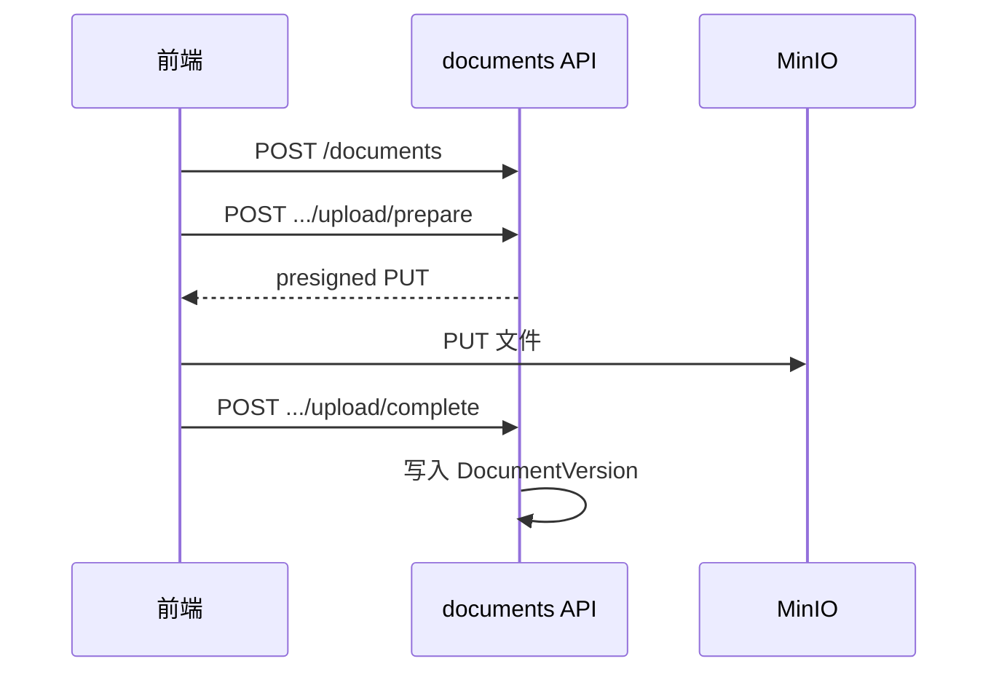

# 文档库实现

> 说明书 · 第三篇 §3.4

---

## 1. 领域模型

| 实体 | 说明 |
|------|------|
| `Document` | 标题、scope、dept_id、folder_id、owner_id、status、deleted_at |
| `DocumentVersion` | 版本号、storage_key、file_name、file_size、是否当前版 |
| `DocumentPermission` | 单文档 grant（仅 `subject_type=user`） |
| `DocumentDenial` | 禁止访问名单 |
| `DocumentLibraryFolder` | 知识库文件夹（按 scope + dept 隔离） |

---

## 2. 分级 scope

| scope | 文档库 Tab | 组织绑定 | 默认可见性 |
|-------|------------|----------|------------|
| `personal` | 个人级 | 不绑定组织（`dept_id` 为空） | 仅 owner；系统管理员可见全部 |
| `team` | 小组级 | 组织树 depth=2 | 绑定节点及其子孙子树内用户 + `doc.read` |
| `department` | 部门级 | 组织树 depth=1 | 同上 |
| `company` | 公司级 | 组织树 depth=0（根） | 同上 |

组织树深度与 scope 映射、用户部门归属、系统管理员 bypass、ACL 档位等完整说明见 [权限模型与文档分级](../platform/permission-model.md)。

判定入口：`app/core/document_scope.py`、`app/core/permissions.py` → `can_access_document`。

虚拟 Tab **分享**：他人通过 user grant、且不因分级默认可见的文档。

---

## 3. 上传流程（实现）

- `prepare`：生成 `storage_key`，返回 MinIO 预签名 URL  
- `complete`：校验大小/类型，设当前版本，可选触发 KnowFlow 同步  
- 大文件**不经** API body

批量上传：前端合并为「批量上传」弹窗，多文件循环上述流程。

---

## 4. ACL 操作

| 操作 | API | 权限 |
|------|-----|------|
| 分享给个人 | POST permissions users | owner 或系统管理员 |
| 撤销分享 | DELETE permissions/users/{uid} | 同上 |
| 禁止访问 | POST denials | 同上 |
| 发布到文库 | PATCH document scope/dept | owner + 对应 `doc.*.create` |

读/编/删 API 内调用：

- `can_read_document` → visible  
- `can_query_document` → query（检索、对比选文档）  
- `can_modify_document` → modify（含上传、分享、重建索引、删除）  
- `can_edit_document` / `can_delete_document` → 兼容别名，等同 `can_modify_document`

---

## 5. 回收站

- 软删：`deleted_at` 非空，列表 `in_recycle=1`  
- 恢复：`can_restore`  
- 永久删除：异步 Celery `delete_document` 清理 MinIO + KnowFlow 链接  

回收站内不可改标题、不可同步知识库（前端与 API 双判）。

---

## 6. 文件夹

- 列表按 `scope` + `dept_id` + `folder_id` 筛选  
- 进入文件夹后顶栏：返回 + 文件夹名 + 批量操作（移动/删除在列表层，详情页已简化）  
- 公司级 scope 与 `scope_key_for_document(db, document)` 用于知识库路由（**必须传入 db**）

组件：`KbFolderCard.vue`、`MoveDocumentFolderModal.vue`。

---

## 7. 同步知识库

| 入口 | 行为 |
|------|------|
| 上传 complete | 可配置自动 sync |
| 详情「同步知识库」 | `POST /documents/{id}/sync-knowflow` |
| 登录/embed 目录同步 | `knowflow_catalog_service` 批量 |

经 `knowledge.sync_document` → `ragflow_sync_service.sync_document_to_knowflow`。

失败文案：`KNOWFLOW_ENABLED` 关、栈不可达、未上传文件等，见 `app/core/user_messages.py`。

---

## 8. 全局搜索

文档中心搜索可带 `scope=all`，后端在 ACL 过滤后合并结果；与单 Tab 列表共用 listing 服务。

---

## 9. 内容导入（网站收藏等）

`app/core/document_scope.py` 中 `content_import_scope` 限制导入目标分级；  
`buildImportToPersonalLibraryBody` 默认 `scope=personal`、`sync_knowflow=true`。

流水线：`web_article_fetcher` → `html_markdown` → 可选 DeepSeek 摘要 → 创建 Document。

---

## 10. 关键代码路径

| 功能 | 路径 |
|------|------|
| HTTP | `app/api/documents.py` |
| 列表 | `services/documents/listing.py` |
| ACL | `services/documents/acl.py` |
| 上传 | `services/documents/content.py` |
| 权限判定 | `core/permissions.py`、`core/document_scope.py` |
| 前端页 | `views/DocumentsView.vue`、`DocumentDetailView.vue` |

---

## 11. 相关文档

- [权限模型](../platform/permission-model.md)
- [知识服务实现](knowledge-implementation.md)
- [API 与约定](api-conventions.md)
