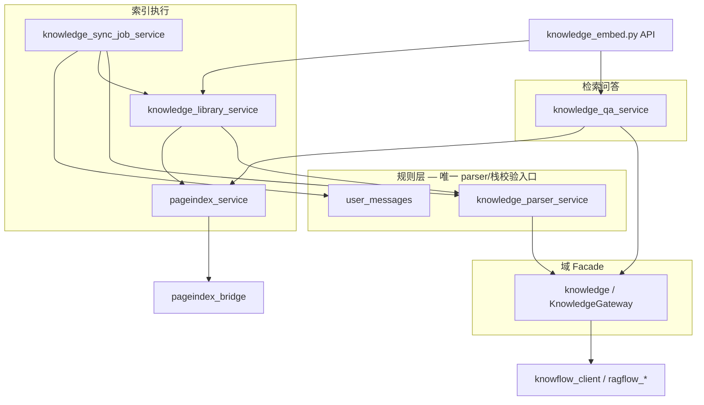
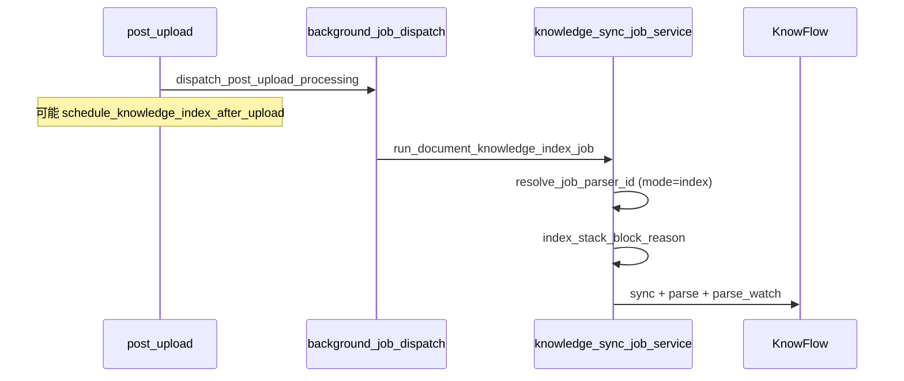
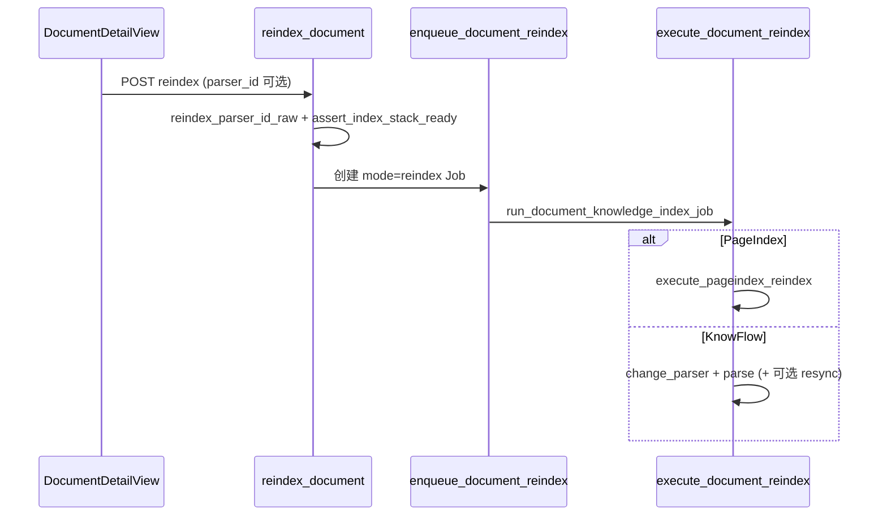
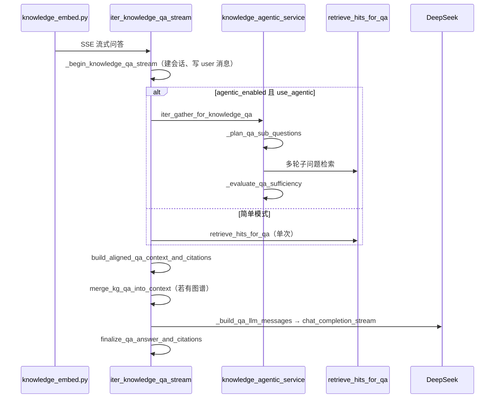

# 知识服务实现

> 说明书 · 第三篇 §3.5 · [开发实现说明书总览](../development/implementation-manual.md)

本文描述平台**原生知识能力**（非 KnowFlow 前端嵌入）的实现：文档同步、分块索引、PageIndex 结构索引、混合检索与问答。重点说明**模块边界**与**关键函数的实现思路**。

---

## 1. 能力总览

| 能力 | 入口 | 后端引擎 |
|------|------|----------|
| 文档上传后索引 | 后台 `document_index` Job | KnowFlow 向量分块（默认 naive） |
| 重新索引 | `POST /knowledge/documents/{id}/reindex` | PageIndex（默认）或 KnowFlow 分块 |
| 知识检索问答 | `KnowledgeSearchView` / 流式 API | PageIndex 树搜索 + KnowFlow 向量 + 本地 fallback |
| 切片浏览 | `GET /knowledge/documents/{id}/chunks` | KnowFlow API |
| 引用预览 | `GET /knowledge/citations/preview` | PDF 页截图 / bbox 高亮 |



**高内聚低耦合原则**：

- **KnowFlow 栈探活、客户端获取**：经 `knowledge.stack_reachable()` / `knowledge.client_for_user()`，不在各 service 写 `settings.knowflow_enabled and knowflow_stack_reachable()`。
- **Parser ID 默认值、PageIndex 判定、索引栈就绪**：经 `knowledge_parser_service`，不硬编码 `"pageindex"` / `"naive"`。
- **用户可见错误**：经 `user_messages.sanitize_user_message` 或 `background_job_error_message`。

---

## 2. KnowledgeGateway（`app/domains/knowledge/gateway.py`）

### 2.1 职责

Facade 模式：对外暴露稳定 API，内部 lazy import 具体 service，避免 `ragflow_sync` ↔ `ragflow_scope` 环依赖。

### 2.2 常用方法实现思路

| 方法 | 实现思路 |
|------|----------|
| `enabled()` | 读 `Settings.knowflow_enabled`，表示功能开关；栈可达性由 `stack_reachable()` 单独判断 |
| `stack_reachable()` | 委托 `knowflow_stack_reachable()`：已 enabled 且 `RagflowClient().health_ok()` |
| `client_for_user(db, user)` | 按用户 RAGFlow 会话 / API Key 构造 `RagflowKnowflowClient`；无 KnowFlow 时返回 `LocalKnowflowClient` |
| `client_probe(user_id)` | 探活用，**不触发** RAGFlow 开户 |
| `sync_document(...)` | 委托 `sync_document_to_knowflow`：上传 bytes → dataset → parse |
| `reconcile_catalog(...)` | 对齐平台文件夹与 KnowFlow dataset 登记 |
| `meta_payload(...)` | 委托 `meta_service.build_rag_meta_payload` |

### 2.3 调用示例

```python
from app.domains.knowledge import knowledge

if not knowledge.stack_reachable():
    raise bad_request("知识服务不可用")

kf = knowledge.client_for_user(db, user)
```

---

## 3. 解析器规则层（`knowledge_parser_service.py`）

### 3.1 两套默认 parser

| 场景 | 配置项 | 默认 | 解析函数 |
|------|--------|------|----------|
| 上传 / 自动推断 | `KNOWLEDGE_DEFAULT_PARSER_ID` | `naive` | `parser_id_raw()` |
| 重新索引 | `KNOWLEDGE_REINDEX_DEFAULT_PARSER_ID` | `pageindex` | `reindex_parser_id_raw()` |

**为何分离**：上传需稳定向量分块；重新索引默认走结构索引（PageIndex），二者产品策略不同，共用一套默认会误伤上传路径。

### 3.2 核心函数实现思路

#### `parser_id_raw(parser_id)`

1. 若调用方传入非空字符串 → 去空格、小写后直接返回  
2. 否则读 `settings.knowledge_default_parser_id`，再 fallback `naive`  
3. 白名单校验由下游 `normalize_parser_id` 统一处理

#### `reindex_parser_id_raw(parser_id)`

同上，但 fallback 链为 `knowledge_reindex_default_parser_id` → `PARSER_PAGEINDEX`。

#### `is_pageindex_parser(parser_id)`

**仅比较字面量** `(parser_id or "").strip().lower() == "pageindex"`。  
不经过 `parser_id_raw`，避免 `None` 被解析成 `naive` 导致误判。

#### `resolve_job_parser_id(payload)`

1. 读 `payload["mode"]`，默认 `"index"`（上传后索引）  
2. `mode == "reindex"` → `reindex_parser_id_raw(payload.get("parser_id"))`  
3. 否则 → `parser_id_raw(...)`  

**关键**：上传 Job 的 payload 通常无 `parser_id`，若误用 reindex 默认会得到 pageindex，故必须按 mode 分支。

#### `job_payload_uses_pageindex(payload)`

`is_pageindex_parser(resolve_job_parser_id(payload))`。  
供 `background_job_dispatch.dispatch_document_index_job` 决定是否跳过 Celery。

#### `index_stack_block_reason(parser_id, *, reindex=False)`

1. 按 `reindex` 标志选择 raw 解析函数，得到 `pid`  
2. 若 `is_pageindex_parser(pid)`：只检查 `pageindex_enabled`，通过则返回 `None`  
3. 否则：`knowledge.enabled()` → `"知识库同步未启用"`；`knowledge.stack_reachable()` → `"知识服务不可用..."`  
4. 全部通过返回 `None`  

API 层 `assert_index_stack_ready` 在此 reason 非空时 `raise bad_request(reason)`。

#### `infer_parser_for_upload_file(file_name, mime_type)`

1. 扩展名 + MIME 双判  
2. xlsx → `table`；ppt → `presentation`；图片 → `picture`  
3. 其余（pdf/doc/md/txt…）→ `normalize_parser_id(knowledge_default_parser_id)` + 默认 layout  
4. **不**自动选 PageIndex

#### `coerce_parser_layout(parser, layout)`

现代 OCR（PaddleOCR/MinerU/DOTS）需配合 smart/title/regex/parent_child；若用户选 naive + PaddleOCR，自动把 parser 提升为 `smart`，减少 KnowFlow 解析失败。

#### `build_parser_config(parser_id, layout_recognize, ...)`

1. PageIndex → 返回 `("pageindex", {"index_engine": "pageindex"})`，不调 KnowFlow  
2. 其它 → `coerce_parser_layout` + 深拷贝 `_PARSER_DEFAULTS[parser]` + 写入 `chunk_token_num` / `layout_recognize`

#### `list_parser_options()`

组装 `CHUNK_METHODS`、`LAYOUT_RECOGNIZERS` 与 `defaults`（**重索引默认** parser/layout）。  
前端 `useDocumentReindex.loadParserOptions()` 拉取后写入 `parserId` ref。

---

## 4. 索引流程

### 4.1 上传后首次索引



**实现要点**：

- Job payload：`mode` 缺省为 `index`，无 `parser_id` 时用上传默认 naive  
- OCR 失败：` _maybe_fallback_plain_text_parse` 先 DeepDOC，再 Plain Text（保留引用截图能力）

### 4.2 重新索引



**`execute_document_reindex` 实现思路**：

1. `reindex_parser_id_raw(parser_id)` 归一化  
2. PageIndex → 直接 `execute_pageindex_reindex`（不经 KnowFlow）  
3. KnowFlow 路径：判断是否需要 `resync`（md 索引、block 派生、dataset 缺失等）  
4. `change_document_parser` + `parse_documents` + 更新 `RagflowDocumentVersionLink`

**`create_document_reindex_job` 实现思路**：

- 启动前 `index_stack_block_reason(parser_id, reindex=True)`，不可用则**不创建** Job（PageIndex 在 KnowFlow 关闭时仍可创建）  
- payload 写入已解析的 `parser_id` 字符串，供 Worker 只读

### 4.3 PageIndex 结构索引（`pageindex_service.py`）

**`execute_pageindex_reindex` 实现思路**：

1. `assert_index_stack_ready(PARSER_PAGEINDEX)`  
2. 校验文件格式（`is_pageindex_supported_file`）  
3. `read_document_file_bytes` → `prepare_pageindex_index_path`（必要时转 md）  
4. `index_file_with_pageindex` → 本地 workspace 存 JSON 树  
5. `_upsert_version_link` 写 `PageindexVersionLink`（与 KnowFlow link 并行存在）

**检索引擎选择**（`resolve_retrieval_engine_for_document`）：

- 比较 PageIndex link 与 KnowFlow link 的 `index_completed_at`，取较新者  
- `effective_retrieval_engine` 再考虑 `pageindex_retrieval_available()`（LLM 是否配置）

---

## 5. 知识问答（`knowledge_qa_service.py`）

### 5.1 流式入口与调用链



| 方法 | 职责 |
|------|------|
| `iter_knowledge_qa_stream` | SSE 主入口；Agentic / 简单两路召回 |
| `_begin_knowledge_qa_stream` | 解析 session、校验文档 scope、持久化 user 消息 |
| `_gather_qa_agentic` | 包装 `iter_gather_for_knowledge_qa`，产出 workflow 事件 |
| `_gather_qa_simple` | 单次 `retrieve_hits_for_qa` + 图谱上下文 |
| `_prepare_qa_stream_bundle` | 合并 hits、图谱、版本对比块，生成 context |
| `_build_qa_llm_messages` | 组装 system + 检索片段 + 问题 |
| `finalize_qa_answer_and_citations` | 后处理引用编号、去来源叙述、裁剪展示用 citations |

### 5.2 `retrieve_hits_for_qa` 实现思路

1. `validate_document_scope` 过滤无权文档  
2. `partition_documents_by_retrieval_engine` → PageIndex / KnowFlow / 不可检索  
3. PageIndex 文档：`pageindex_tree_search`（LLM 选 node_id → 取正文片段）  
4. KnowFlow 文档：`knowledge.stack_reachable()` 且 client enabled → 向量检索；否则 `_local_retrieve`  
5. 合并 hits，可选 `merge_nearby_retrieval_hits`，截断 `top_k`（默认 `knowledge_retrieval_top_k`，上限 20）

**检索优先级**：KnowFlow 向量文档优先 `_knowflow_retrieve`；PageIndex 文档走 `retrieve_pageindex_hits_for_qa`；PageIndex 未命中时回退 KnowFlow / `_local_retrieve`。

### 5.3 问答 System 提示词（`_KNOWLEDGE_QA_SYSTEM`）

由 `assistant_knowledge_qa_persona()` + 固定规则拼接，经 `_qa_system_prompt(include_kg=…)` 输出：

| 规则类别 | 内容要点 |
|----------|----------|
| 身份 | 知识检索问答助手「小析」 |
| 事实依据 | 仅以编号检索片段为准；与模型常识冲突时以片段为准 |
| 引用 | 句末 `[1][2]`，与片段 `[n]` 严格一一对应 |
| 禁止来源叙述 | 正文不出现文档名、「根据…文档」「参考了…」等 |
| 不足处理 | 信息不足时明确说明；禁止元信息脚注 |

含本体图谱时追加 `_KG_QA_SYSTEM_APPENDIX`：图谱片段与文档片段同等可作为依据。

**材料不足追加段**（`insufficient_note` 非空时）：

```
【材料不足】当前检索材料可能不足以完整回答。不足方面：{gaps}。
请基于已有片段尽力回答；并在回答末尾友好提示用户可补充哪些具体信息。
```

LLM 调用：`temperature=0.2`；消息经 `build_bounded_qa_messages()` 受 `chat_prompt_max_chars` / `chat_context_max_chars` 约束。

### 5.4 检索上下文与引用对齐

`build_aligned_qa_context_and_citations(hits, doc_titles)`：

1. 遍历 hits，提取正文 `_extract_qa_context_body`  
2. 按顺序编号：`[1]\n{body}`、`[2]\n{body}`…  
3. `build_citations` 生成前端引用卡片（snippet 高亮、页码、bbox、预览图 id）  
4. 回答生成后 `finalize_qa_answer_and_citations`：重排引用、合并同句多引用、过滤未使用 citations

图谱合并：`kg_service.merge_kg_qa_into_context(doc_context, citations, kg_ctx)`，引用 index 在文档 citations 之后顺延。

### 5.5 Agentic 检索（`knowledge_agentic_service.py`）

开关：`knowledge_agentic_enabled=true` 且 DeepSeek 已配置（`agentic_enabled()`）。

#### 规划子问题（`_plan_qa_sub_questions`）

**System**：

```
你是企业知识库检索规划助手。根据用户问题拆解为若干可独立检索的子问题。
仅返回 JSON：{"reasoning":"简要策略","sub_questions":["子问题1","子问题2"]}。
sub_questions 数量 1～{max_q}，使用简体中文。
```

**User**：用户问题、已选文档数、可选本体图谱规划参考。

#### 充足性评估（`_evaluate_qa_sufficiency`）

**System**：

```
你是检索质量评估助手。判断材料是否足以回答。
仅返回 JSON：{"sufficient":true|false,"gaps":"…","extra_queries":["…"]}。
```

不足时进入下一轮，用 `extra_queries` 补充检索（最多 `knowledge_agentic_qa_max_rounds` 轮）。

#### 报告侧规划（`_plan_report_gathering`）

输出 JSON：`use_local`、`local_queries`、`use_web`、`web_queries`；按 `intent`（`initial` / `follow_up` / `format_adjust`）决定是否检索。

### 5.6 思维导图提示词（`generate_knowledge_mindmap`）

**System（`_MINDMAP_SYSTEM`）**：

```
你是知识结构分析助手。根据用户问题和 AI 回答，输出 Mermaid mindmap 语法。
- 仅输出 mindmap 代码，不要使用 ``` 围栏
- 第一行必须是 mindmap，根节点形如 root((问题摘要))
- 提炼 2-3 层要点分支，节点文字简短，使用简体中文
```

`temperature=0.1`；LLM 失败时 `_normalize_mindmap_source` 从回答文本本地回退生成简单 mindmap。

### 5.7 本体图谱与 AI 智能体

**`retrieve_kg_context_for_question`**（`kg_service.py`）：

1. 从问题文本 **匹配实体名称**（`match_entities_in_question`）  
2. 以 seed 实体为中心 **BFS 扩展** 指定跳数（默认 2）  
3. 格式化为带编号引用块的 `KgQaContext`

**消费方**：

| 场景 | 合并方式 |
|------|----------|
| 知识检索 | `merge_kg_qa_into_context` 追加在文档 hits 之后，引用 index 顺延 |
| 报告生成 | `KnowledgeAgenticToolkit.retrieve_kg`；详见 [报告生成实现](report-generation-implementation.md) |
| AI 智能体 | `skill_chat_service.resolve_combined_research_async` 内合并 KB + KG + Web |

AI 智能体在无显式选文档时，自动在用户 **可 query 的前 20 份文档** 内检索（需 `feature.knowledge_search`）。

### 5.8 流式问答错误处理

`_resolve_qa_session` 抛 `HTTPException` 时，用 `http_exception_message(exc, fallback=KNOWLEDGE_SERVICE_UNAVAILABLE)` 写入 SSE JSON，与 REST API 文案一致。

---

## 6. 配置项

| 环境变量 | 含义 | 默认 |
|----------|------|------|
| `KNOWFLOW_ENABLED` | KnowFlow 功能总开关 | — |
| `KNOWLEDGE_DEFAULT_PARSER_ID` | 上传/推断默认分块 | `naive` |
| `KNOWLEDGE_REINDEX_DEFAULT_PARSER_ID` | 重新索引默认分块 | `pageindex` |
| `KNOWLEDGE_DEFAULT_LAYOUT_RECOGNIZE` | PDF OCR 引擎 | `DeepDOC` |
| `PAGEINDEX_ENABLED` | 结构索引开关 | — |
| `PAGEINDEX_WORKSPACE_DIR` | 树索引本地目录 | `platform/.run/pageindex` |
| `KNOWLEDGE_AGENTIC_ENABLED` | 知识检索 Agentic 多轮召回 | — |
| `KNOWLEDGE_AGENTIC_QA_MAX_SUB_QUESTIONS` | 问答子问题上限 | 4 |
| `KNOWLEDGE_AGENTIC_QA_MAX_ROUNDS` | 问答充足性评估轮次 | — |
| `KNOWLEDGE_RETRIEVAL_TOP_K` | 单次检索 hit 上限 | 5 |

---

## 7. 前端协作

| 模块 | 职责 |
|------|------|
| `api/knowledge.js` | `fetchParserOptions`、`reindexDocument`（parser_id 可选，默认由后端 Schema 填充） |
| `composables/useDocumentReindex.js` | 弹窗、轮询 Job / parse_status |
| `utils/knowledgeCitation.js` | PageIndex / KnowFlow 引用跳转 |
| `composables/usePlatformUi.js` | 统一 toast，错误经 `sanitizeUserFacingMessage` |

---

## 8. 相关文档

- [报告生成实现](report-generation-implementation.md)
- [Agent Skills 实现](agent-skills-implementation.md)
- [分层架构](../development/layered-architecture.md)
- [异步任务](async-and-jobs.md)
- [应用服务与域](backend-implementation.md)
- [前端结构](frontend-implementation.md)
- [知识数据一致性](../operations/knowledge-data-consistency.md)
