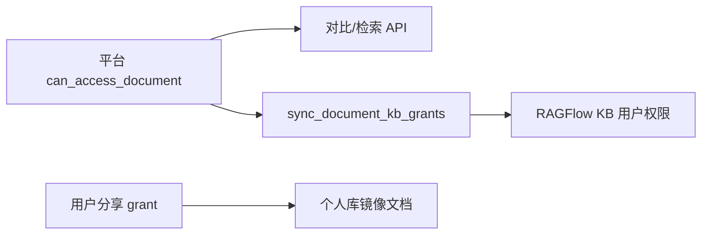

# 知识服务实现

> 说明书 · 第三篇 §3.5

---

## 1. RAGFlow 与 KnowFlow 的分工

| 组件 | 端口 | 平台用法 |
|------|------|----------|
| **RAGFlow** | 9380 | 知识库 dataset、文档解析、向量检索、Web UI（iframe） |
| **KnowFlow Backend** | 5001 | RBAC（如全局 admin）、知识库级 user 授权 API |

平台业务上统称「知识服务」；配置项 `KNOWFLOW_*` 表总开关，`RAGFLOW_*` 表引擎与同步策略。

```python
# integrations/ragflow_client.py — 底层 HTTP
# integrations/knowflow_client.py — RagflowKnowflowClient 封装
# domains/knowledge/gateway.py — 对外 Facade
```

---

## 2. 权限双轨（必须理解）



- **文档级**：平台 PostgreSQL ACL，检索/对比**先**算 `allowed_document_ids`  
- **知识库级**：`ragflow_scope_service` 把 scope/部门/公司映射为 dataset + KB ACL  
- **分享镜像**：他人 grant ≥ query → `RagflowDocumentMirrorLink` 复制到接收者个人 dataset  

**不用** RAGFlow 自带 RBAC 做文档级授权。

---

## 3. 用户与账号（mapped 模式）

`ragflow_identity_service`：

1. 平台用户登录 → 确保 RAGFlow 用户存在（`RagflowUserLink`）  
2. 可选 `ragflow_grant_global_admin` → KnowFlow RBAC 授 admin（可建库）  
3. `RAGFLOW_LLM_SHARED_FROM_TEMPLATE` 从模板账号复制 LLM 配置到 MySQL `tenant_llm`  

`shared` 模式仅开发演示，生产用 `mapped`。

---

## 4. 分级 Dataset

| 登记 | 表 | 命名前缀 |
|------|-----|----------|
| 个人 | `RagflowScopeDataset` | `zt-personal` / `zt-platform-{user_id}` |
| 部门 | 同上 | `zt-dept` |
| 公司 | 同上 | `zt-company` |

`ensure_user_scope_datasets` 在 catalog reconcile 时创建/修复。  
个人库强制 `me` 可见：`enforce_personal_kb_private_for_user`。

---

## 5. 文档同步

`sync_document_to_knowflow(db, user, document, force=False)`：

1. 解析当前版本文件（MinIO）  
2. 选择目标 dataset（由 `scope_key_for_document(db, document)` 决定）  
3. `RagflowClient` 上传 → 写入 `RagflowDocumentLink`  
4. 可选 `sync_document_kb_grants`  

分享镜像走 `sync_shared_document_mirror`。

---

## 6. 目录同步时机

| 配置 | 行为 |
|------|------|
| `RAGFLOW_SYNC_ON_LOGIN=true` | 登录时 reconcile（慢） |
| `RAGFLOW_SYNC_ON_EMBED=true` | 打开知识问答 iframe 时 |
| `ragflow_sync_doc_limit` | 单次最多同步文档数 |

推荐生产：登录关闭，embed 或前端后台 `sync=1` 补同步。

`reconcile_user_knowflow_catalog`：建库、改名、去重、授权、限量拉文档。

---

## 7. 嵌入问答 UI

| API | 用途 |
|-----|------|
| `GET /rag/meta` | 是否启用、是否可达 |
| `GET /rag/embed-session` | iframe URL、token |
| `embed_proxy` | 可选同源代理 `KNOWFLOW_UI_PROXY_PREFIX` |

前端：`useKnowflowEmbed.js`。  
主题：`deploy/knowflow/theme/*` 挂载到 RAGFlow 容器；API embed-proxy 使用 `platform/knowflow-theme/`（镜像内 COPY，须与 deploy 目录同步）。

遗留 `POST /rag/sessions` 平台内问答已弃用，以 iframe 为准。

---

## 8. 不可用时的降级

`knowflow_stack_reachable()` 为 false 时：

- `get_knowflow_client()` → `LocalKnowflowClient`（本地文本检索回退）  
- API 返回 `KNOWFLOW_*` 用户文案，非原始 500  

---

## 9. 关键代码路径

| 模块 | 路径 |
|------|------|
| Facade | `app/domains/knowledge/gateway.py` |
| 同步 | `app/services/ragflow_sync_service.py` |
| Scope/KB ACL | `app/services/ragflow_scope_service.py` |
| 目录 | `app/services/knowflow_catalog_service.py` |
| 身份 | `app/services/ragflow_identity_service.py` |
| RBAC HTTP | `app/integrations/ragflow_rbac.py` |
| RAGFlow HTTP | `app/integrations/ragflow_client.py` |

---

## 10. 部署注意

- arm64：源码构建 `docker-compose.knowflow.yml`  
- amd64：可用 `docker-compose.knowflow.amd64.yml` 预构建镜像  
- **勿删** `platform/third_party/KnowFlow/`

---

## 11. 相关文档

- [项目总体架构](../development/system-architecture-overview.md) §6.4、§8.1–8.2  
- [智碳平台说明](../development/doc-platform.md) §知识问答  
- [平台架构与运维](../development/platform-architecture.md) §配置
