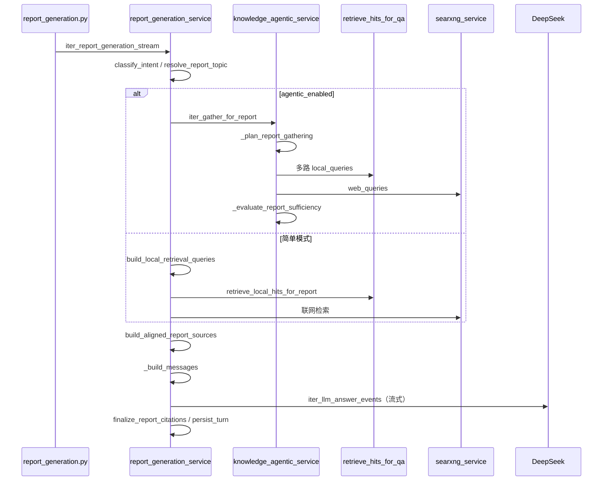

# 报告生成实现说明

> **适用读者**：产品、运维、后端开发  
> **版本**：v4.2.1 · 入口 `ReportGenerationView` / `POST /api/v1/report-generation/stream`  
> **配套阅读**：[功能实现说明 §4.7](../operations/feature-implementation.md) · [知识库实现 §5](knowledge-implementation.md)

---

## 1. 能力定位

报告生成在**同一对话会话**内交付万字级 Markdown 长报告，与知识检索短答的差异：

| 维度 | 知识检索 | 报告生成 |
|------|----------|----------|
| 召回量 | 默认 top 5，可合并邻近块 | 每查询 15 段，合并后最多 28 段 |
| 生成目标 | 精炼归纳 | 大量取材、扩写、分章节长文 |
| 多轮 | 单轮问答为主 | `initial` / `follow_up` / `format_adjust` 三意图 |
| Prompt 预算 | `chat_prompt_max_chars` | `chat_report_prompt_max_chars`（更大） |

---

## 2. 调用链



| 方法 | 文件 | 职责 |
|------|------|------|
| `iter_report_generation_stream` | `report_generation_service.py` | SSE 主入口 |
| `classify_intent` | 同上 | 判定 `initial` / `follow_up` / `format_adjust` |
| `resolve_report_topic` | 同上 | 从用户句抽取报告主题 |
| `build_local_retrieval_queries` | 同上 | 规则多路查询（含六方面后缀） |
| `retrieve_local_hits_for_report` | 同上 | 多查询召回 + `merge_retrieval_hits` 去重 |
| `build_aligned_report_sources` | 同上 | 本地 citations + 联网 citations 连续编号 |
| `_build_messages` | 同上 | 组装 system + history + user |
| `_gather_report_agentic` | 同上 | Agentic 材料收集 |
| `generate_report_mindmap` | 同上 | LLM mindmap，失败则本地回退 |
| `import_report_to_library` | 同上 | 导出 Word 并入库 personal scope |

---

## 3. 意图分类（`classify_intent`）

基于当前消息 + 历史上下文打分：

| 意图 | 触发特征 | 检索策略 |
|------|----------|----------|
| `initial` | 无历史助手回复 | 主题为 base query + `{topic} 背景与定义` 等六方面后缀 |
| `follow_up` | 补充/扩写/修订类正则命中 | 当前句 + 主题 + 上轮报告标题 |
| `format_adjust` | 格式/目录/表格/Executive Summary 等 | Agentic 规划通常跳过检索，改写上轮报告 |

正则池：`_FORMAT_PATTERNS`、`_SUPPLEMENT_PATTERNS`、`_FORMAT_HINTS`。

---

## 4. 多路召回

### 4.1 简单模式

`build_local_retrieval_queries` 生成最多 6 条查询；每条调用 `retrieve_hits_for_qa(..., limit=_PER_QUERY_LOCAL_HITS)`（15）；`merge_retrieval_hits` 按文档+chunk 去重，保留至多 `_MAX_LOCAL_CHUNKS`（28）段。

联网：`searxng_service` 检索，结果经 `build_web_citations` 编号，起始 index = 本地 citations 数 + 1。

### 4.2 Agentic 模式

`knowledge_agentic_service.iter_gather_for_report`：

1. **`_plan_report_gathering`** — LLM 返回 `use_local` / `local_queries` / `use_web` / `web_queries`  
2. 执行本地与联网检索  
3. **`_evaluate_report_sufficiency`** — 不足则补充查询，最多 `knowledge_agentic_report_max_rounds` 轮  

规划 **System** 摘录：

```
你是研究报告材料检索规划助手。
根据意图与上下文智能判断是否需要检索：
- format_adjust：通常无需检索
- follow_up：需要新事实/数据/案例时才检索
- initial：通常需要检索
仅返回 JSON：{"reasoning":"…","use_local":true|false,"local_queries":[…],"use_web":true|false,"web_queries":[…]}
```

---

## 5. System 提示词（`_REPORT_SYSTEM`）

由 `assistant_report_persona()` 开头，核心写作原则：

| # | 原则 |
|---|------|
| 1 | **大量取材**：编号材料块应尽可能吸收进各章节 |
| 2 | **扩写整合**：忠实材料含义前提下解释衔接 |
| 3 | **结构化长文**：Markdown 标题；首次含摘要、背景、分析、结论与建议 |
| 4 | **引用编号**：句末 `[n]` 与材料块严格对应 |
| 5 | **禁止来源叙述**：正文不写文档名、URL、「参考文献」章节 |
| 6 | **信息源优先级**：本地知识库 > 联网检索 > 模型知识 |
| 7 | **不足即说明**：缺失处标「待补充」 |
| 8 | **语言风格**：专业研究报告写法，避免 AI 套话 |

### 5.1 意图追加指令（`_intent_instruction`）

| intent | 追加内容 |
|--------|----------|
| `initial` | 生成完整长报告；提示已召回片段数，要求多数片段体现在正文 |
| `follow_up` | 结合历史中 assistant 完整报告 + 新材料，输出**完整修订稿** |
| `format_adjust` | 主要依据上轮报告重写格式/结构 |

### 5.2 材料块注入（`_build_messages`）

system 后半按顺序拼接：

1. `_SOURCE_PRIORITY_RULE` — 三级优先级说明  
2. `_REPORT_CITATION_RULE` — 编号与块序号对应规则  
3. `【编号材料 · 本地知识库 · 优先级 1】` + `local_context`  
4. `【编号材料 · 联网检索 · 优先级 2】` + `web_context`  
5. 无材料时：`【模型知识 · 优先级 3】` 说明  

多轮时追加：`对话历史中 role=assistant 的消息为上一版报告正文`。

**材料不足**时追加与知识检索类似的 `【材料不足】` 段，要求章节标「待补充」。

### 5.3 LLM 参数

| 参数 | 值 |
|------|-----|
| `temperature` | `format_adjust` → 0.35；其余 → 0.55 |
| 输出长度 | `unlimited_output=True`（报告不限 `max_tokens`） |
| 总预算 | `fit_messages_to_total_budget(..., report_prompt_max_chars)` |

---

## 6. 引用与后处理

`build_aligned_report_sources`：

- 本地 hits → `build_citations`（与知识检索同一套）  
- 联网 items → `build_web_citations(start_index=web_start)`  
- 合并为连续 `[1]…[n]` 材料块写入 system  

`finalize_report_citations`：根据正文实际使用的 `[n]` 过滤展示用 citations（与 QA 同一 `finalize_citations_for_display` 逻辑）。

---

## 7. 优化预设（`REPORT_OPTIMIZE_PRESETS`）

前端可选一键优化，将 preset `prompt` 作为用户消息送入同一流式管线：

| id | 用途 |
|----|------|
| `expand` | 扩写充实 |
| `shorten` | 精简压缩 |
| `add_cases` | 补充案例 |
| `executive_summary` | 文首 Executive Summary |
| `table_format` | 对比内容改表格 |
| `formal_polish` | 正式润色 |
| `add_recommendations` | 强化结论与建议 |

---

## 8. 思维导图

`generate_report_mindmap(question, answer)`：

1. 调用 `knowledge_qa_service.generate_knowledge_mindmap`（LLM + `_MINDMAP_SYSTEM`）  
2. 失败则 `knowledge_mindmap_service.build_mindmap_from_answer` 本地解析 Markdown 标题  

前端报告页「思维导图」Tab 展示 Mermaid；支持导出 Word / Markdown 大纲 / OPML。

---

## 9. 配置项

| 环境变量 | 含义 |
|----------|------|
| `KNOWLEDGE_AGENTIC_ENABLED` | 开启报告 Agentic 材料规划 |
| `KNOWLEDGE_AGENTIC_REPORT_MAX_SUB_QUESTIONS` | 报告本地子查询上限（默认 6） |
| `KNOWLEDGE_AGENTIC_REPORT_MAX_ROUNDS` | 报告充足性评估轮次 |
| `chat_report_prompt_max_chars` | 报告 system 总字符预算 |
| `chat_report_context_max_chars` | 本地+联网材料块预算 |

---

## 相关文档

- [知识库实现](knowledge-implementation.md)  
- [Agent Skills 实现](agent-skills-implementation.md)  
- [功能实现说明](../operations/feature-implementation.md)
