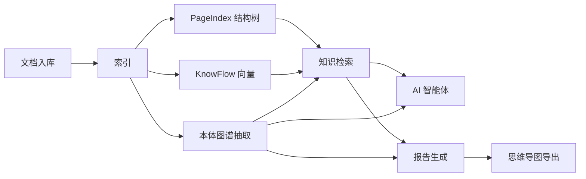

# 企业 AI 知识库平台 文档

**当前版本 v4.0.9** · 运维与开发文档入口。

## 知识能力闭环（速览）



| 环节 | 文档 |
|------|------|
| 检索 vs 传统 RAG | [功能实现 §4.5](operations/feature-implementation.md#45-知识检索原生页) |
| 本体图谱 | [功能实现 §4.6](operations/feature-implementation.md#46-本体图谱) |
| 报告生成 | [功能实现 §4.7](operations/feature-implementation.md#47-报告生成区别于短答式-rag) |
| AI 智能体 | [功能实现 §4.8](operations/feature-implementation.md#48-ai-智能体) |
| 实现细节 | [知识服务实现](implementation/knowledge-implementation.md) |

## 运维与部署

| 文档 | 说明 |
|------|------|
| [运维手册](operations/README.md) | **推荐**：部署、配置、迁移、热重载 |
| [组件位置与数据存储](operations/components-and-storage.md) | **各服务在哪、各库存什么、如何连接查看** |
| [配置文件与脚本](operations/config-and-scripts.md) | **Compose、.env、脚本、Mermaid** |
| [功能实现说明](operations/feature-implementation.md) | 各功能当前实现方式 |
| [单机迁移与热重载](operations/single-server-migration.md) | 迁到同一服务器 + dev-up |
| [运维部署指南（根目录）](../../运维部署指南.md) | 速查：架构图、端口、启停命令 |
| [系统架构](operations/architecture.md) | 分层与组件 |
| [部署指南](operations/deployment.md) | dev / 生产 / 镜像推送 |

## 开发

| 文档 | 说明 |
|------|------|
| [快速开始](getting-started.md) | 5 分钟上手 |
| [实现说明书总览](development/implementation-manual.md) | 开发导航 |
| [脚本说明](../../scripts/README.md) | `dev.sh` / `stack.sh` 职责 |

```bash
./dev.sh docker              # 全 Docker 开发（推荐）
```
