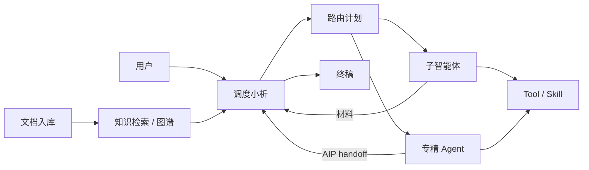

# 本析-企业级 AI 智能体平台

**当前版本 v4.9.0** · 多智能体设计与运维开发文档。

> 文档站标题强调**智能体平台**；产品内其它模块（文档库、翻译、知识库等）见运维 / 开发分册。

## 智能体能力闭环


```mermaid
flowchart LR
  user[用户] --> orch[调度小析]
  orch --> route[路由计划]
  route --> sub[子智能体]
  route --> sp[专精 Agent]
  sub --> tools[Tool / Skill]
  sp --> tools
  sp -->|AIP handoff| orch
  sub -->|材料| orch
  orch --> reply[终稿]
  docs[文档入库] --> kb[知识检索 / 图谱]
  kb --> orch
```

| 主题 | 文档 |
|------|------|
| **Agent 架构**（通信 · Plan-and-Execute · 并行） | [Agent 架构](agent-architecture.md) |
| **设计哲学** | [设计哲学](agent-philosophy.md) |
| Skills / 浏览器 / 报告 | [Skills](implementation/agent-skills-implementation.md) · [RPA](implementation/browser-rpa-implementation.md) · [报告](implementation/report-generation-implementation.md) |
| 数据与备份 | [组件与数据存储 §2.2](operations/components-and-storage.md) |
| 平台能力总览 | [功能实现说明](operations/feature-implementation.md) |

## 运维与部署

| 文档 | 说明 |
|------|------|
| [运维手册](operations/README.md) | 部署、配置、迁移、热重载 |
| [组件位置与数据存储](operations/components-and-storage.md) | 服务位置、DATA_ROOT、`backups/` |
| [配置文件与脚本](operations/config-and-scripts.md) | Compose、.env、MkDocs |
| [系统架构](operations/architecture.md) | 部署分层与组件 |
| [部署指南](operations/deployment.md) | dev / 生产 |

## 开发

| 文档 | 说明 |
|------|------|
| [快速开始](getting-started.md) | 5 分钟上手 |
| [项目总体架构](development/system-architecture-overview.md) | Monorepo 全景 |
| [实现说明书总览](development/implementation-manual.md) | 开发导航 |

```bash
./dev.sh docker              # 全 Docker 开发
./dev.sh docs                # 本地文档站 :40100
```
