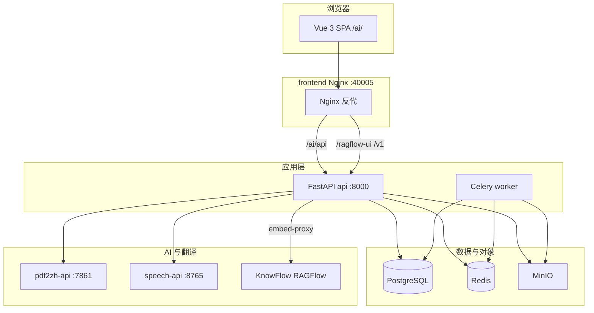

# 系统架构

## 总体定位

AI 办公系统 = **企业文档与权限控制面** + **PDF 翻译引擎** + **可插拔 AI 能力**（知识库、问数、会议转写、智能工具等）。

设计目标：**稳定**、**多架构可迁移**（arm64 开发 / amd64 生产）、**UI 一致**（Vue 3 + Naive UI）、**对外单端口**（生产仅暴露 Nginx）。

## 逻辑分层



## 开源组件与优势

| 组件 | 版本/来源 | 作用 | 相对同类优势 |
|------|-----------|------|--------------|
| **pdf2zh_next / BabelDOC** | 本仓库 | PDF 科学文献翻译、版式保留 | 开源、可自建 API，与平台任务队列集成 |
| **FastAPI + Celery** | Python 3.11 | 平台 API、异步任务 | 轻量、类型友好；任务与 Web 分离可水平扩展 worker |
| **Vue 3 + Vite + Naive UI** | 前端 | 统一工作台、暗色/国际化 | 组件成熟；`FeaturePlugin` 驱动功能发现，无需改路由表即可加能力 |
| **PostgreSQL 16** | Alpine 镜像 | 业务库、RBAC、文档元数据 | 成熟关系型；平台用 `schema_migrate` 增量升级 |
| **MinIO** | S3 兼容 | 文档二进制、版本文件 | 与 KnowFlow 共用，减少重复对象存储 |
| **KnowFlow + RAGFlow** | profile knowflow | 向量库、切片、RAG UI iframe | **保留原厂 UI 与溯源**；平台做 SSO、分级 dataset、文档同步，不重写 RAG 前端 |
| **FunASR** | profile speech | 语音转写、说话人分离 | 可离线部署模型；与 DeepSeek 总结解耦 |
| **Infinity** | infiniflow/infinity | RAGFlow 向量与全文检索 | KnowFlow 栈内隔离，不暴露公网；`DOC_ENGINE=infinity` |
| **Gotenberg** | KnowFlow | Office → PDF 转换 | 容器化文档预处理 |

## 功能插件模型

后端 `platform/app/features/builtin/` 注册 `FeaturePlugin`：

- 自动挂载 `/api/v1` 路由（若有 `router`）
- 写入 RBAC 权限种子
- 出现在「功能列表」API（按权限过滤）

前端 `SystemFunctionsView` 按 **文档 / 工具 / 智能** 三类展示；KnowFlow 相关：**切片管理**（侧栏）、**编码管理**（系统设置）、**知识检索**（功能列表）。

## KnowFlow 集成要点

- 平台用户 → RAGFlow **mapped 账号**（`zt-platform-{user_id}` 等 dataset）
- `GET /api/v1/rag/embed-session` 下发 SSO token
- Web UI 经 **embed-proxy** 同源反代 + `platform-branding` 白标
- 文档上传后 `ragflow_sync_service` 同步至向量库

详见 [知识服务实现](../implementation/knowledge-implementation.md)（实现细节）与本目录 [网络拓扑](network-topology.md)。

## 启动与版本（v4.0.4）

| 项 | 说明 |
|----|------|
| 版本源 | 仓库根 `VERSION`（当前 4.0.4）→ `ZHITAN_VERSION` 镜像 tag |
| 开发入口 | `./dev.sh docker`（全 Docker 热重载） |
| 编排 | `bash scripts/stack.sh` build / up / dev-up / down |
| 数据存储 | PostgreSQL（平台）· MySQL+Infinity（KnowFlow）· MinIO · Redis；见 [组件与数据存储](components-and-storage.md) |
| 应用配置 | `platform/.env`；栈级 `/.env` 由 `setup-stack-env.sh` 合并 |

新增 **资源管理**（系统设置）：在线配置 LLM / KnowFlow / OCR 等，`GET /api/v1/system/client-config` 供前端启动拉取主题与 API 根地址。

## 代码仓库布局

```
pdf_trans/
├── compose.yaml              # 统一栈（核心服务）
├── compose.dev.yaml          # 开发覆盖（热重载、18000）
├── compose.mirror.yaml       # 国内镜像 build args
├── deploy/knowflow.yml       # profile knowflow
├── platform/                 # FastAPI + Celery
├── platform-frontend/        # Vue SPA + 生产 Nginx
├── pdf2zh_next/              # 翻译核心
└── scripts/stack.sh          # 唯一编排入口
```
