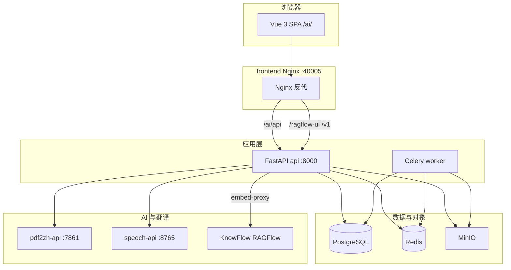

# 系统架构

## 总体定位

企业 AI 知识库平台 = **企业文档与权限控制面** + **PDF 翻译引擎** + **可插拔 AI 能力**（知识库、问数、会议转写、智能工具等）。

设计目标：**稳定**、**多架构可迁移**（arm64 开发 / amd64 生产）、**UI 一致**（Vue 3 + Naive UI）、**对外单端口**（生产仅暴露 Nginx）。

## 逻辑分层



## 开源组件与优势

| 组件 | 版本/来源 | 作用 | 相对同类优势 |
|------|-----------|------|--------------|
| **pdf2zh_next / BabelDOC** | 本仓库 | PDF 科学文献翻译、版式保留 | 开源、可自建 API，与平台任务队列集成 |
| **FastAPI + Celery** | Python 3.11 | 平台 API、异步任务 | 轻量、类型友好；任务与 Web 分离可水平扩展 worker |
| **Vue 3 + Vite + Naive UI** | 前端 | 统一工作台、暗色/国际化 | 组件成熟；`FeaturePlugin` 驱动功能发现，无需改路由表即可加能力 |
| **PostgreSQL 16** | Alpine 镜像 | 业务库、RBAC、文档元数据 | 成熟关系型；平台用 `schema_migrate` 增量升级 |
| **MinIO** | S3 兼容 | 文档二进制、版本文件 | 与 KnowFlow 共用，减少重复对象存储 |
| **KnowFlow + RAGFlow** | profile knowflow | 向量库、切片、RAG UI iframe | **保留原厂 UI 与溯源**；平台做 SSO、分级 dataset、文档同步，不重写 RAG 前端 |
| **FunASR** | profile speech | 语音转写、说话人分离 | 可离线部署模型；与 DeepSeek 总结解耦 |
| **Infinity** | infiniflow/infinity | RAGFlow 向量与全文检索 | KnowFlow 栈内隔离，不暴露公网；`DOC_ENGINE=infinity` |
| **Gotenberg** | KnowFlow | Office → PDF 转换 | 容器化文档预处理 |

## 功能插件模型

后端 `platform/app/features/builtin/` 注册 `FeaturePlugin`：

- 自动挂载 `/api/v1` 路由（若有 `router`）
- 写入 RBAC 权限种子
- 出现在「功能列表」API（按权限过滤）

前端 `SystemFunctionsView` 按 **文档 / 工具 / 智能** 三类展示；KnowFlow 相关：**切片管理**（侧栏）、**编码管理**（系统设置）、**知识检索**（功能列表）。

## KnowFlow 集成要点

- 平台用户 → RAGFlow **mapped 账号**（`zt-platform-{user_id}` 等 dataset）
- `GET /api/v1/rag/embed-session` 下发 SSO token
- Web UI 经 **embed-proxy** 同源反代 + `platform-branding` 白标
- 文档上传后 `ragflow_sync_service` 同步至向量库

详见 [知识服务实现](../implementation/knowledge-implementation.md)（实现细节）与本目录 [网络拓扑](network-topology.md)。

## 启动与版本（v4.6.0）

| 项 | 说明 |
|----|------|
| 版本源 | 仓库根 `VERSION`（当前 4.8.6）→ `BENXI_VERSION` 镜像 tag |
| 开发入口 | `./dev.sh docker`（全 Docker 热重载） |
| 编排 | `bash scripts/stack.sh` build / up / dev-up / down |
| 数据存储 | PostgreSQL（平台）· MySQL+Infinity（KnowFlow）· MinIO · Redis；见 [组件与数据存储](components-and-storage.md) |
| 应用配置 | `platform/.env`；栈级 `/.env` 由 `setup-stack-env.sh` 合并 |

新增 **资源管理**（系统设置，需 `admin.user`）：在线配置 LLM / 语音合成 / KnowFlow / OCR 等，`GET /api/v1/system/client-config` 供前端启动拉取主题与 API 根地址。

## 启动与资源（v4.6.0）

| 机制 | 说明 |
|------|------|
| DB 启动 | `auto` / `light` / `full` 分流；light 仅跑增量 DDL + 权限种子 |
| 流式 API | 鉴权后 `detach_request_db` 归还连接池；SSE 轮询用独立短会话 |
| Agent 工具循环 | `AgentLoopSession`：LLM/外部 I/O 前 `release_before_io()`，工具执行前 `open()`；supervisor / report 流式路径不再长占 `SessionLocal` |
| 路由信号 | `agent_routing_signals` 集中 regex（浏览器/调度/复合句等），planner 与 supervisor 共用 |
| 前端内存 | 对话/知识壳 KeepAlive；知识双面板 max=1；重型 chunk 异步加载 |
| 进程退出 | 关闭 `last_seen` 线程池与后台 executor |

## AIP 智能体互联（v4.6.0）

| 组件 | 说明 |
|------|------|
| 对外 API | `/api/v1/aip/discover`、`/agents/{aid}`、`/interact`、`/interact/stream` |
| 管理 | `/admin/aip/keys`（SK 密钥）；外部智能体 CRUD 在 Agent Skills 管理 API |
| 数据 | `aip_secret_keys`、`aip_external_agents` 表；配置 JSON 与 DB 双源合并 |
| 执行 | `agent_aip_executor` 由 supervisor 调用，统一内置专精与外部 HTTP |

## 容量与连接池（v4.6.0）

约 **200 人在线**时，瓶颈通常在 **瞬时并发占用 DB 连接**，而非平均 QPS。

| 部署形态 | 连接池配置 | 经验并发上限 |
|----------|------------|--------------|
| 本地 / 单 worker（`dev.sh local`） | `DB_POOL_SIZE=20` + `DB_MAX_OVERFLOW=20` | 约 **30–40** 个同时打 DB 的请求 |
| **单机生产档位 C**（`compose.yaml` / `server-up`） | API 6×(12+8)=120 + Celery (10+5)；PG `max_connections=220` | 目标 **~100–150** 瞬时打 DB |

**503「系统繁忙」**：连接池排队超过 `DB_POOL_TIMEOUT` 时触发；`/health` 不打 DB，仍可用于探活。

**解析入队**：文档解析在 KnowFlow/Celery 异步执行；API 侧为鉴权 + 元数据 + 入队。档位 C 面向 200 人**同时**点解析入队；真正切片仍由 Celery/KnowFlow 排队执行。

**压测回归**（自动清理测试文档）：

```bash
cd platform
python scripts/stress_test_throughput.py --concurrency 40 --parse-jobs 50   # 常规
python scripts/stress_test_throughput.py --concurrency 80 --parse-jobs 80   # 档位 C 验收
```

详见 [配置说明](configuration.md#单机生产档位-c200-在线--瞬时-100150-打-db) 与 [测试指南](testing.md#吞吐量--压力测试-v441)。

## 代码仓库布局

```
pdf_trans/
├── backend/                   # FastAPI + Celery
├── frontend/                  # Vue SPA + 生产 Nginx
├── third_party/               # 三方依赖（pdf2zh、speech-service、knowflow 等）
├── configs/
│   ├── compose/               # Docker Compose 编排文件
│   └── envs/                  # 环境配置模板
├── backend/                    # FastAPI 后端（含 app/agentkit/ 智能体工具箱）
├── scripts/                   # 运维与开发脚本
├── docs/                      # 项目文档
└── tests/                     # 测试
```
