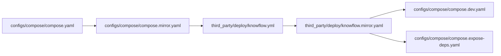

# 配置文件与脚本说明（v4.6.0）

> 本文说明当前系统**仍在使用**的 Compose 编排文件、环境配置与脚本职责。  
> 数据存储与数据库连接见 [组件位置与数据存储](components-and-storage.md)。

---

## 1. Compose 编排文件

当前**仅**使用仓库根目录的统一栈（位于 `configs/compose/`），**不存在** `platform/docker-compose*.yml`（已删除）。

### 1.1 文件清单与合并顺序

`scripts/stack.sh` 按以下顺序叠加（后者覆盖前者）：

| 顺序 | 文件 | 何时叠加 | 作用 |
|------|------|----------|------|
| 1 | **`configs/compose/compose.yaml`** | 始终 | 核心服务：postgres、redis、minio、pdf2zh-api、api、worker、frontend；speech-api（profile） |
| 2 | **`configs/compose/compose.mirror.yaml`** | `STACK_USE_MIRROR=1`（默认） | 国内 Docker Hub 镜像前缀与 build args |
| 3 | **`third_party/deploy/knowflow.yml`** | `--profile knowflow` | MySQL、Infinity、Gotenberg、ragflow、knowflow-backend |
| 4 | **`third_party/deploy/knowflow.mirror.yaml`** | 镜像加速 + knowflow profile | KnowFlow 预构建镜像（amd64 常用） |
| 5 | **`configs/compose/compose.dev.yaml`** | `stack.sh dev-up` | API 热重载、Vite 前端、挂载源码 |
| 6 | **`configs/compose/compose.expose-deps.yaml`** | `EXPOSE_DEPS=1` | 映射 40002–40009 供 remote-dev |



### 1.2 各文件详解

#### `configs/compose/compose.yaml` — 基础栈

- **项目名**：`benxi`（`COMPOSE_PROJECT_NAME` 可覆盖，当前统一使用 `benxi`）
- **对外端口**：仅 `frontend` → `${FRONTEND_PORT:-40005}`
- **数据卷**：`${DATA_ROOT}/postgres|minio|pdf2zh-config|speech-models`
- **容器间地址**：`api` 环境变量写死 Docker DNS（`postgres:5432`、`minio:9000` 等）

#### `compose.dev.yaml` — 开发热重载

| 服务 | 变更 |
|------|------|
| `api` | 映射 `127.0.0.1:18000:8000`；`uvicorn --reload`；挂载 `platform/app`、`docs/` |
| `worker` | 挂载 `platform/app`、`workers` |
| `frontend` | 换用 `node:22` + Vite；`VITE_API_BASE=http://127.0.0.1:18000` |

入口：`./dev.sh docker`

#### `compose.mirror.yaml` — 国内镜像

覆盖 postgres/redis/minio 等 `image:` 与 Dockerfile `build.args`，避免直连 Docker Hub。

变量：`DOCKER_MIRROR`（默认 `docker.1ms.run`）、`PIP_INDEX_URL`、`NPM_REGISTRY`。

#### `compose.expose-deps.yaml` — 远程依赖端口

仅在服务器跑依赖、本机跑 API 时使用。映射 postgres:40002、redis:40003 … knowflow-mysql:40009。  
模板：`.env.server.deps.example`。

#### `deploy/knowflow.yml` — KnowFlow profile

| 服务 | 职责 |
|------|------|
| `knowflow-mysql` | RAGFlow 元数据（库 `rag_flow`） |
| `knowflow-infinity` | 向量与全文索引（`DOC_ENGINE=infinity`） |
| `knowflow-gotenberg` | Office → PDF |
| `ragflow` | RAGFlow Web + API（容器内 nginx :80，后端 :9380） |
| `knowflow-backend` | KnowFlow 管理 API :5000 |

挂载：`deploy/knowflow/nginx/*`、`infinity_conf.toml`、`settings.yaml`、`theme/*`。

#### `deploy/knowflow.mirror.yaml` — KnowFlow 镜像加速

amd64 生产常用预构建：`zxwei/knowflow:v2.1.8`、`zxwei/knowflow-server:v2.1.8`。

### 1.3 已删除 / 废弃的 Compose 方式

| 废弃项 | 替代 |
|--------|------|
| `platform/docker-compose.yml` 等 | `configs/compose/compose.yaml` |
| `docker-compose.knowflow.yml` | `deploy/knowflow.yml` |
| `docker-compose.speech.yml` | `configs/compose/compose.yaml` 内 `speech-api` profile |
| `compose.server-deps.yaml`（空文件） | `compose.expose-deps.yaml` + `stack.sh` |
| `merge-stack-env.sh` | `setup-stack-env.sh` |

---

## 2. 环境配置文件

| 文件 | 用途 | 提交 Git |
|------|------|----------|
| **`VERSION`** | 单一版本源 → `BENXI_VERSION` 镜像 tag | 是 |
| **`.env`** | 栈运行时（compose `env_file`） | 否 |
| **`configs/envs/.env.stack.example`** | 栈模板：端口、镜像、profile、KnowFlow 开关 | 是 |
| **`configs/envs/.env.server.deps.example`** | 远程依赖服务器 `.env` 模板（含 `EXPOSE_DEPS=1`） | 是 |
| **`platform/.env`** | 业务密钥源（JWT、API Key、管理员） | 通常否 |
| **`platform/.env.example`** | 业务配置模板 | 是 |
| **`platform/.env.remote.example`** | remote-dev 本机 `.env` 模板 | 是 |
| **`platform/deploy.target`** | SSH 部署目标（`DEPLOY_HOST`、`DEPLOY_PATH`） | 否 |
| **`deploy/knowflow/settings.yaml`** | knowflow-backend 运行时配置 | 是 |
| **`deploy/knowflow/infinity_conf.toml`** | Infinity 向量库配置 | 是 |
| **`deploy/knowflow/init.sql`** | MySQL 首次初始化（库 `rag_flow`） | 是 |

### 生成 `.env`

```bash
cp .env.stack.example .env
cp platform/.env.example platform/.env
# 编辑 JWT_SECRET、BOOTSTRAP_ADMIN_* 等
bash scripts/setup-stack-env.sh   # 合并 platform/.env → 根 .env
```

关键变量见 [配置说明](configuration.md)。

---

## 3. 脚本说明

开发与运维**仅一个入口**：**`./dev.sh`**。完整命令表见 [scripts/README.md](../../../scripts/README.md)。

| 脚本 | 职责 |
|------|------|
| **`dev.sh`** | 统一入口：`local` / `docker` / `stop` / `remote-dev` / `stack` / `deploy` |
| **`scripts/local-dev.sh`** | 本机 conda `pdf2zh` API + Vite（由 `dev.sh local` 调用） |
| **`scripts/stack.sh`** | Compose 编排 |
| **`scripts/deploy.sh`** | 生产镜像推送 |
| **`./dev.sh sync` / `sync --all`** | 同步代码到服务器并重建 API/Worker（含档位 C compose） |
| **`platform/scripts/stress_test_throughput.py`** | API 压测（自动清理测试文档）；见 [测试指南](testing.md#吞吐量--压力测试-v441) |

```bash
# 本机 conda 开发（默认环境 pdf2zh）
./dev.sh local

# 全 Docker 热重载
./dev.sh docker

# 生产
./dev.sh stack build --profile knowflow --profile speech
./dev.sh stack up --profile knowflow --profile speech
```

---

## 4. 文档站（MkDocs）

系统文档使用 [MkDocs Material](https://squidfunk.github.io/mkdocs-material/) 构建，源码在 `docs/zh/`，导航见 `mkdocs.yml`。

### 4.1 独立服务启动（推荐）

```bash
# Docker 容器（profile docs，默认 http://127.0.0.1:40100/）
./dev.sh docs

# 本机 venv（改 md 自动热重载，同上端口）
./dev.sh docs local

# 停止
./dev.sh docs stop
```

| 变量 | 默认 | 说明 |
|------|------|------|
| `DOCS_PORT` | 40100 | 文档站主机端口（勿与 speech-api 8765 混用） |

Compose 服务名 `docs`，profile `docs`；挂载 `mkdocs.yml`、`docs/zh/`、`icon/` 实现改文档即生效。

### 4.2 Mermaid 图表

运维文档中的架构图使用 [Mermaid](https://mermaid.js.org/) 语法。

配置要点（`mkdocs.yml`）：

- 使用 **Material 主题内置 Mermaid**（`pymdownx.superfences` + `fence_code_format`）
- **不要**再安装 `mkdocs-mermaid2-plugin`（与 Material 冲突会导致图表不渲染）
- 须通过 `./dev.sh docs` 或 `mkdocs serve` 由 HTTP 访问，**不要**直接双击 `index.html` 打开

---

## 5. 相关文档

| 文档 | 说明 |
|------|------|
| [运维部署指南](../../../运维部署指南.md) | 启动、部署、端口速查 |
| [Docker 容器说明](docker-services.md) | 各容器职责与健康检查 |
| [配置说明](configuration.md) | `.env` 变量详解 |
| [scripts/README.md](../../../scripts/README.md) | 脚本速查 |
