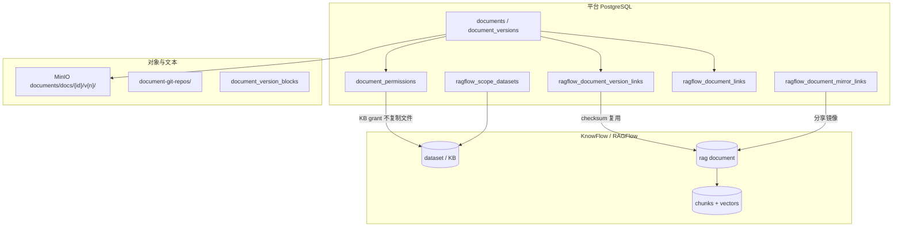

# 知识库与文档存储一致性

本文说明平台如何贯彻 **「存在则不重复计算」**：通过权限赋权访问已有索引，通过 checksum 复用切片，通过对账清理孤儿资源。

## 1. 分层关系



| 层 | 职责 | 孤儿定义 |
|----|------|----------|
| **MinIO `docs/`** | 原文件二进制 | 无 `documents` 行或文档已软删 |
| **version blocks / Git** | 对比/展示用解析文本 | 随版本/文档删除清理 |
| **version link** | 版本 ↔ RAG 文档 + `index_completed_at` | 文档已删/关闭 |
| **canonical link** | 文档级快捷映射 | dataset 已不存在且未登记 |
| **mirror link** | 分享接收者个人库副本 | 分享撤销或文档删除 |
| **KnowFlow chunks** | 向量检索实体 | 无平台 link 且非共享引用 |

## 2. 「存在则不重复计算」

### 2.1 索引复用（内容级）

同 **dataset + 文件名 + MD5**，且已有 `index_completed_at` 时：

- `find_reusable_knowflow_version_link` 查找可复用映射
- `sync_document_to_knowflow` 直接绑定已有 `ragflow_document_id`，**不上传、不重新切片**

实现：`platform/app/services/ragflow_version_link_service.py`、`ragflow_sync_service.py`。

### 2.2 上传后索引（任务级）

- 新版本或未索引版本：`force=True`，入队 `document_index` Job
- **当前版本已索引**：`force=False`，仅刷新 KB ACL，不删远端切片

实现：`knowledge_data_reconcile_service.should_force_knowledge_index_after_upload`。

### 2.3 权限赋权（不复制文件）

组织/单文档 ACL → `sync_document_kb_grants` 映射到 KnowFlow dataset 权限；**不复制向量**。

例外：显式分享且需检索时，`sync_shared_document_mirror` 在接收者个人库建镜像（当前无 checksum 跨用户复用，属已知冗余点）。

### 2.4 共享索引安全删除

多平台版本 link 指向同一 `ragflow_document_id`（checksum 复用）时，删除一篇文档**不会**删除仍被其他文档引用的远端切片。

实现：`count_ragflow_document_references` + `detach_platform_document_knowflow`。

## 3. 权限与数据可见性（双套模型）

| 维度 | 平台 | KnowFlow |
|------|------|----------|
| 文档分级 | `personal/team/department/company` + ACL 三档 visible/query/modify | scope → `ragflow_scope_datasets` |
| 检索 | `can_query_document` | dataset KB grant + 分享镜像 |
| 索引/删除 | `can_modify_document` | 同步/重索引/删 link |
| 管理 | `sys_admin` 跳过 ACL | RAGFlow 租户管理员 |

详见 [权限模型](../platform/permission-model.md)、[权限与账户](permissions.md)。

## 4. 自动对账（运行时）

| 触发点 | 行为 |
|--------|------|
| 用户登录 | `reconcile_user_knowflow_catalog`：建库、去重 dataset、清 orphan link、同步 ACL |
| 登录后台 | `purge_stale_knowflow_links`：已删/关闭文档的 KnowFlow 残留 |
| 应用启动 | `repair_document_library_alignment`：scope ↔ dataset 错位补丁 |
| 索引 Job 完成 | 失效 scope tree 缓存 |

## 5. 运维手动对账

```bash
cd platform

# 干跑：仅统计，不写库
python scripts/reconcile_knowledge_data.py

# 应用：清 stale link、修 library 错位、清 orphan canonical link
python scripts/reconcile_knowledge_data.py --apply

# 额外：删未登记 KnowFlow 知识库
python scripts/reconcile_knowledge_data.py --apply --purge-kbs

# 额外：删 MinIO 无文档绑定的 docs/{id}/ 前缀（谨慎）
python scripts/reconcile_knowledge_data.py --apply --purge-minio
```

已有单功能脚本：

| 脚本 | 作用 |
|------|------|
| `scripts/purge_orphan_knowflow_kb.py` | 未登记 KB |
| `scripts/repair_ragflow_kb_acl.py` | 批量 KB ACL |
| `scripts/repair_document_dept_ids.py` | 文档 dept 对齐 |

代码 API：`knowledge.reconcile_data(db, dry_run=True)`（`KnowledgeGateway`）。

## 6. 清理决策表

| 现象 | 推荐动作 | 是否删向量 |
|------|----------|------------|
| 文档已软删，link 仍在 | `purge_stale_knowflow_links` | 是（无其他引用时） |
| dataset 在 KnowFlow 已不存在 | `_drop_orphan_document_links` | 否（仅删 PG 映射） |
| 未登记「部门」等误建 KB | `purge_unregistered_knowledge_bases` | 是 |
| scope 与 link.dataset 不一致 | `repair_document_library_alignment` | 否（改映射/ACL） |
| MinIO `docs/{id}/` 无文档行 | `reconcile_knowledge_data --purge-minio` | N/A |
| checksum 复用共享 rag id | 删一篇文档 | **否**（保留共享切片） |

## 7. 已知冗余与后续优化

1. **分享镜像**：每被分享用户一份向量副本；可改为纯 KB grant（不 mirror）。
2. **三重解析**：blocks + Git + KnowFlow 各 parse 一次；对比场景保留 blocks/Git，检索仅 KnowFlow。
3. **canonical + version 双表**：历史兼容；读统一走 `document_index_service`。

## 8. 相关代码索引

| 模块 | 路径 |
|------|------|
| 对账服务 | `app/services/knowledge_data_reconcile_service.py` |
| 索引状态统一读 | `app/services/document_index_service.py` |
| 同步与复用 | `app/services/ragflow_sync_service.py` |
| 版本映射 | `app/services/ragflow_version_link_service.py` |
| 目录 reconcile | `app/services/knowflow_catalog_service.py` |
| 库对齐 | `app/services/document_library_align_service.py` |
| 域入口 | `app/domains/knowledge/gateway.py` |
