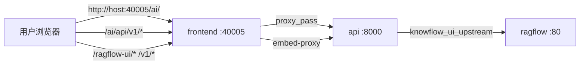

# 网络与反代拓扑

## 生产 / 本机 stack up（仅 40005）

### Nginx 规则（`platform-frontend/nginx.conf`）

| 路径 | 转发目标 | 说明 |
|------|----------|------|
| `/ai/` | SPA 静态 | Vue base path |
| `/ai/api/` | `http://api:8000/api/` | 平台 REST API |
| `/ragflow-ui/` | `api:8000/api/v1/embed-proxy/knowflow/` | KnowFlow 静态 + HTML 注入白标 |
| `/v1/` | `api:8000/api/v1/embed-proxy/knowflow/v1/` | KnowFlow SPA 内 API |
| `/api/knowflow/` | 同上 knowflow 路径 | KnowFlow 管理 API |
| `/api/` | `api:8000` | 兼容旧直连 |

**安全：** 生产环境 **不** 映射 8000、9380、5432 等到公网；仅 40005。

## 开发模式（40005 + 18000）

| 流量 | 路径 |
|------|------|
| 平台 SPA | http://127.0.0.1:40005/ai/ |
| 平台 API | 浏览器直连 http://127.0.0.1:18000（`VITE_API_BASE`） |
| KnowFlow iframe | http://127.0.0.1:18000/ragflow-ui/...（与生产同路径；含 /v1 API） |
| KnowFlow `/v1` API | http://127.0.0.1:18000/v1/...（`knowflow_browser_router`） |

开发 iframe 与 API **同源在 18000**，避免跨端口导致 SPA 内 `/v1` 404。

Vite 亦配置 `/ragflow-ui`、`/v1` 反代（供不走 18000 直链的场景）；宿主机经 40005 访问反代偶发超时，**推荐 API 走 18000**。

## 容器内 DNS

| 主机名 | 服务 |
|--------|------|
| `postgres` | PostgreSQL |
| `redis` | Redis |
| `minio` | MinIO |
| `pdf2zh-api` | 翻译 API |
| `api` | 平台 API |
| `speech-api` | 语音（profile） |
| `ragflow` | RAGFlow nginx（profile） |
| `knowflow-backend` | KnowFlow server |
| `mysql` / `infinity` | KnowFlow 栈 alias |

环境变量中 **必须使用服务名**，勿写 `127.0.0.1`（除 `KNOWFLOW_UI_PUBLIC_URL` 等浏览器地址）。

## embed-proxy 注入

`platform/app/api/embed_proxy.py`：

1. 反代 `knowflow_ui_upstream`（默认 `http://ragflow:80`）
2. HTML 响应注入 `platform-branding.css/js`
3. 静态资源前缀由 `knowflow_ui_asset_prefix` 决定（与 `KNOWFLOW_UI_PUBLIC_URL` 路径一致）

## 设计系统 / 外链

- 智能问数、双碳问答：iframe 嵌入外部设计系统（`DESIGN_SYSTEM_UPSTREAM_URL`）
- 外链类功能插件不经 embed-proxy

详见 [配置说明](configuration.md)。
