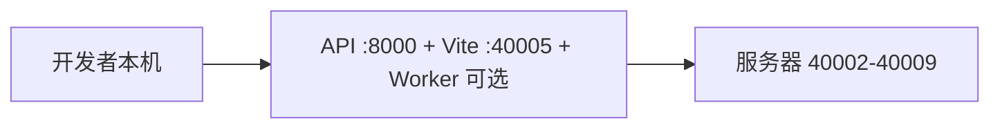

# 远程依赖开发（过渡方案）

> **说明**：在依赖已迁到 **同一台服务器** 前，可用本模式：服务器跑 Postgres / Redis / MinIO / KnowFlow 等，本机只跑 API + 前端 +（按需）Worker。  
> **最终目标**见 [单机迁移与热重载](single-server-migration.md)。

---

## 1. 架构



| 位置 | 运行内容 |
|------|----------|
| 服务器 | `postgres` `redis` `minio` `pdf2zh` `speech` `knowflow` 全栈，**EXPOSE_DEPS=1** 映射 40002–40009 |
| 本机 | FastAPI（venv）、Vite、Celery Worker（远程 Redis 无 Worker 时自动启动） |

---

## 2. 服务器侧

```bash
# 同步编排（可选，见 server-deps.sh）
bash scripts/server-deps.sh sync
bash scripts/server-deps.sh up

# 或已有仓库时
EXPOSE_DEPS=1 bash scripts/stack.sh up --profile knowflow --profile speech
```

端口约定见 `compose.expose-deps.yaml` 与 `.env.server.deps.example`。

---

## 3. 本机侧

```bash
REMOTE_HOST=172.19.134.45 bash scripts/zhitan.sh remote-dev
bash scripts/verify-remote-deps.sh
bash scripts/zhitan.sh local-dev
bash scripts/zhitan.sh local-status
```

`setup-remote-dev-env.sh` 根据 `platform/.env.remote.example` 生成 `platform/.env`（`REMOTE_DEPS=1`）。

---

## 4. 热重载（本机）

| 组件 | 行为 |
|------|------|
| 前端 | 保存即 Vite HMR |
| API | uvicorn `--reload` |
| Worker | 改任务代码后重启 local worker 进程 |

本机 **所见即所得**；服务器上 KnowFlow/pdf2zh 等仍为容器，改平台代码不 rebuild 远程镜像。

---

## 5. 迁到单机

完成联调后按 [单机迁移与热重载](single-server-migration.md)：

1. `stack backup`  
2. 目标机 `stack up`（无 EXPOSE_DEPS）  
3. `stack restore`  
4. `platform/.env` 改为 Docker 服务名  
5. 服务器上使用 `zhitan.sh dev` 继续热重载  

---

## 相关命令

| 命令 | 说明 |
|------|------|
| `bash scripts/server-deps.sh status` | 查看远程容器 |
| `bash scripts/server-deps.sh down` | 停远程依赖（不影响同机 Dify 等） |
| `bash scripts/verify-remote-deps.sh` | 本机探测 40002–40009 |
