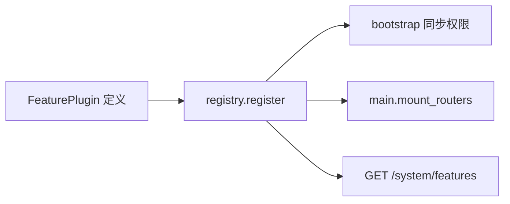

# 功能插件接入指南

平台业务能力（翻译、RAG、文档对比等）通过 **`app/features`** 插件机制接入，避免在 `main.py` / `system.py` 中硬编码。

## 架构一览



| 组件 | 职责 |
|------|------|
| `FeaturePlugin` | 描述功能元数据、权限码、前端路由、可选 FastAPI `router` |
| `registry` | 注册表、挂载路由、导出权限列表 |
| `bootstrap` | 将插件权限写入 DB，并按 `grant_to_roles` 赋给默认角色 |
| `require_feature(id)` | API 依赖项，按插件 ID 校验权限 |
| 系统功能 API | 按用户权限生成卡片列表 |

## 新增一个功能（四步）

### 1. 实现 API（可选）

在 `app/api/` 下新建模块，例如 `app/api/my_feature.py`：

```python
from fastapi import APIRouter, Depends
from app.api.deps import require_feature

router = APIRouter(
    prefix="/my-feature",
    tags=["my-feature"],
    dependencies=[Depends(require_feature("my_feature"))],
)

@router.get("/ping")
def ping():
    return {"ok": True}
```

### 2. 注册插件

新建 `app/features/builtin/my_feature.py`：

```python
from app.api import my_feature as api
from app.features.base import FeaturePlugin
from app.features.registry import register

register(
    FeaturePlugin(
        id="my_feature",                    # 与 require_feature 一致
        title="我的功能",
        description="……",
        icon="document-text",               # 前端 ionicons 名
        route="/system/my-feature",         # 前端路由（需在 platform-frontend 增加页面）
        router=api.router,
        permission_code="feature.my_feature",
        permission_name="我的功能",
        enabled=True,
        grant_to_roles=("sys_admin", "member"),
    )
)
```

在 `app/features/builtin/__init__.py` 中 import 该模块：

```python
from app.features.builtin import my_feature  # noqa: F401
```

### 3. 前端

- 在 `platform-frontend/src/router/index.js` 增加 `route` 对应页面。
- 系统功能页会自动从 `GET /api/v1/system/features` 拉取卡片（无需改侧栏）。

### 4. 权限

- 重启 API 后 `bootstrap` 会自动创建 `feature.my_feature` 权限。
- 在 **角色管理** 中为角色勾选该权限；`grant_to_roles` 仅影响**默认角色**的初始授权。

## 占位功能（未实现 API）

仅注册 `FeaturePlugin`，**不设置 `router`**，并设 `enabled=False`：

```python
register(FeaturePlugin(
    id="rag_qa",
    ...
    enabled=False,
    tag="即将推出",
))
```

仍会出现在系统功能清单；用户可见但不可进入。

## 权限约定

- 平台核心：`admin.*`、`doc.*` — 定义在 `app/core/permissions.py`
- 业务能力：`feature.<slug>` — 由各插件 `permission_code` 提供
- API 校验：`Depends(require_feature("plugin_id"))` 或 `Depends(require_permission("feature.xxx"))`

## 与文档库集成（翻译示例）

翻译插件除本地上传外，通过 `document_service.list_translatable_documents` / `read_document_pdf_bytes` 读取文档库 PDF，权限要求：

- 列表与读取均校验 **`doc.use`（使用）** 级别 ACL
- 仅返回已上传且为 PDF 的当前版本

前端在翻译页提供「文档库」选择器，调用 `GET /api/v1/translate/documents`。

## 测试

```bash
cd platform && .venv/bin/pytest tests/ -q
```
