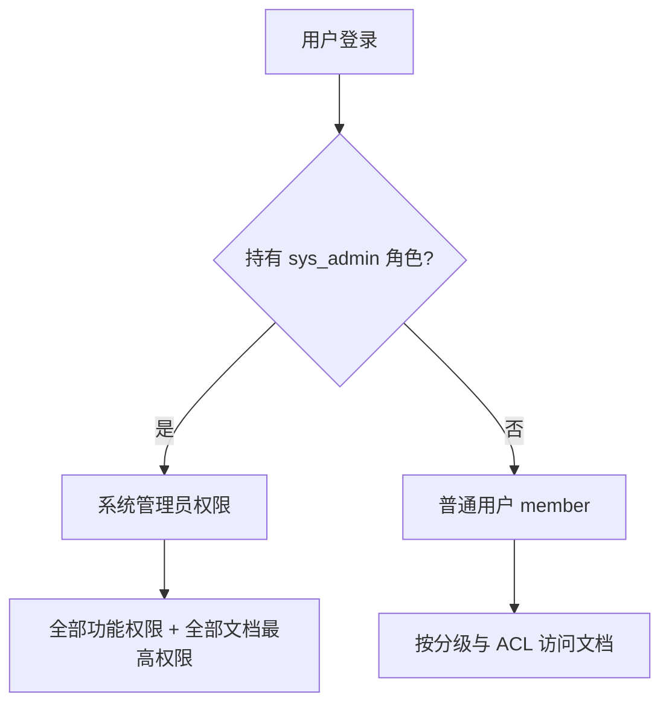

# 平台权限模型说明

> **开发实现说明书 · 第三篇 §3.3** · [说明书总览](../development/implementation-manual.md)

本文描述智碳平台 **账号身份**、**功能权限（RBAC）** 与 **文档权限（分级 + 单文档 ACL）** 的关系与判定顺序。实现以 `platform/app/core/permissions.py`、`document_scope.py`、`platform_admin.py` 为准。

---

## 1. 内置管理员账号与系统管理员权限

| 项 | 说明 |
|----|------|
| **内置账号手机号** | 配置项 `BOOTSTRAP_ADMIN_PHONE`（默认 `15963564658`） |
| **默认密码** | 配置项 `BOOTSTRAP_ADMIN_PASSWORD`（默认 `admin123`） |
| **显示名** | 默认「系统管理员」 |
| **内置账号数量** | 全平台**仅这一个**手机号作为不可删除的内置管理员账号 |

要点：

- **内置账号**（`is_bootstrap_admin`）：不能注册、不能改手机号/姓名、不能删除、不能禁用、不归属部门；启动时自动保证其持有 `sys_admin` 角色。
- **系统管理员权限**（`user_is_system_admin`）：持有 `sys_admin` 角色的用户均可；可在用户管理中为其他账号分配「系统管理员」角色。
- 登录后 `/auth/me` 的 `permissions` 与 `is_system_admin` 反映角色；前端按权限码展示系统设置等菜单。

---

## 2. 角色（RBAC）

种子角色（`DEFAULT_ROLES`）：

| 角色 code | 名称 | 用途 |
|-----------|------|------|
| `sys_admin` | 系统管理员 | 用户管理中可分配；含全部功能权限 |
| `member` | 普通用户 | 用户管理中可分配；文档与文库权限见下表 |

**不要**再使用已废弃的 `company_admin`、`dept_admin`。

---

## 3. 系统管理员能做什么

当 `user_is_system_admin` 为真时：

| 范围 | 能力 |
|------|------|
| **功能权限** | `user_has_permission` 对任意权限码返回真（可进用户管理、部门管理等） |
| **文档库** | 可见 **所有部门** Tab；可查看 **所有用户** 的个人/部门/公司级文档 |
| **单文档** | 读、查、编、删、授权、禁止访问等与文档相关的最高能力 |
| **发布** | 可将任意自己的文档发布到任意部门/公司文库（超级管理员还可代管） |

普通用户（`member`）：

- 默认只能看到自己的 **个人级** 文档；
- **部门级 / 公司级** 按下面「分级默认可见」规则；
- 可通过「发布到文库」把文档放入部门/公司库；
- 可通过「分享给个人」做个人文档的例外协作。

---

## 4. 文档分级（scope）

| scope | 文档库 Tab | 默认谁能看见（无单文档 ACL） |
|-------|------------|------------------------------|
| `personal` | 我的 | 仅创建人；系统管理员可见全部 |
| `company` | 公司级 | 组织**根节点**（`parent_id` 为空）；同根或其下级且具备 `doc.read` 的成员 |
| `department` | 部门级 | 组织树**二级节点**（depth=1） |
| `team` | 小组级 | 组织树**三级节点**（depth=2） |
| `personal` | 我的 | 仅创建人；与组织树第四层概念对应，为个人文库（不共享组织节点） |

另有虚拟 Tab **「分享」**：仅收录他人通过 **个人级 user 授权** 分享、且不因分级默认可见的文档。

---

## 5. 两种「共享」方式（勿混淆）

| 方式 | 操作入口 | 机制 | 他人从哪里看到 |
|------|----------|------|----------------|
| **发布到文库** | 文档详情 →「发布到文库」 | 修改 `scope` / `dept_id` | 文档库 **公司级 / 部门级 / 小组级** |
| **分享给个人** | 文档详情 →「分享给个人」 | 写入 `document_permissions`（仅 `subject_type=user`） | 文档库 **分享** Tab |

原则：**部门/公司可见 = 改分级；个人例外协作 = user 型 ACL。**

---

## 6. 单文档 ACL 与禁止访问

### 6.1 显式授权（grant）

- 仅 **文档创建人** 或 **系统管理员** 可添加/撤销。
- 仅支持按 **用户** 授权（四档：`visible` / `query` / `edit` / `full`）。
- 存储上每人至多一条 `document_permissions` 记录；对外 API 返回 **当前分享状态**（`user_id` + `level`），不保留历史授权记录。
- `GET /documents/{id}/permissions` → 当前已授权用户列表；`DELETE .../permissions/users/{user_id}` → 取消对该用户的分享。

### 6.2 禁止访问（deny）

- 仅 **文档创建人** 或 **系统管理员** 可设置。
- 用于在部门/公司默认可见规则下，屏蔽个别用户。

### 6.3 读权限判定顺序（普通用户）

1. 系统管理员 → 允许  
2. 存在未过期的显式授权（级别 ≥ 所需）→ 允许  
3. 在禁止访问名单中 → **拒绝**  
4. 按 scope 默认规则（个人/部门/公司）  

---

## 7. 用户与部门

- 每人至多归属 **一个** 部门（`user_departments.user_id` 唯一）。
- 内置 **admin** 不归属任何部门。
- 部门级文档列表、文件夹、发布到部门时需指定 `dept_id`；系统管理员在文档库中可选择 **任意部门** 查看该部门下文档。

---

## 8. 管理后台操作约束（唯一系统管理员）

| 操作 | 系统管理员账号 | 其他用户 |
|------|----------------|----------|
| 删除 | 不可 | 可（需权限） |
| 改手机号 | 不可 | 可 |
| 禁用 | 不可 | 可 |
| 分配部门 | 不可（无部门） | 可 |
| 设为系统管理员 | — | **不可**（界面无此选项） |

---

## 9. 登录与注册

- **登录**：`POST /auth/login` 请求体字段 `account`（兼容旧字段 `phone`），可为 **11 位手机号** 或 **用户名**（不区分大小写）。
- **注册**：`phone`、`email` **必填且唯一**；`username` 可选（默认同 `display_name`），唯一。
- **用户管理**（需 `admin.user`，系统管理员具备）：可修改任意用户的手机号、用户名、邮箱、显示名、部门、角色等。

## 10. 前端与 API 约定

- `GET /api/v1/auth/me` 返回：
  - `is_bootstrap_admin`：是否为内置 admin 账号
  - `is_system_admin`：是否具备系统管理员能力（含上述两类）
  - `permissions`：角色聚合后的权限码列表
- 前端 `useAuth().isSystemAdmin` 与后端 `is_system_admin` 对齐，用于文档库部门切换、权限按钮等。

---

## 11. 相关代码入口

| 模块 | 路径 |
|------|------|
| 系统管理员判定 | `app/core/permissions.py` → `user_is_system_admin` |
| 内置 admin | `app/core/platform_admin.py` → `is_bootstrap_admin` |
| 文档分级与可见性 | `app/core/document_scope.py` |
| 用户授予角色 | `app/api/users.py` |
| 启动种子 | `app/bootstrap.py` |

---

## 12. 已废弃

- 角色 `company_admin`、`dept_admin`
- 公司/部门库「仅某类管理员上传才显示」的过滤
- 通过 `subject_type=dept/role` 写入单文档 ACL（读取侧兼容历史数据，新数据勿写）
