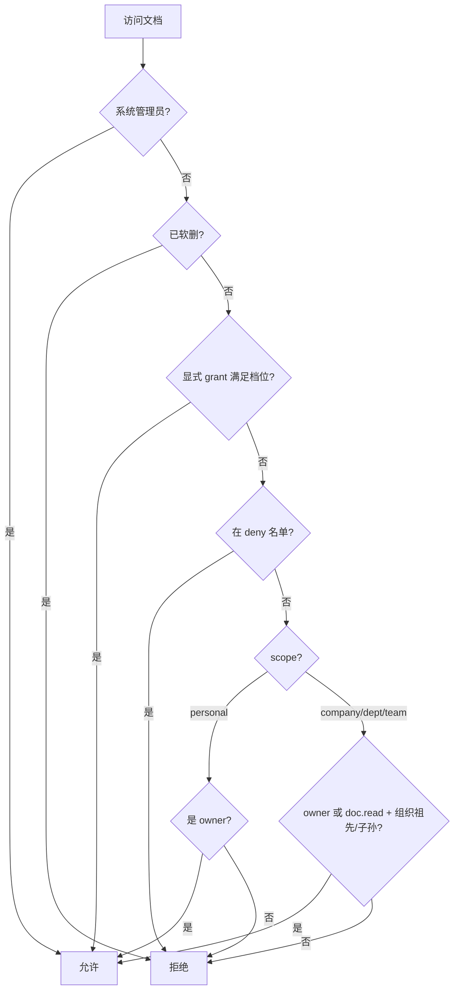

# 权限模型与文档分级

> 面向管理员与业务用户的说明。实现细节见 [文档中心实现](../implementation/documents-implementation.md)。

---

## 1. 两套独立维度

平台在「谁能做什么」上同时使用两套互不替代的规则：

| 维度 | 含义 | 主要取值 |
|------|------|----------|
| **文档分级（scope）** | 文档放在哪一层文库 | `personal` / `team` / `department` / `company` |
| **用户身份（role）** | 平台管理身份与全局 bypass | `member`（普通用户）/ `sys_admin`（系统管理员） |

文档中心 Tab 顺序：**个人级 → 小组级 → 部门级 → 公司级**（另有虚拟 Tab「分享」，见 §6）。

后端 scope 值统一为 `personal`；界面与本文档均称「个人级」。

---

## 2. 组织树 ↔ 文档分级

组织部门是一棵**有父子关系**的树。文档分级中的公司 / 部门 / 小组，**不是**独立的权限层级名称，而是与组织树**深度（depth）**一一绑定：

| 组织树深度 | 节点示例 | 对应文档分级 | scope 值 |
|------------|----------|--------------|----------|
| 0（根） | 公司 | 公司级 | `company` |
| 1 | 一级子部门 | 部门级 | `department` |
| 2 | 二级子部门（小组） | 小组级 | `team` |
| ≥ 3 | 更深层节点 | **不能**绑定组织文库 | 发布时只能选 personal |

典型结构：

```
智碳平台（公司，depth=0）          ← 公司级文档绑定此节点
├── 研发部（depth=1）               ← 部门级文档绑定此节点
│   ├── 前端组（depth=2）           ← 小组级文档绑定此节点
│   └── 后端组（depth=2）
└── 市场部（depth=1）
    └── 品牌组（depth=2）
```

**发布规则：** 向公司 / 部门 / 小组级发布时，必须选择**深度匹配**的组织节点。例如 depth=1 的「研发部」不能作为小组级发布目标，系统会拒绝并提示节点实际对应的分级。

**历史兼容：** 若文档未显式写入 `scope` 字段，系统会根据 `dept_id` 在组织树中的深度自动推断分级。

判定入口：`app/core/document_scope.py`（`department_depth`、`scope_for_department`、`validate_dept_for_scope`）。

---

## 3. 用户 ↔ 部门

### 3.1 每人至多一个部门

每个用户在 `user_departments` 中**最多归属一个**组织节点（可为根公司、部门或小组任意深度）。在「系统设置 → 用户管理」中分配部门时，只能单选。

### 3.2 部门归属与「能看到哪些组织 Tab」

用户被分配到的部门深度，决定文档中心里**组织 Tab 下可选的组织单元**（普通用户）：

| Tab | 普通用户可见的组织单元 |
|-----|------------------------|
| **公司级** | 自己所属部门向上追溯到的**根公司** |
| **部门级** | 仅当用户直属部门 depth=1 时，显示该部门 |
| **小组级** | 仅当用户直属部门 depth=2 时，显示该小组 |

**系统管理员**在各 Tab 可看到对应深度下的**全部**组织节点。

!!! tip "Tab 可选单元 ≠ 可读范围"
    用户直属在「前端组」(depth=2) 时，部门级 Tab 可能**没有**可选组织单元，但仍可能**阅读**绑定在上级「研发部」的部门级文档（见 §4.3 祖先/子孙规则）。

---

## 4. 各分级详解

### 4.1 个人级（personal）

| 项目 | 说明 |
|------|------|
| 绑定 | **不**绑定组织节点（`dept_id` 为空） |
| 归属 | 按上传者 `owner_id` |
| 默认可见 | 仅文档创建人本人 |
| 系统管理员 | 可见全部个人级文档 |
| 典型来源 | 手动上传、翻译/对比结果导入、公众号/RSS/网站资讯导入（固定 personal） |

### 4.2 小组级 / 部门级 / 公司级（team / department / company）

| 项目 | 说明 |
|------|------|
| 绑定 | 必须绑定对应深度的组织节点（`dept_id`） |
| 默认可见 | 见 §4.3 |
| 文件夹 | 按 `scope + dept_id` 隔离（`DocumentLibraryFolder`） |
| KnowFlow | 按 scope 与组织 `scope_key` 路由到共享 dataset（见 §9） |

### 4.3 组织文库默认可见规则

对绑定组织的文档，默认可读需同时满足：

1. 用户持有 **`doc.read`**（文档查阅）权限；
2. 用户的所属部门 **等于** 文档绑定的组织节点，或位于该节点的**子孙**子树内（`user_can_access_org_unit`）。

**举例：**

- 文档挂在「研发部」(depth=1) → 「前端组」(depth=2) 成员**可以**默认看到。
- 文档挂在「前端组」(depth=2) → 「后端组」成员**不能**默认看到（非同一祖先链下的兄弟节点）。
- 文档创建人本人**始终**可读自己发布的组织文库文档。

### 4.4 系统管理员（sys_admin）

**不存在「系统级」文档 scope。** 「系统」指 **系统管理员**角色：

- 持有 `sys_admin` 角色（含内置 bootstrap 管理员账号）；
- 跳过文档 ACL，对所有分级文档具备读 / 编 / 删能力；
- 拥有用户管理、部门管理、角色管理、审计、系统设置等平台权限；
- 历史上独立的「公司级管理员 / 部门级管理员」角色已废弃，管理身份统一为系统管理员。

用户管理界面为二选一：**普通成员** 或 **系统管理员**，不可同时持有多个角色。

---

## 5. 分级操作权限（RBAC）

除 `doc.read`（查阅组织文库）外，每个分级有独立的 create / edit / delete 权限码：

| 分级 | 权限前缀 | 典型能力 |
|------|----------|----------|
| 个人级 | `doc.personal.*` | 在个人级 Tab 新建、编辑、删除 |
| 小组级 | `doc.team.*` | 在小组级 Tab 新建、编辑、删除 |
| 部门级 | `doc.dept.*` | 在部门级 Tab 新建、编辑、删除 |
| 公司级 | `doc.company.*` | 在公司级 Tab 新建、编辑、删除 |

默认 **member（普通用户）** 角色已包含上述全部权限及 `doc.read`。**sys_admin** 拥有全部权限码。

**新建 / 发布校验（`resolve_create_params`）：**

- 组织分级必须选择 `dept_id`，且深度与 scope 一致；
- 非系统管理员只能选择**本人可访问**的组织节点（所属节点或其祖先链上的节点，用于发布到上级文库）；
- 未归属任何部门的用户无法在组织分级新建文档。

---

## 6. 单文档 ACL 与「分享」Tab

分级决定**默认可见范围**；单文档还可叠加显式授权与禁止规则。

### 6.1 权限档位

| 档位 | 代码 | 能力（简述） |
|------|------|--------------|
| 0 可见 | `visible` | 下载、预览 |
| 1 可查 | `query` | 知识问答、检索、对比选文档 |
| 2 可修改 | `modify` | 上传、分享、重建索引、删除、管理 ACL |

旧档位 `edit` / `full` / `use` / `delete` 在 API 与存储中自动归并为 `modify`。

判定函数：`can_read_document` → `can_query_document` → `can_modify_document`。

**组织分级默认**：文档发布到公司/部门/小组库后，所属组织成员默认获得 **可修改**（不再仅为可查）。

### 6.2 分享给个人

- 通过 `DocumentPermission` 写入，主体类型为 **user**（及兼容的 dept / role）；
- **文档创建人、系统管理员、或被授予 `modify` 的用户**可授予 / 撤销；
- 无需审核，即时生效；
- 若启用 KnowFlow，会同步 KB ACL 与分享镜像（被分享者在个人 dataset 中可检索副本）。

### 6.3 禁止访问（deny）

- `DocumentAccessDenial` 对指定用户生效；
- **优先级高于**分级默认可见与 grant；
- 仅文档创建人或系统管理员可维护。

### 6.4 「分享」虚拟 Tab

出现在「分享」Tab 的文档须同时满足：

- 他人通过显式 grant 获得至少 **query** 及以上权限；
- **不属于**分级默认可见（`readable_by_scope_default` 为 false）。

即：因组织归属本就能看到的文档，不会重复出现在「分享」列表。

---

## 7. 权限判定流程（简图）



代码入口：`app/core/document_scope.py` → `can_access_document`；平台 RBAC：`app/core/permissions.py`。

---

## 8. 回收站与状态

| 规则 | 说明 |
|------|------|
| 软删 | 设 `deleted_at`，在个人回收站列表可见 |
| 恢复 | 删除者本人，或具备文档管理权限者 |
| 永久删除 | 异步任务清理 MinIO、KnowFlow 链接、Git 版本等 |
| 禁用状态 | `status=disabled` 时，非管理者不可读 |

---

## 9. 与知识库（KnowFlow）的对应

| scope | RAGFlow dataset 策略 |
|-------|---------------------|
| `personal` | 用户个人 dataset |
| `team` / `department` | 按组织 `scope_key` 绑定的共享 dataset |
| `company` | 公司级共享 dataset |

平台维护 `ragflow_scope_datasets` 注册表，避免重复创建。文档同步、检索范围树（知识检索）均按上述 scope 与组织节点展开；知识检索树顶部分级文案对个人级统一为「个人级」。

账号映射：每平台用户在 RAGFlow 侧有 mapped 账号（如 `zt-platform-{user_id}`）。详见 [功能实现说明 · KnowFlow](../operations/feature-implementation.md#4-knowflow--知识库)。

---

## 10. 常见场景速查

| 场景 | 行为 |
|------|------|
| 新用户上传第一份文档 | 默认进入**个人级**，仅本人可见 |
| 发布到部门文库 | owner 选择 depth=1 节点 + 持有 `doc.dept.create` |
| 组员看部门通知 | 部门级文档 + 组员 `doc.read` + 组员部门在该部门子树内 |
| 跨组分享 | owner 发起 user grant；出现在对方「分享」Tab |
| 屏蔽某成员 | owner 或管理员写入 deny，优先于组织可见 |
| 公众号文章导入 | 固定 `personal`，可选同步 KnowFlow |
| 组织树超过 3 层 | 第 4 层及以下节点不能作为 company/dept/team 发布目标 |

---

## 11. 关键代码路径

| 功能 | 路径 |
|------|------|
| 分级与 ACL 判定 | `app/core/document_scope.py` |
| 角色与权限码 | `app/core/permissions.py` |
| 用户部门（单人单部门） | `app/core/user_department.py` |
| 文档列表 / 筛选 | `app/services/documents/listing.py` |
| 知识检索范围树 | `app/services/knowledge_scope_tree_service.py` |
| KnowFlow scope 路由 | `app/services/ragflow_scope_service.py` |
| 前端 Tab / 常量 | `platform-frontend/src/constants/documentScope.js` |

---

## 12. 相关文档

- [文档中心实现](../implementation/documents-implementation.md)
- [功能实现说明 · 分级文档库](../operations/feature-implementation.md#32-分级文档库)
- [权限与账户](../operations/permissions.md)
