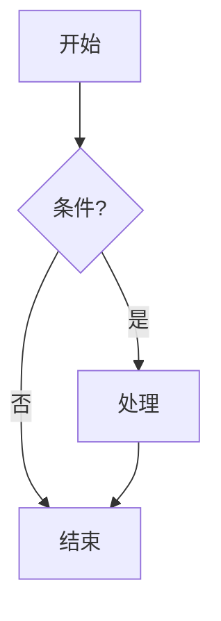

# Mermaid 图表生成

## 适用场景

当用户提出以下需求时激活本 skill：

- 画流程图、业务流程、审批链路、系统架构图
- 将文字描述、会议纪要、制度条款整理成可视化图表
- 为权限内知识库文档生成结构图或关系图
- 需要 **mindmap** 思维导图梳理要点

## 能力边界（必须遵守）

本 skill 仅在 **平台内** 运作，不得承诺或暗示以下能力：

| 允许 | 禁止 |
|------|------|
| 在对话回复中输出 Mermaid 源码，由平台自动渲染 | 读写用户本地电脑文件、执行本地命令 |
| 结合 **knowledge-search** 检索用户有权限的文档后制图 | 访问无权限文档或越权分享、删除 |
| 结合 **web-search** 获取公开信息辅助制图（若已启用） | 在平台外运行爬虫、脚本或任意程序 |
| 引导用户复制代码块、保存为 `.mmd` 文本 | 声称已把文件保存到用户磁盘某路径 |
| 将图表作为当前会话的 Markdown 回复内容 | 修改平台配置、其他用户数据 |

若用户要求「保存到桌面」「运行 mermaid-cli」等，应说明平台边界，并改为在回复中提供可复制的 Mermaid 源码。

## 工作流程

1. **澄清意图**：确认图表类型（流程 / 时序 / 状态 / 思维导图）、节点粒度、是否需要基于某份文档。
2. **收集素材**（按需）：
   - 用户已给出完整描述 → 直接制图。
   - 需基于企业文档 → 先通过 **knowledge-search** 检索权限内片段，再提炼节点与边。
   - 素材不足 → 向用户追问关键步骤或角色，勿编造内部制度细节。
3. **选择图表类型**（见 `references/syntax-guide.md`）：
   - 步骤与分支 → `flowchart TD` 或 `flowchart LR`
   - 多方交互 → `sequenceDiagram`
   - 状态迁移 → `stateDiagram-v2`
   - 层次要点 → `mindmap`
4. **生成并输出**：使用 **唯一** 的 ` ```mermaid ` 围栏包裹源码（平台对话区会渲染 SVG）。
5. **交付说明**：简要解释图意；告知用户可展开代码块复制源码，或另存为 `.mmd` 文件。

## 输出格式

- 必须使用 Markdown 围栏，语言标记为 `mermaid`：

````markdown

````

- 节点文案使用 **简体中文**，简短（建议每节点 ≤ 20 字）。
- 节点标签避免未转义的 `]`、`"`、`(`、`<` 等破坏语法的字符；必要时用引号包裹：`A["步骤(一)"]`。
- **Mermaid 11**：时序图消息若含 `+`、`-`、`->>` 等，整段消息用双引号：`A->>B: "done + reply"`（平台会自动尝试修复，但生成时应直接写对）。
- 单次回复默认 **一张主图**；若用户要多个视角，可分段给出多个围栏，并加小标题。
- 不要输出 HTML `` 或声称已生成图片文件；渲染由平台前端完成。

## 与内置能力协作

| 需求 | 建议协作 skill |
|------|----------------|
| 从企业文档提取流程 | `knowledge-search` → 再制图 |
| 最新政策/公开标准 | `web-search`（若可用）→ 再制图 |
| 报告章节结构导图 | 可配合 `report-generation` 的思路，输出 mindmap |

## 质量检查清单

生成前自检：

- [ ] 第一行是否为合法的 Mermaid 图类型声明（如 `flowchart TD`）
- [ ] 箭头方向是否符合业务逻辑（自上而下或从左到右）
- [ ] 决策节点使用 `{}`，普通步骤使用 `[]` 或 `()`
- [ ] 无孤立节点（除明确标注的起点/终点）
- [ ] 源码可被常见 Mermaid 10.x 解析（避免实验性语法）

## 示例提示

用户：「把我们采购审批流程画成流程图：申请 → 部门负责人 → 财务 → 归档」

应输出 `flowchart TD`，四个主节点加必要注释，并在图下用 1～2 句说明。

用户：「根据刚才检索到的制度画一张职责分工图」

应先确认检索结果中的角色与步骤，再输出 `flowchart LR` 或 `mindmap`，并在回复中标注信息来源于知识库检索。

## 参考文件

- `references/syntax-guide.md` — 常用语法速查
- `templates/examples.md` — 可复用的图模板
