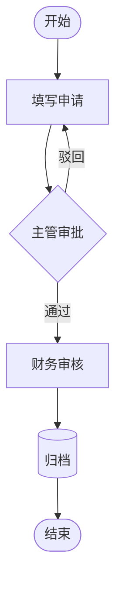
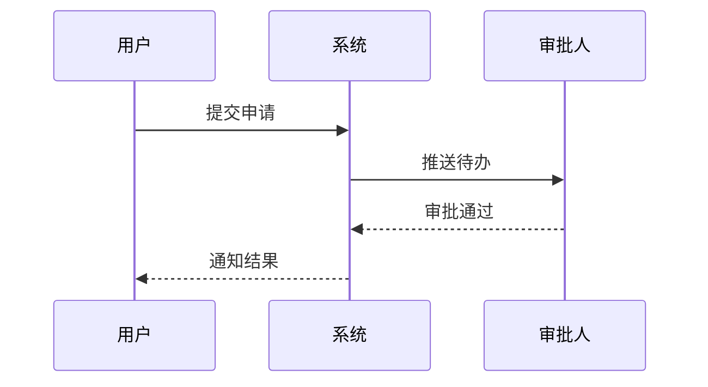
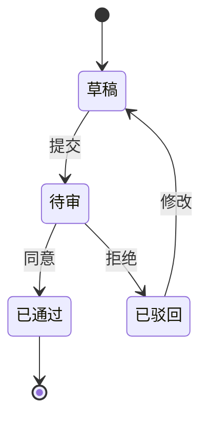
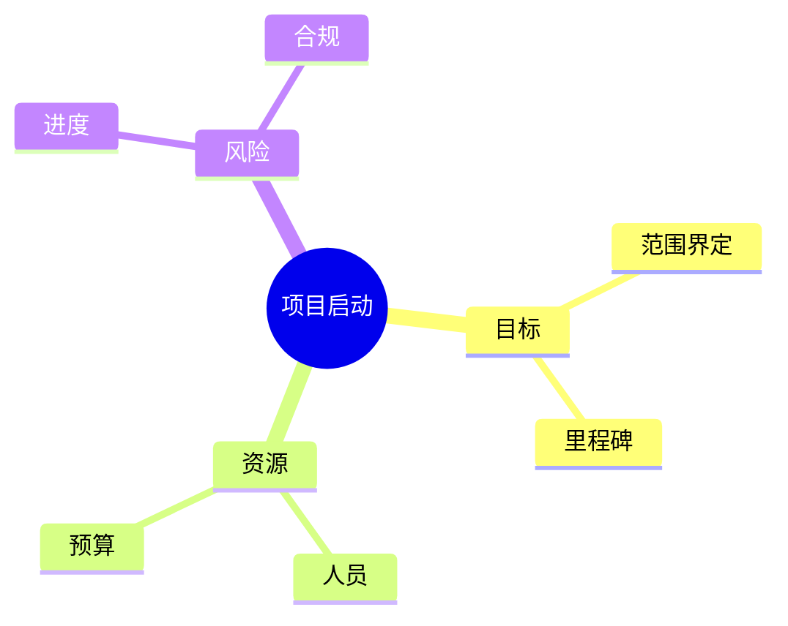
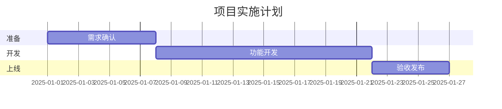

# Mermaid 语法速查

## 流程图 flowchart

常用形状：

| 语法 | 形状 |
|------|------|
| `A[矩形]` | 处理步骤 |
| `B(圆角)` | 一般活动 |
| `C{菱形}` | 判断 |
| `D([体育场])` | 开始/结束 |
| `E[(数据库)]` | 存储 |

方向：`TD` 上下、`LR` 左右、`BT` 下上、`RL` 右左。

## 时序图 sequenceDiagram

## 状态图 stateDiagram-v2

## 思维导图 mindmap

注意：mindmap 节点避免括号、引号等特殊符号。

## 甘特图 gantt（可选）

## 常见错误

1. 节点 ID 含空格 — 使用 `step1` 而非 `step 1` 作为 ID。
2. 中文边标签 — 使用 `A -->|是| B` 格式。
3. 子图 — `subgraph 标题` … `end`，标题可用引号包裹特殊字符。
