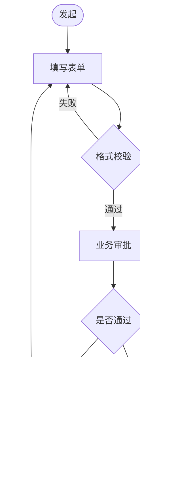
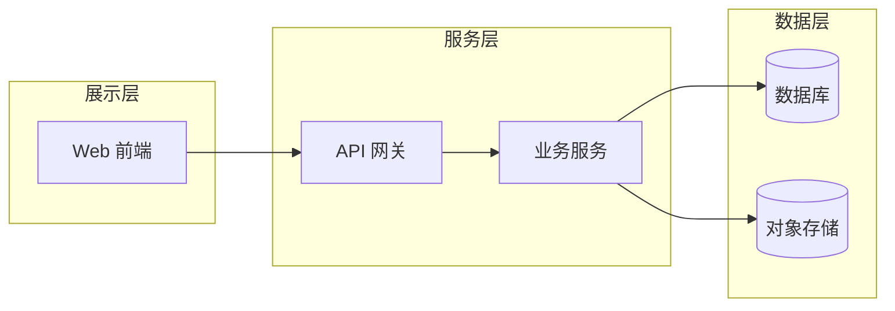
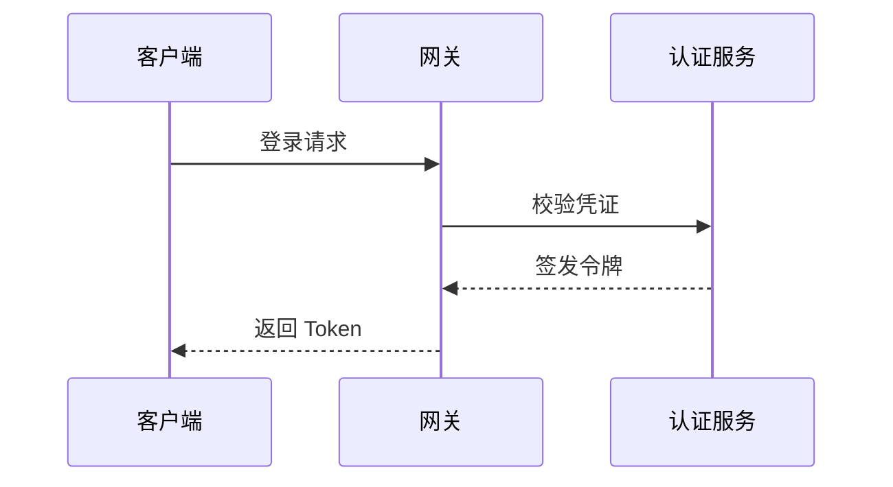
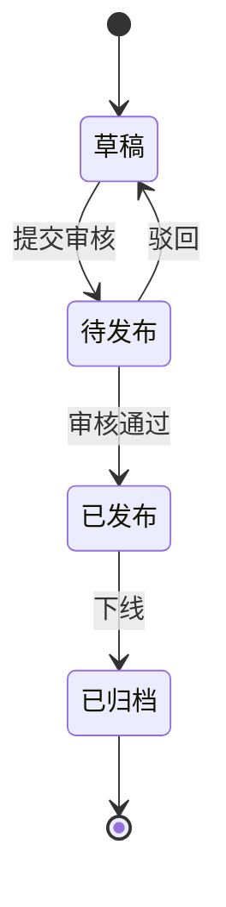
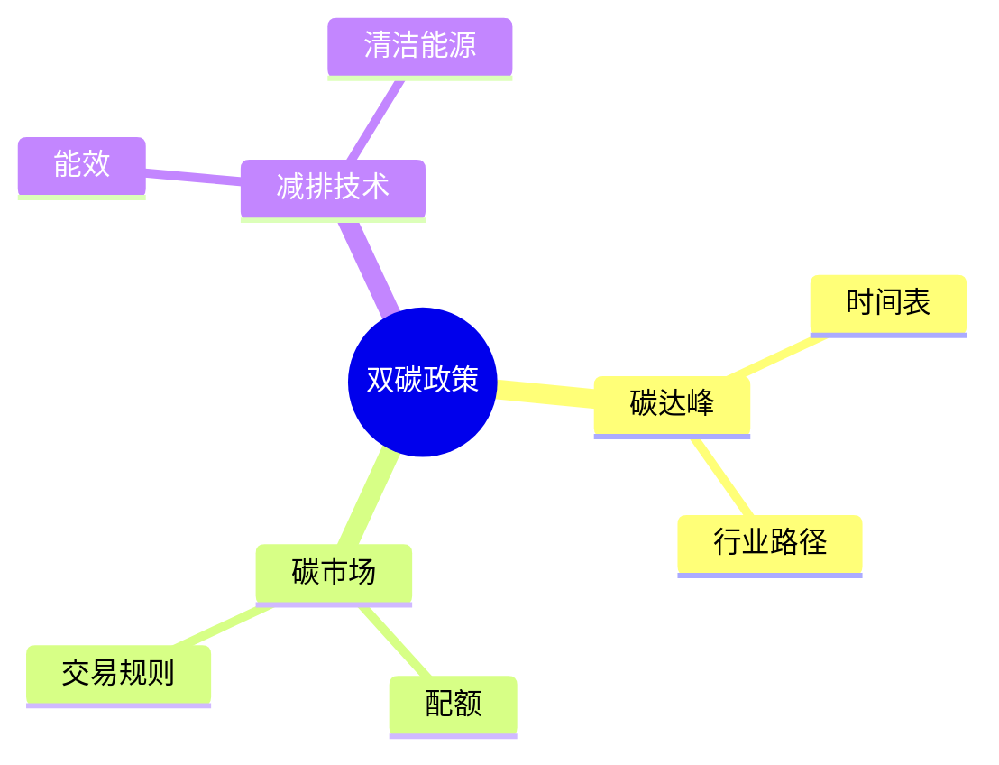

# 图表示例模板

复制后替换节点文案即可；输出给用户时放入 ` ```mermaid ` 围栏。

## 1. 通用审批流程


```mermaid
flowchart TD
    A([发起]) --> B[填写表单]
    B --> C{格式校验}
    C -->|失败| B
    C -->|通过| D[业务审批]
    D --> E{是否通过}
    E -->|否| F[退回修改]
    F --> B
    E -->|是| G[执行归档]
    G --> H([完成])
```

## 2. 系统分层架构（LR）


```mermaid
flowchart LR
    subgraph 展示层
        UI[Web 前端]
    end
    subgraph 服务层
        API[API 网关]
        SVC[业务服务]
    end
    subgraph 数据层
        DB[(数据库)]
        OSS[(对象存储)]
    end
    UI --> API --> SVC
    SVC --> DB
    SVC --> OSS
```

## 3. 登录时序


```mermaid
sequenceDiagram
    participant C as 客户端
    participant G as 网关
    participant Auth as 认证服务
    C->>G: 登录请求
    G->>Auth: 校验凭证
    Auth-->>G: 签发令牌
    G-->>C: 返回 Token
```

## 4. 文档生命周期状态


```mermaid
stateDiagram-v2
    [*] --> 草稿
    草稿 --> 待发布: 提交审核
    待发布 --> 已发布: 审核通过
    待发布 --> 草稿: 驳回
    已发布 --> 已归档: 下线
    已归档 --> [*]
```

## 5. 知识主题 mindmap


```mermaid
mindmap
  root((双碳政策))
    碳达峰
      时间表
      行业路径
    碳市场
      配额
      交易规则
    减排技术
      能效
      清洁能源
```
