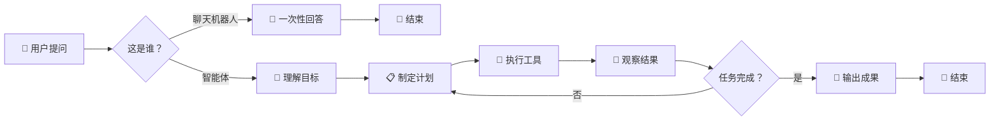
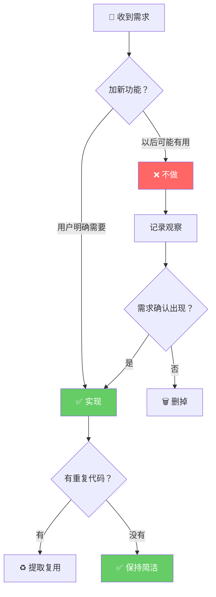
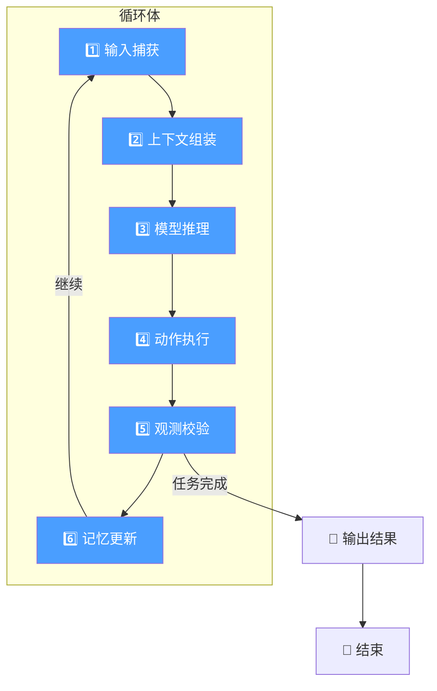
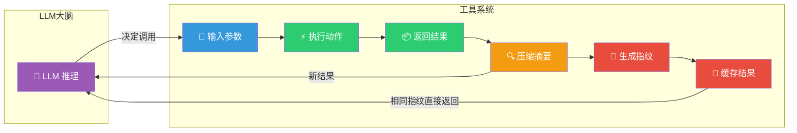
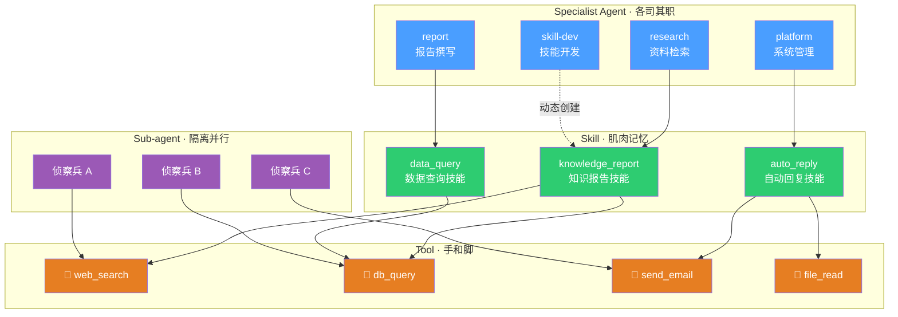
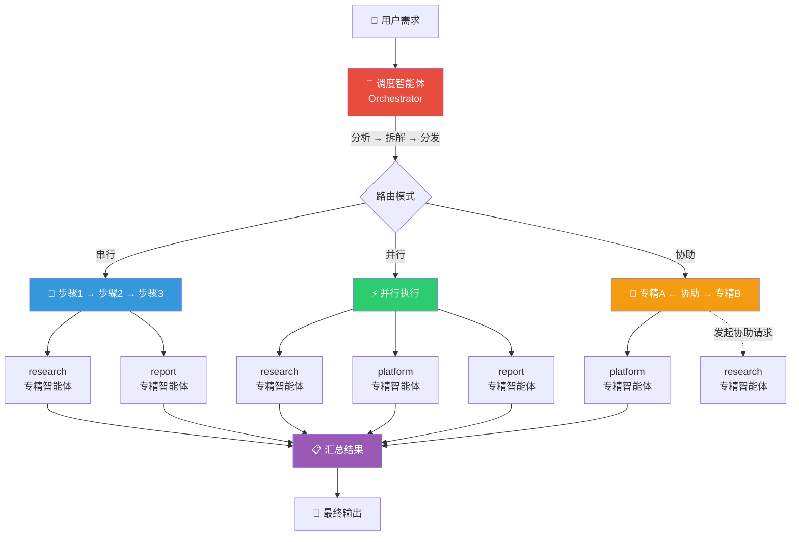
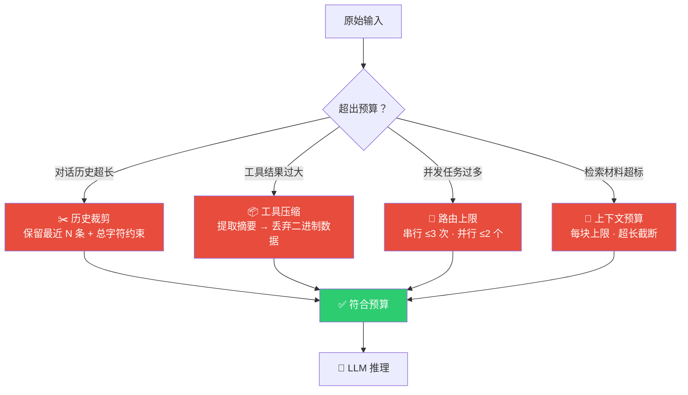
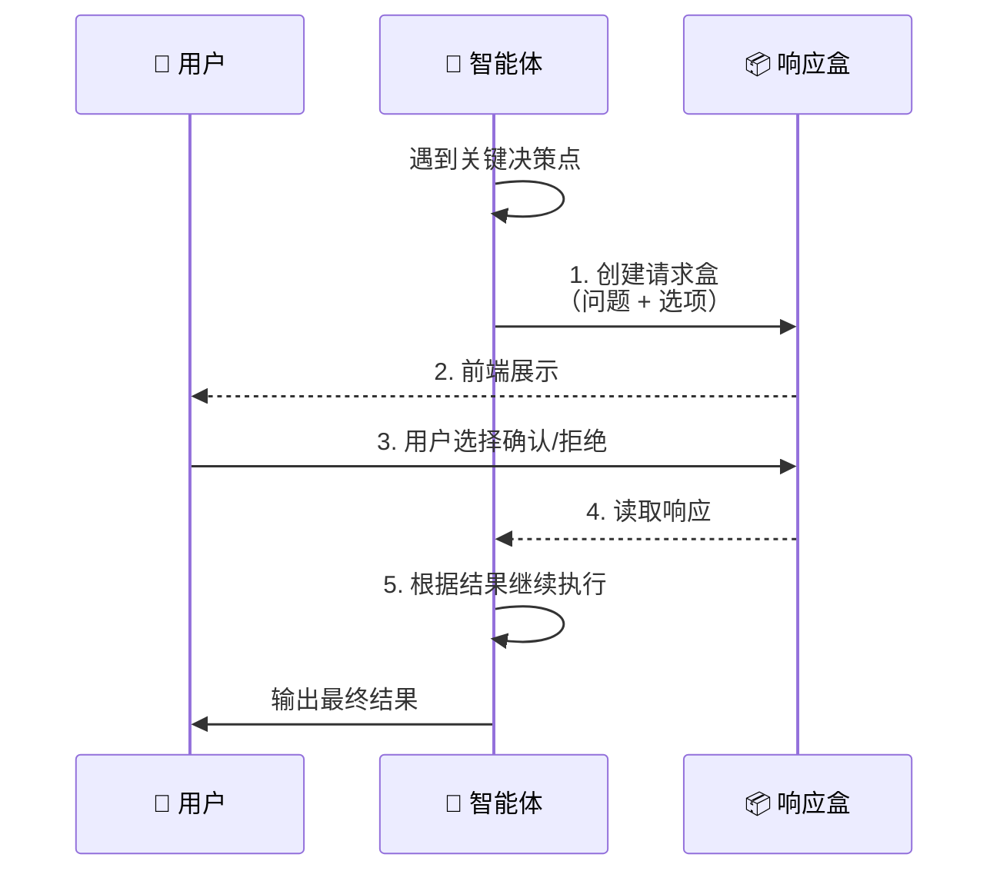
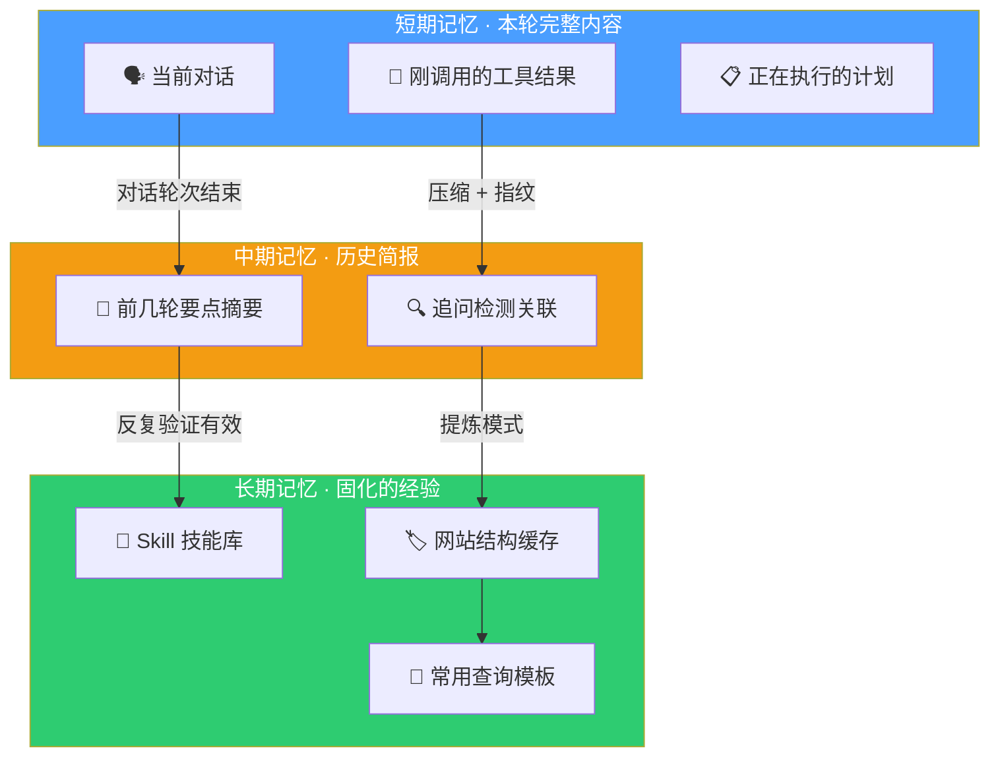

# 我的智能体设计哲学 —— 让 AI 真正干活的工程法则

## 一、开篇：智能体的"灵魂"是什么？

2024 年以来，几乎每个月都有新的 AI 智能体框架冒出来。每个人都在说"我的智能体如何如何"，但很少有人认真思考一个问题：

**智能体和聊天机器人到底有什么区别？**

聊天机器人是"一问一答"：你问它答，它说完就结束。但智能体不同。一个真正的智能体，核心能力是**自主完成多步骤任务**——它要自己规划、自己行动、自己观察结果、自己决定下一步做什么，而不是等着人类每一步都告诉它该干嘛。

我花了三个多月的时间，从零构建了一个叫 **Agentkit** 的智能体框架。它不是那种塞满炫技功能的"玩具"，而是一套经过真实业务检验的工程实践。这篇文章就是想把这些设计思路说清楚，让不懂技术的普通读者也能理解：**一个靠谱的智能体，到底是怎么被"设计"出来的**。

---

## 二、奥卡姆剃刀：最好的功能就是没有功能

我的哲学第一条，来自一把 14 世纪的剃刀。

奥卡姆的威廉说："如无必要，勿增实体。"翻译成大白话就是——**不要把简单的事情搞复杂**。

很多智能体框架的通病是：什么都想做。你可以在 system prompt 里塞五十条指令，给它注册一百个工具，它看起来无所不能，实际上什么都干不好。就像一个人身上装了二十把瑞士军刀，最后连拧螺丝都找不对工具。

Agentkit 的设计原则非常明确：

- **不做不存在的功能。** 用户没说要的，就不做。不要为了"以后可能有用"去提前堆砌抽象层。
- **不做无用的抽象。** 一个工具函数就是一段代码，不需要经过三层工厂模式才能调用。
- **能复用就复用。** 写代码最忌讳的事情之一就是"重复造轮子"——同样的工具调用逻辑，不要在三个地方各写一遍。

打个比方：造一辆车，车轮就是圆的，没必要把它设计成八边形再通过算法转成圆形。**框架的核心价值是解决问题，不是展示你有多会设计模式。**

---

## 三、循环工程：智能体是"跑"出来的，不是"想"出来的

很多人对智能体的理解还停留在"我给它一段指令，它输出一段结果"。但这本质上跟普通的大模型对话没有区别。

真正让智能体变得"智能"的，是一个叫做 **循环** 的东西。

Agentkit 提出了一个 **"六相循环"** 模型，每一步都不复杂，但组合起来就很强大：

1. **输入捕获** —— 接收用户的需求
2. **上下文组装** —— 把历史对话、工具结果、规划信息拼成一个"简报"
3. **模型推理** —— LLM 根据简报决定下一步做什么
4. **动作执行** —— 调用工具（如搜索网页、查询数据库）
5. **观测校验** —— 看工具返回的结果是不是够用了
6. **记忆更新** —— 把本轮结果写回状态，为下一轮做准备

你发现没有？这其实跟人类做事的逻辑一模一样。你要完成一件事，先看看自己有什么信息（上下文），想一下该做什么（推理），动手干（动作），看看效果（观测），记下来（记忆），不行就再来一轮。

传统做法的误区是：**把所有的指令全部塞进 system prompt 里。** 那就像考试前通宵背书，考场上全忘了。

Agentkit 的做法恰恰相反：**system prompt 越短越好，只放"循环契约"——告诉智能体你该用什么方式工作。** 真正的任务目标、规划步骤、工具观测结果，都在每一轮动态组装进 user message 里。

这就像一个人带队干活：你不必在早上就把全天的每一句话都交代清楚，而是在每个阶段告诉他："目前的情况是这样，你接下来做这件事。"

---

## 四、工具是肌肉，智能体用它来"动手"

如果你把 LLM 比作大脑，那么工具（Tool）就是它的手和脚。没有工具的智能体，只能纸上谈兵。

Agentkit 的工具系统有几个关键设计：

**第一，每个工具的结果都要"压缩"。** LLM 的上下文窗口是有限的。有些工具（比如网页搜索）返回的结果可能有一本书那么厚。如果不加处理直接扔给模型，大脑很快就塞满了。

所以我们会对工具结果做"精加工"：summary + 关键数据 + 计数，把几万字的原始输出压缩成几百字的重点摘要。这就像秘书在老板开会前先准备好一页纸的简报，而不是把原始文件全部摊在他桌上。

**第二，相同的工具调用不做第二次。** 你有没有遇到过这种情况：问智能体一个问题，它明明已经查过数据库了，过了一会儿又问了一遍同样的问题？这不是它笨，而是它"忘了"自己做过什么。

Agentkit 用了一个叫 **工具指纹** 的技术。每次调用工具，我们都会根据"工具名 + 参数"生成一个唯一的 SHA256 指纹。下一次如果遇到完全相同的调用，直接从缓存里取结果，不走第二遍。这既省了时间，也省了钱（API 调用是要花钱的）。

**第三，工具系统是轻量级的。** Agentkit 的 MCP（Model Context Protocol）客户端只有不到 200 行代码。它不做复杂的会话管理，不做花哨的负载均衡，就做一件事：连上外部工具服务器，调用工具，返回结果。

---

## 五、四个基础概念：为什么缺一不可

在 Agentkit 里，所有的智能体能力都建立在四个基础概念之上：**工具（Tool）**、**技能（Skill）**、**子智能体（Sub-agent）** 和**专精智能体（Specialist Agent）**。它们不是随便分出来的，而是每一层解决一个特定的问题。少了任何一个，系统的能力就会出现断层。

我们一个一个来看。

### 1. 工具（Tool）—— 智能体的"手和脚"

工具是最小单位的可执行动作。一个工具就是"输入参数 → 执行动作 → 返回结果"这么一个简单的闭环。比如：

- `web_search("北京天气")` → 返回搜索结果
- `db_query("SELECT * FROM orders")` → 返回数据库记录
- `send_email(to, subject, body)` → 发送一封邮件

**为什么不能没有工具？** 因为 LLM 本身是"只说不做"的。它再聪明，也发不了邮件、查不了数据库、访问不了网页。工具就是给 LLM 安装的"外挂器官"——没有它，智能体只能侃侃而谈，什么实事都干不了。

但工具也有它的局限：它**太细了**。一个工具就是一步操作。如果要完成"帮我在知识库里检索资料，然后用检索结果写一份报告，最后发到群里"这样的事情，光靠单个工具是搞不定的——你需要把多个工具串起来。

这就是 Skill 出场的原因。

### 2. 技能（Skill）—— 可复用的"肌肉记忆"

如果说 Tool 是单一动作，那 Skill 就是**一套编排好的动作组合**，再加上元数据（什么时候该用、什么时候不该用、输出什么格式）。

举个例子：你有一个 `search_knowledge_base` 工具和一个 `generate_report` 工具。单独看，它们各管各的。但把它们组合成一个叫 `knowledge_report` 的 Skill，智能体就知道："当用户让我调研某个话题并出报告时，我应该先用检索工具找材料，再用生成工具写报告。"

**为什么不能没有 Skill？** 因为 LLM 没有"肌肉记忆"。每次遇到同一类任务，它都要从头推理一遍"该调用哪个工具、按什么顺序"。这不仅慢、费钱，还容易出错。Skill 就是把这些"已验证有效的执行路径"固化下来，像人类的肌肉记忆一样——下次遇到同样的情况，不用过脑子，直接上手干。

而且 Skill 还有一个更厉害的能力：**可以在运行时动态创建**。什么意思？如果一个智能体反复做不好某类任务，调度会触发"技能开发"流程——先调研问题的本质，然后编写一个 Skill 脚本并注册到系统中。下次遇到同样的问题，直接调用这个新 Skill 就行，不用再让 LLM 从零推理。这是 Agentkit 的**自进化能力**。

Skill 的注册表就是一个"技能目录"，里面既有系统内置的技能（builtin），也有用户上传或智能体自己开发出来的技能（developed/uploaded），还有通过 MCP 协议接入的外部技能。每个技能都有自己的名字、描述、适用场景和反适用场景，智能体可以根据任务描述自动选择匹配的 Skill。

> 打个比方：**Tool 是乐高积木的单个颗粒，Skill 是用这些颗粒搭好的一个模型。** 你不需要每次搭房子都从找颗粒开始——直接从"房子模型"起步就行。

### 3. 子智能体（Sub-agent）—— 派出去的"侦察兵"

子智能体是 Agentkit 里最有意思的设计之一。它本质上是一个**临时创建、独立运行、用完即走**的迷你智能体。

**它是怎么工作的？** 父智能体（通常是调度器）给子智能体一个明确的子任务，然后它带着这个任务和一套受限的工具集，进入一个"隔离沙箱"开始工作。它有自己的消息循环、自己的上下文窗口，跟父智能体互不干扰。工作完成后，它把结果浓缩成一段摘要"汇报"给父智能体，然后自己就消失了。

**为什么不能没有子智能体？** 原因有三：

第一是**隔离**。假设你让一个智能体"同时查北京、上海、深圳三个城市的政策"。如果让它在同一个上下文里做，三个城市的信息会搅在一起——它可能把北京的结论和深圳的搞混。但如果派三个子智能体各自查一个城市，它们互不干扰，最后把三份干净的摘要合并在一起。

第二是**并行**。三个子智能体可以同时跑，互不等待。对于"多路调研"这种任务，速度是串行的三倍。

第三是**预算控制**。每个子智能体在自己的上下文窗口里工作，它的全部产出被压缩成一小段摘要后，才回传给父智能体。这就好比一个将军派出三个侦察兵去三个方向侦察，侦察兵回来后各交一份"简报"，将军不需要阅读他们写满原始记录的笔记本。

> 注意：**子智能体和专精智能体虽然听起来像是一回事，但它们要解决的问题完全不同。** 子智能体解决的是"拆任务"的问题——它是临时的、轻量的、用完即焚的。而专精智能体解决的是"分专业"的问题——它是常设的、有固定角色的、维护着长期知识和工具的。下面展开说。

### 4. 专精智能体（Specialist Agent）—— 各司其职的"部门经理"

一个智能体不可能什么都会。如果你让同一个智能体既做财务分析、又写营销文案、又调试代码，它在每个领域都只能是"半桶水"。

专精智能体的思路很简单：**为不同的领域配备不同的智能体，每个只做自己最擅长的事。**

在 Agentkit 里，有一个**调度智能体（Orchestrator）** 负责理解用户需求，然后通过路由系统把任务分发给合适的专精智能体。目前系统中常见的专精角色包括：

- **research** —— 资料检索、知识问答、联网调研
- **platform** —— 文档管理、用户管理、系统配置
- **report** —— 长文档撰写、研究报告生成
- **diagram** —— 流程图、思维导图等图示绘制
- **rpa** —— 浏览器自动化、网页操作
- **scheduler** —— 定时任务、到期提醒
- **skill-dev** —— 技能开发，为系统编写新的 Skill

每个专精智能体都有自己的 system prompt（角色说明书）、工具集、和知识边界。调度器在做路由决策时，会考虑"这个任务需要什么能力"→"哪个专精智能体匹配这个能力"→"以什么模式执行（串行/并行）"。

**为什么不能没有专精智能体？** 因为没有分工就没有效率。一个什么都能干的通用智能体，在每一个细分领域都会被专精智能体完爆。而且从工程维护角度看，每个专精智能体的行为可以独立调优——修改 "research" 的 prompt 不会影响 "report" 的行为，反过来也一样。万一某个专精智能体出了 bug，不影响其他领域正常运作。

**最后，用一个真实流程把这四个概念串起来理解：**

> 用户说："帮我调研一下最近 AI 编程工具的趋势，写一份报告，然后发到群里。"
>
> 1. 调度器（Orchestrator）先分析需求，拆出两个子任务：①调研趋势 ②写报告
> 2. 它派一个**子智能体**去执行调研，这个子智能体在隔离环境里调用 `web_search` **工具**上网搜索，收集信息
> 3. 子智能体返回一份摘要，调度器把摘要转交给 **report 专精智能体**
> 4. report 专精智能体调用一个叫 `trend_report` 的 **Skill**（这个 Skill 知道报告该用什么结构、什么语气、什么长度），自动生成报告
> 5. 最后调度器调用 `send_message` 工具把报告发到群里

你看，**工具**负责动手、**技能**固化经验、**子智能体**隔离并行、**专精智能体**聚焦领域。缺了任何一个，这个流程要么跑不动，要么跑不好，要么跑不快。

---

## 六、路由与编排：让专业的人做专业的事

（上一节已经详细解释了四个概念及其关系，这一节聚焦"它们是怎么被串起来的"。）

Agentkit 采用了一种叫做 **"星型编排"** 的架构。核心思想是：有一个**调度智能体**（Orchestrator）负责理解用户需求，然后把它拆成子任务，分发给**专精智能体**去执行。

有点像一个大厨（调度）接到订单一桌菜，他不会自己去切所有的菜，而是告诉配菜师傅（专精 A）、面点师傅（专精 B）、烧烤师傅（专精 C）各自干什么，最后把所有人做好的东西拼成一桌菜。

这里面有三个关键模式：

- **串行** —— 任务有明确的先后顺序。比如先搜索资料，再写报告。前面的步骤是后面的前提。
- **并行** —— 任务之间互不依赖。比如同时查三个不同网站的资料，同时跑，最后汇总。
- **协助（Assist）** —— 一个专精智能体干到一半发现需要另一个领域的知识，主动请求调度安排"外援"。这就像财务做报表时发现需要了解某个业务部门的流程，就请业务同事来帮忙。

还有一个很重要的设计叫 **"能力升级"** 。如果一个专精智能体反复做不好某件事，调度不会一直让它重试，而是会触发"技能开发"流程——先调研，再写一个可复用的 Skill 固化下来。下次遇到同样的问题，直接调用脚本就行了，不用再让 LLM 从头推理。

---

## 七、预算意识：智能体的"能量守恒"

这是几乎所有智能体框架都忽视的问题，但在我看来可能是最重要的。

LLM 的上下文窗口是有上限的，API 调用是按 token 算钱的。如果你不控制开销，一个稍微复杂一点的任务就能花掉几十美元。

Agentkit 把"预算控制"作为一等设计原则。体现在几个方面：

- **历史裁剪** —— 对话长了不是全留着，而是从最近的开始保留，同时约束条数和字符数。旧的聊天记录会被"遗忘"。
- **工具压缩** —— 超大的工具输出会被自动压缩，图片二进制数据会被直接丢弃，只保留摘要。
- **路由上限** —— 一个任务最多串行 3 次 handoff，并行最多 2 个智能体同时跑。不是不能更多，而是不值得——边际效益递减。
- **上下文预算** —— 每条消息的字符数、每个检索块的大小都有上限，超过就截断。

听上去好像有点"抠门"？但这就是工程思维的体现：**资源是有限的，好的设计不是能处理无限资源的情况，而是在有限资源下做到最好。**

---

## 八、人机协作：智能体知道什么时候该问人

我见过很多智能体设计，它们最大的毛病是：**自作主张**。

用户说"帮我处理一下这些文档"，好家伙，它二话不说就把一百份文档全删了。你说它错了吧，它确实"理解"了用户的指令；你说它对了吧，用户根本没让它删。

Agentkit 引入了 **HITL（Human-in-the-Loop，人在回路）** 机制。核心是"响应盒"模式：

1. 智能体遇到需要人类确认的事情（比如"真的要删除这些文档吗？"）
2. 它会创建一个"请求盒"，放入问题 + 选项
3. 前端展示给用户
4. 用户选择确认或拒绝
5. 智能体读取结果后继续执行

这个机制看起来很简单，但它解决了一个根本性的信任问题：**用户不需要时刻盯着智能体，但关键环节必须由人拍板。**

这种设计在心理学上也很重要。人对 AI 最大的恐惧就是"失控"。一个懂得在关键时刻停下来请示人类的智能体，比一个什么都能做但从不打招呼的智能体，让人安心得多。

---

## 九、上下文管理：智能体的"记忆法"

前面提到过，智能体不能什么都记。但同样糟糕的是，它也不能什么都忘。

一个好的上下文管理策略，应该像人脑一样分层次：

- **短期记忆** —— 本轮对话的内容。比如正在执行的任务、刚调用的工具结果。这些会保留完整信息。
- **中期记忆** —— 前几轮对话的"简报"。不保留原文，只保留要点。类似于人类对几天前聊过的事情，能回忆起"大概是聊了什么"，但记不住每一句话。
- **长期记忆** —— 从经验中提炼的结论。比如之前调研过的某个网站的结构、某个常用的数据库查询模板。这些会被写成 Skill 固化下来。

Agentkit 还有一个非常有特色的设计叫 **"追问检测"** 。用户说"继续"、"然后呢"、"另外也查一下"，这些不是全新的独立问题，而是对前文的跟进。系统会识别出这些"跟帖"，把它们和前面的对话关联起来处理，而不是当成一个全新的对话轮次。

这听起来很自然对吧？但很多 AI 产品其实做不到这一点——你刚问完"北京有什么好玩的"，说了一句"还有呢"，它可能就忘了上一个话题，开始答非所问。

---

## 十、结语：智能体不是魔法，是工程

写完这些，我想说一句可能不太讨喜的话：

**智能体不是靠大模型"涌现"出来的，而是靠工程一点点搭起来的。**

很多人以为，有了 GPT-4 这样的强大模型，智能体就是"往里面加 prompt 就行"。这种想法就像以为有了最好的发动机，就能直接开上马路一样天真。

一辆好车需要发动机，但还需要轮胎、方向盘、刹车、安全带、仪表盘、悬挂系统……每一个部件都不起眼，但少了任何一个，车都开不远。

Agentkit 的设计哲学归结起来就是下面这 10 条：

1. **别做多余的事** —— 奥卡姆剃刀，不加不必要的功能
2. **让它跑起来** —— 循环工程，智能体是在迭代中变聪明的
3. **给它好用的工具** —— 但要压缩结果、避免重复调用
4. **把经验固化下来** —— Skill 让已验证的执行路径可复用
5. **隔离并行，用完即焚** —— 子智能体解决"多路探索"问题
6. **让专业的人做专业的事** —— 专精智能体各司其职
7. **分而治之** —— 路由与编排把复杂任务拆解成可管理的单元
8. **控制预算** —— 好的设计知道资源有限
9. **关键时刻问人** —— 不要让智能体自作主张
10. **学会记和忘** —— 上下文管理是智能体的记忆术

没有一条是高深的理论，每一条都是我在实际编码和调试中踩过的坑。把这些坑填平了，智能体才能真正帮你干活。

---

> *如果你对具体的技术细节感兴趣，欢迎查阅 Agentkit 的源码（`packages/agentkit-*`）。每一行代码都在践行上面这些理念——不多一行、不少一行、恰如其分。*
