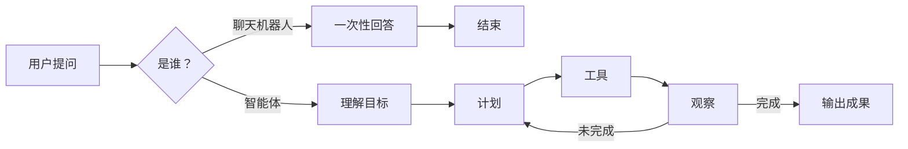
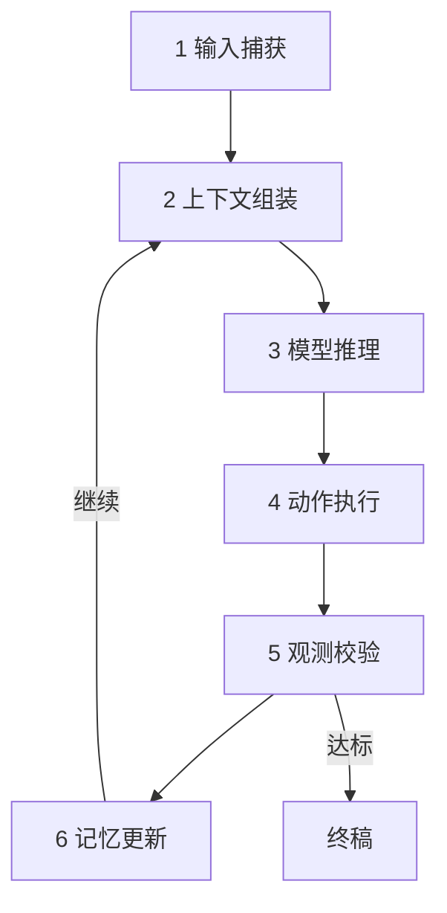
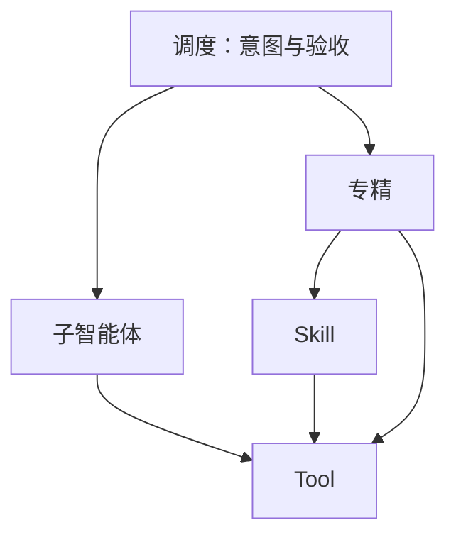

# 我的智能体设计哲学 —— 让 AI 真正干活

> 对应产品文档站：**本析-企业级 AI 智能体平台**。  
> 实现：`backend/app/agent/` + `agent_tool_loop`。  
> 工程地图：[Agent 架构](docs/zh/agent-architecture.md)（含 AIP 通信 · Plan-and-Execute · 并行 DAG）· [设计哲学](docs/zh/agent-philosophy.md)

---

## 一、智能体 ≠ 聊天机器人

聊天机器人是一问一答；智能体是**自主完成多步骤任务**：规划 → 行动 → 观察 → 再决定。

```mermaid
flowchart LR
  A[用户提问] --> B{是谁？}
  B -->|聊天机器人| C[一次性回答] --> D[结束]
  B -->|智能体| E[理解目标] --> F[计划] --> G[工具] --> H[观察]
  H -->|未完成| F
  H -->|完成| I[输出成果]
```

本析用**调度 + 专精 + 子智能体 + Tool/Skill** 把「想」和「做」拆开，避免一个巨型 prompt 扛所有事。

---

## 二、奥卡姆剃刀

- 用户没要的功能不做；不为「以后可能有用」堆抽象。  
- 一个动作就是一段可调用代码，不搞三层工厂。  
- 能复用就复用；新增专精成本最高，新增子智能体 kind 次之，调已有原子工具最轻。

---

## 三、六相循环：智能体是「跑」出来的

```mermaid
flowchart TB
  A[1 输入捕获] --> B[2 上下文组装] --> C[3 模型推理]
  C --> D[4 动作执行] --> E[5 观测校验] --> F[6 记忆更新]
  F -->|继续| B
  E -->|达标| G[终稿]
```

System prompt **宜短**：只放循环契约（怎么工作）。目标、计划、工具观测每轮动态塞进上下文——像带队干活，按阶段给简报，而不是一早背完全天台词。

终稿只引用**观测证据**；禁止把「调用了哪些工具」复述成对用户的答卷；禁止编造结果。

---

## 四、工具是肌肉

- **压缩**：长输出变成 summary + 关键字段，省上下文。  
- **指纹去重**：同名同参不跑第二遍。  
- **校验**：参数进 Pydantic，坏调用尽早失败。  

没有工具的 LLM 只能纸上谈兵；工具太细时，用 Skill 固化路径，或用子智能体做多步推理。

---

## 五、四层能力：缺一不可

| 层 | 本质 | 决策者 |
|----|------|--------|
| Tool | 一步动作 | 调用方 LLM |
| Skill | 固化动作包 | 父层选型 |
| 子智能体 | 隔离多轮 loop（search/use/execute） | 自己的 LLM；只交材料 |
| 专精 Agent | 领域完整对话 | 自己的 LLM；可交用户结果 |

```mermaid
flowchart TB
  O[调度：意图与验收] --> Sub[子智能体]
  O --> Sp[专精]
  Sp --> Skill[Skill]
  Sp --> Tool[Tool]
  Sub --> Tool
  Skill --> Tool
```

**调度（小析）不直执原子工具**——只调编排入口（子智能体 / 求助专精 / 问用户 / 发现工具）。检索、浏览器、文档 CRUD 等一律下沉。这样父层上下文干净，专精与子层各自带白名单工具，互不污染。

**子智能体 ≠ 专精**：前者是父流程里的步骤，后者是「用户找专家办事」。子层报告是素材，终稿由父层写。

---

## 六、路由思维（调度怎么想）

1. 常识 / Mermaid → 直接答。  
2. 要查网、要多源核实 → `search` 子智能体。  
3. 要跑已挂载 Skill → `use`。  
4. 步骤明确（打开页、点击、截图）→ `execute` + steps。  
5. 文档/报告/技能开发/双碳/电力/股市 → 对应专精。  
6. **必须先委托再回答**；失败如实说，不编造、不擅自换题。

业务偏好写在 `backend/agent_md/routing/`，代码只做通用路由算法，不写死领域规则。

---

## 七、编排、通信与人机

- 多专精：`single` / `sequential` / `parallel`；复杂依赖用 **TaskDAG** 按波次并行。  
- 专精结束用 **AIP handoff**（task_request / task_response）交回调度再合并。  
- 对外工作流阶段：**thinking → planning → executing**（Plan-and-Execute）。  
- 删库、跑脚本等危险动作走 **HITL**：打断 → 用户确认 → checkpoint 续跑。

---

## 八、一句话收束

> **短契约、动态简报、分层动手、证据终稿。**  
> 调度管「派谁」；专精管「领域」；子智能体管「多步想清楚」；Tool/Skill 管「动手」。

源码入口：`backend/app/agent/`（可抽离库）、`backend/app/services/agent_tool_loop.py`（六相宿主循环）、`backend/agent_md/`（指令与路由偏好）。
