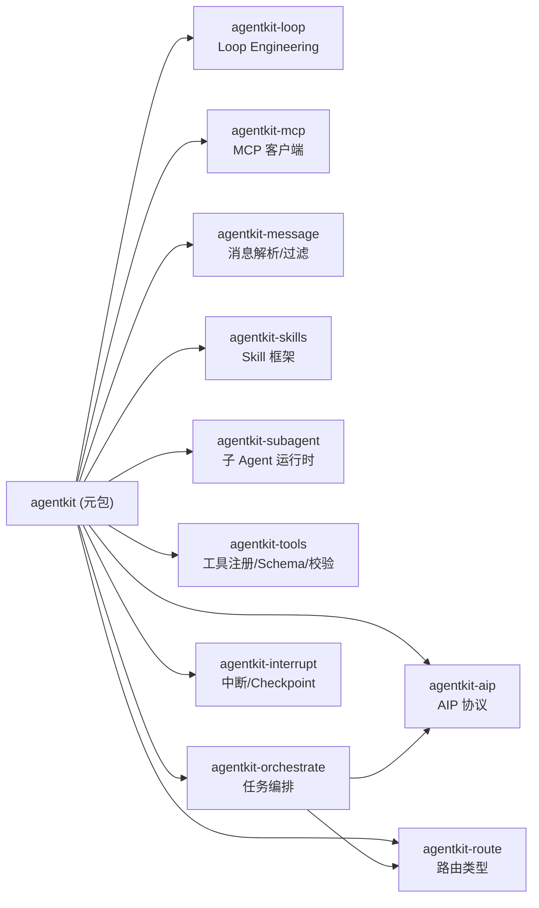

# AgentKit

> 多智能体架构的 Python 工具包 — 路由 · 编排 · 通信 · 执行

[](https://github.com/zhibinQiu/Agentkit)
[](../LICENSE)

AgentKit 是本析平台（Benxi）的多智能体架构 Python 工具包，提供从路由、编排、通信到执行的全链路组件。设计上强调 **Protocol 注入** 与 **零平台耦合**，可独立使用。

- **GitHub**: [https://github.com/zhibinQiu/Agentkit](https://github.com/zhibinQiu/Agentkit)
- **本析平台**: [https://github.com/zhibinQiu/benxi](https://github.com/zhibinQiu/benxi)

---

## 包架构



## 设计原则

- **Protocol 注入**：宿主通过 Protocol 接口注入 LLM、Tool 等依赖，库本身无平台耦合
- **渐进式采用**：子包可独立安装，按需引入
- **零 ORM/DB**：业务上下文通过 `extras` 字典传递，不依赖任何 ORM
- **面向测试**：纯函数核心，I/O 边界清晰

## 快速开始

```bash
# 安装全部组件
pip install -e packages/agentkit

# 或按需安装
pip install -e packages/agentkit-aip
pip install -e packages/agentkit-mcp
pip install -e packages/agentkit-tools
pip install -e packages/agentkit-message
```

## 子包导航

| 包 | 版本 | 依赖 | 职责 |
|----|------|------|------|
| [agentkit-aip](agentkit-aip) | 0.2.0 | pydantic | AIP 消息类型、handoff、会话总线 |
| [agentkit-loop](agentkit-loop) | 0.2.0 | 无 | Loop Engineering 动态 Prompt 组装 |
| [agentkit-mcp](agentkit-mcp) | 0.2.0 | httpx | MCP JSON-RPC 协议与客户端 |
| [agentkit-message](agentkit-message) | 0.1.0 | 无 | LLM 消息解析、内嵌工具调用提取、内容过滤 |
| [agentkit-orchestrate](agentkit-orchestrate) | 0.2.0 | agentkit-aip, agentkit-route | 多专精任务编排 |
| [agentkit-route](agentkit-route) | 0.2.0 | 无 | 路由类型与纯逻辑 |
| [agentkit-skills](agentkit-skills) | 0.2.0 | 无 | Skill 插件框架 |
| [agentkit-subagent](agentkit-subagent) | 0.2.0 | 无 | 隔离上下文子 Agent 运行时 |
| [agentkit-tools](agentkit-tools) | 0.1.0 | pydantic | 工具注册、Schema 生成、参数校验、结果压缩 |
| [agentkit-interrupt](agentkit-interrupt) | 0.1.0 | 无 | 中断与 Checkpoint、HITL 响应管理 |

## 各子包详情

### agentkit-aip
AIP（Agent Interaction Protocol）消息类型定义、Agent handoff 与会话总线。

### agentkit-loop
Loop Engineering — 从自然语言目标指令出发，通过"发问→回答→规划→评估"的四步循环动态组装 Prompt。

### agentkit-mcp
MCP（Model Context Protocol）JSON-RPC 协议客户端实现，支持标准 MCP 工具调用。

### agentkit-message
LLM 消息解析、内嵌工具调用提取、内容过滤与格式化。

### agentkit-orchestrate
多专精任务编排，支持 Agent 间 handoff 与依赖管理。

### agentkit-route
路由类型与纯逻辑，定义 Agent 路由策略。

### agentkit-skills
Skill 插件框架 — 轻量级插件系统，支持动态加载与热更新。

### agentkit-subagent
隔离上下文的子 Agent 运行时，支持独立生命周期管理。

### agentkit-tools
工具注册、JSON Schema 生成、参数校验、结果压缩。

### agentkit-interrupt
中断与 Checkpoint 管理、Human-In-The-Loop 响应管理。

## 示例

见 [examples/](examples/) 目录，每个子包都有独立的可运行示例。

## 许可

[AGPL v3](../LICENSE)
