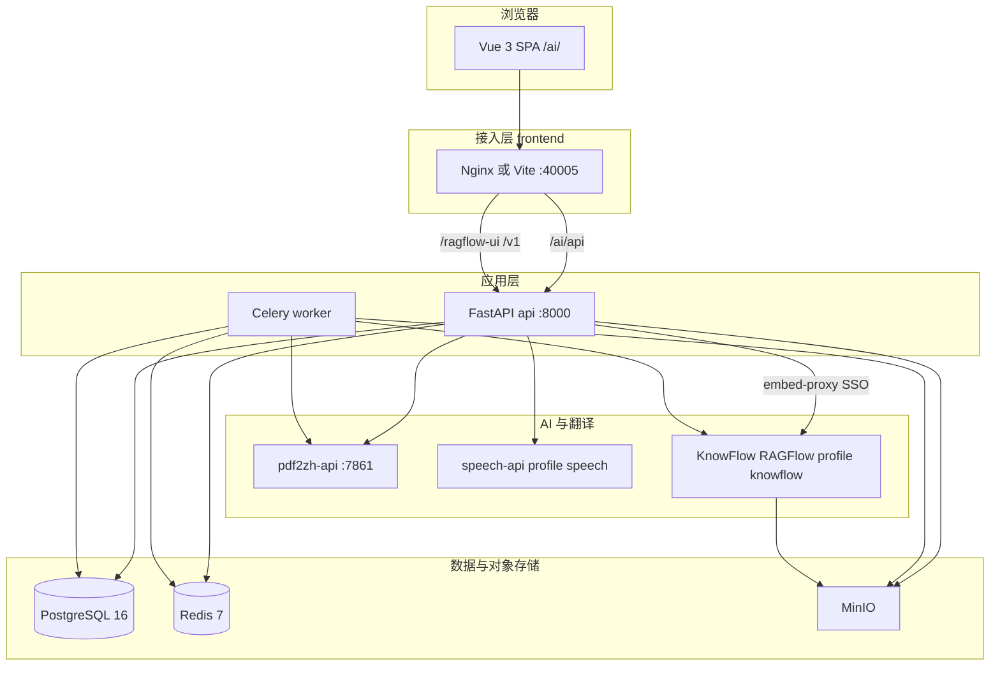
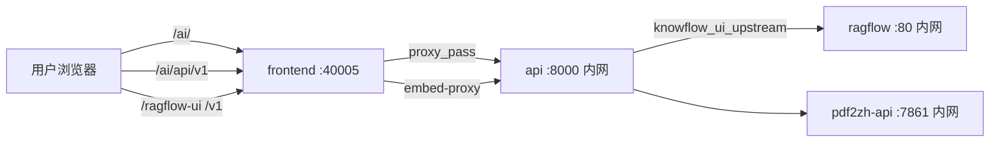
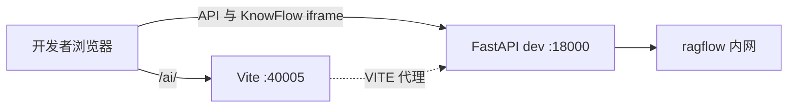
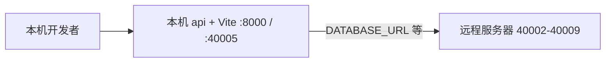

# 企业 AI 知识库平台 — 运维部署指南

> **当前版本：v4.2.1**（版本源：仓库根目录 `VERSION`）  
> 本文档位于项目根目录，汇总 **启动**、**部署**、**数据迁移** 及 **架构 / 网络 / 端口 / 组件** 说明。  
> 更细分的专题文档见 [`docs/zh/operations/`](docs/zh/operations/README.md)。

---

## 目录

1. [系统概述](#1-系统概述)
2. [系统架构图](#2-系统架构图)
3. [网络通信图](#3-网络通信图)
4. [端口一览](#4-端口一览)
5. [组件说明](#5-组件说明)
5.1. [数据存储与数据库连接](#51-数据存储与数据库连接)
6. [启动项目](#6-启动项目)
7. [部署项目](#7-部署项目)
8. [数据迁移](#8-数据迁移)
9. [日常运维命令](#9-日常运维命令)
10. [故障排查](#10-故障排查)
11. [功能实现说明](#11-功能实现说明)
12. [单机迁移与热重载](#12-单机迁移与热重载)

---

## 1. 系统概述

企业 AI 知识库平台 = **企业文档与权限控制面** + **PDF 科学文献翻译（BabelDOC）** + **可插拔 AI 能力**（KnowFlow 知识库、会议转写、智能工具等）。

| 设计原则 | 说明 |
|----------|------|
| 统一容器栈 | 根目录 `compose.yaml` + `scripts/stack.sh`，项目名 `zhitan` |
| 对外单端口 | 生产环境仅暴露 **40005**（Nginx 反代 SPA + API + KnowFlow iframe） |
| 开发热重载 | **`stack dev-up`**：API `--reload` + Vite HMR，改代码即生效（见 §12） |
| 多架构交付 | arm64 开发 / amd64 生产，镜像 `save/load` 推送 |
| 配置分层 | 栈级 `.env` + 业务 `platform/.env` |

### 仓库结构

```
pdf_trans/
├── VERSION                   # 单一版本源 → ZHITAN_VERSION 镜像 tag
├── compose.yaml              # 核心服务（postgres / redis / minio / api / worker / frontend …）
├── compose.dev.yaml          # 开发覆盖：API :18000 热重载、Vite 前端
├── compose.mirror.yaml       # 国内镜像 build args
├── compose.expose-deps.yaml  # 远程依赖开发：服务器暴露 40002–40009
├── deploy/knowflow.yml       # profile knowflow（MySQL / Infinity / RAGFlow / KnowFlow）
├── platform/                 # FastAPI + Celery 后端
├── platform-frontend/        # Vue 3 SPA + 生产 Nginx
├── pdf2zh_next/              # PDF 翻译核心
├── scripts/
│   ├── dev.sh                # 开发与运维统一入口（推荐）
│   ├── stack.sh              # Docker 编排（build / up / backup …）
│   └── deploy.sh             # 远程镜像部署
└── data/                     # 持久化数据（DATA_ROOT，默认 ./data）
```

---

## 2. 系统架构图

### 2.1 逻辑分层



### 2.2 功能模块关系


---

## 3. 网络通信图

### 3.1 生产 / 本机 `stack up`（仅暴露 40005）



**Nginx 路由规则**（`platform-frontend/nginx.conf`）详见 [网络拓扑](docs/zh/operations/network-topology.md)。

> **安全：** 生产环境 **不要** 将 8000、5432、9380、9200 等映射到公网；仅开放 `${FRONTEND_PORT:-40005}`。

### 3.2 开发模式

**Docker dev-up**（API :18000 + Vite :40005）：



| 流量 | 地址 |
|------|------|
| 平台 SPA | http://127.0.0.1:40005/ai/ |
| 平台 API | http://127.0.0.1:18000 |
| KnowFlow iframe | http://127.0.0.1:18000/ragflow-ui/… |

**本机 venv remote-dev**（API :8000 + Vite :40005，依赖在远程）：见 §6.5，使用 `./dev.sh local`。

### 3.3 远程依赖开发（本机 UI + 服务器依赖）

本机跑前端与 API，数据库 / MinIO / KnowFlow 在远程服务器：



```bash
# 1. 服务器：暴露依赖端口
EXPOSE_DEPS=1 bash scripts/stack.sh up --profile knowflow --profile speech

# 2. 本机：生成 platform/.env
REMOTE_HOST=你的服务器IP bash scripts/dev.sh remote-dev

# 3. 本机：启动 venv 开发栈（推荐）
./dev.sh
```

### 3.4 容器内 DNS（Docker 网络 `zhitan`）

| 服务名 | 用途 |
|--------|------|
| `postgres` | 平台 PostgreSQL |
| `redis` | Redis |
| `minio` | MinIO 对象存储 |
| `pdf2zh-api` | PDF 翻译 API |
| `api` | 平台 FastAPI |
| `worker` | Celery Worker |
| `speech-api` | 语音转写（profile speech） |
| `ragflow` | RAGFlow Nginx 入口 |
| `knowflow-backend` | KnowFlow 管理 API |
| `mysql` / `infinity` | KnowFlow MySQL / Infinity 向量库别名 |

容器间通信 **必须使用服务名**，勿写 `127.0.0.1`（浏览器地址如 `KNOWFLOW_UI_PUBLIC_URL` 除外）。

---

## 4. 端口一览

### 4.1 对外端口（宿主机）

| 端口 | 场景 | 服务 | 说明 |
|------|------|------|------|
| **40005** | 始终 | frontend | **唯一生产 Web 入口**（Nginx 或 Vite） |
| **18000** | 开发 | api | API 热重载直连（`compose.dev.yaml`） |
| 40002 | 远程依赖 | postgres | `compose.expose-deps.yaml` |
| 40003 | 远程依赖 | redis | 同上 |
| 40004 | 远程依赖 | minio | 同上 |
| 40005 | 远程依赖 | pdf2zh-api | 与 frontend 同端口时需分机器或改 `REMOTE_PDF2ZH_PORT` |
| 40006 | 远程依赖 | speech-api | 同上 |
| 40007 | 远程依赖 | ragflow | 同上 |
| 40008 | 远程依赖 | knowflow-backend | 同上 |
| 40009 | 远程依赖 | knowflow-mysql | 同上 |

### 4.2 容器内端口（默认不映射主机）

| 服务 | 容器端口 | 说明 |
|------|----------|------|
| postgres | 5432 | 平台业务库 |
| redis | 6379 | Celery broker |
| minio | 9000 / 9001 | S3 API / Console |
| pdf2zh-api | 7861 | BabelDOC 翻译 REST |
| api | 8000 | FastAPI |
| speech-api | 8765 | FunASR 转写 |
| ragflow | 80 | RAGFlow Web + 反代入口 |
| ragflow（内） | 9380 | RAGFlow 后端 API（容器内） |
| knowflow-backend | 5000 | KnowFlow 管理 API |
| knowflow-mysql | 3306 | RAGFlow 元数据 |
| knowflow-infinity | 23820（HTTP） | Infinity 向量与全文索引 |
| knowflow-gotenberg | 3000 | Office → PDF |

---

## 5. 组件说明

> 容器职责、镜像 tag、依赖顺序与数据卷详见 [Docker 容器说明](docs/zh/operations/docker-services.md)。  
> **各组件位置、各库存什么、如何登录查看** 见 [组件位置与数据存储](docs/zh/operations/components-and-storage.md)。

核心栈：`postgres` · `redis` · `minio` · `pdf2zh-api` · `api` · `worker` · `frontend`  
可选 profile：`knowflow`（MySQL / **Infinity** / ragflow / knowflow-backend）· `speech`（FunASR）

向量库为 **Infinity**（`DOC_ENGINE=infinity`），**不是** Elasticsearch。

### 5.1 数据存储与数据库连接

| 存储 | 容器 | 宿主机目录 | 存什么 | 查看方式 |
|------|------|------------|--------|----------|
| **PostgreSQL** | `postgres` | `data/postgres/` | 用户、权限、文档元数据、任务、对比、订阅等 | `docker compose -p zhitan exec -it postgres psql -U platform -d platform` |
| **MySQL** | `knowflow-mysql` | `data/knowflow-mysql/` | KnowFlow/RAGFlow 元数据（库 `rag_flow`） | `docker compose -p zhitan exec -it knowflow-mysql mysql -uroot -p'<MYSQL_PASSWORD>' rag_flow` |
| **Infinity** | `ragflow-infinity` | `data/knowflow-infinity/` | 向量与全文索引（二进制） | HTTP `23820` 或经 RAGFlow API；勿直接删目录 |
| **Redis** | `redis` | 内存（可选持久化） | Celery 队列、平台缓存 | `docker compose -p zhitan exec -it redis redis-cli` |
| **MinIO** | `minio` | `data/minio/` | 文档原文件（桶 `documents`）及 KnowFlow 对象 | 容器内 `mc` 或临时映射 Console :9001 |

默认账号见根目录 `.env`（`POSTGRES_*`、`MYSQL_PASSWORD`、`MINIO_ROOT_*`）。完整表清单与数据流图见专题文档。

---

## 6. 启动项目

### 6.1 前置条件

- Docker 24+、Docker Compose v2
- 磁盘：KnowFlow + 语音模型建议 **30GB+**
- arm64（Apple Silicon）：KnowFlow 需源码构建或 `save/load` 预构建镜像
- amd64 服务器：可使用 `deploy/knowflow.mirror.yaml` 预构建镜像

### 6.2 首次初始化

```bash
# 1. 复制配置模板
cp .env.stack.example .env
cp platform/.env.example platform/.env

# 2. 编辑 platform/.env：JWT_SECRET、DEEPSEEK_API_KEY、BOOTSTRAP_ADMIN_* 等
# 3. 合并栈配置（可选，自动将 platform/.env 合并到根 .env）
bash scripts/stack.sh init-env

# 4. 启用 KnowFlow（.env 中）
# KNOWFLOW_ENABLED=true
# STACK_PROFILES="knowflow speech"
```

### 6.3 开发模式（热重载 · 所见即所得）

**全 Docker（本机或服务器均可）**：

```bash
bash scripts/dev.sh dev
```

| 组件 | 保存文件后 |
|------|------------|
| `platform-frontend` | Vite **HMR**，浏览器即时更新 |
| `platform/app` | uvicorn **自动 reload** |
| Celery Worker | 需 `docker compose -p zhitan restart worker` |
| 系统说明 Markdown | 刷新系统设置文档页即可 |

| 项 | 值 |
|----|-----|
| Web | http://127.0.0.1:40005/ai/ |
| API | http://127.0.0.1:18000 |
| KnowFlow iframe | 与 API 同源 :18000 |

> 生产式 `stack up` **无热重载**；持续改代码请用 `dev-up`。详见 [§12 单机迁移与热重载](#12-单机迁移与热重载)。

停止：

```bash
bash scripts/dev.sh stop
# 或
bash scripts/stack.sh down
```

### 6.4 本机生产式（容器内 Nginx，无热重载）

```bash
bash scripts/stack.sh build --profile knowflow --profile speech
bash scripts/stack.sh up --profile knowflow --profile speech
```

访问：http://127.0.0.1:40005/ai/  
内网健康检查：`docker compose -p zhitan exec api curl -s localhost:8000/health`

### 6.5 远程依赖 + 本机开发（过渡 · 非目标形态）

> **推荐**：依赖与代码在同一台机器时用 `bash scripts/dev.sh dev`。  
> 仅在本机跑 UI/API、依赖在远程服务器时使用本节；迁完后按 [§12](#12-单机迁移与热重载) 改为单机 `dev-up`。

```bash
# 服务器
EXPOSE_DEPS=1 bash scripts/stack.sh up --profile knowflow --profile speech

# 本机（生成 platform/.env，REMOTE_DEPS=1）
REMOTE_HOST=172.19.134.45 bash scripts/dev.sh remote-dev

# 方式 A（推荐）：本机 venv + Vite，API :8000、前端 :40005
./dev.sh
./dev.sh local status

# 方式 B：Docker 全栈 dev-up，API :18000
bash scripts/dev.sh dev
```

验证远程连通：

```bash
bash scripts/verify-remote-deps.sh
```

> **登录不了？** 通常是本机 API 未启动（Vite 代理 `ECONNREFUSED`）。请在**本地终端**执行 `./dev.sh`，并用 http://127.0.0.1:40005/ai/ 访问（勿混用其它端口）。

**经服务器给他人访问本机 dev**（可选）：

```bash
./dev.sh tunnel setup    # 生成 platform/tunnel.target（默认远程 :14005）
./dev.sh local             # 自动建立 SSH 反向隧道
# 他人: http://<服务器IP>:14005/ai/
```

服务器 `sshd_config` 需 `GatewayPorts clientspecified`，防火墙放行 `14005`；本机需 `ssh-copy-id` 免密登录。

### 6.6 KnowFlow 源码构建（arm64 首次）

```bash
bash scripts/dev.sh knowflow setup    # 克隆 third_party/KnowFlow
bash scripts/dev.sh knowflow build    # 约 30–90 分钟
bash scripts/stack.sh build --profile knowflow
```

---

## 7. 部署项目

### 7.1 部署方式对比

| 场景 | 构建 | 启动 | 对外端口 | 适用 |
|------|------|------|----------|------|
| 开发热重载 | 可选 build | **`dev-up`** | 40005 + 18000 | 本机或**服务器**改代码即生效 |
| Mac / Linux 开发 | 可选 build | `dev-up` | 40005 + 18000 | 日常开发 |
| 本机生产式 | `stack build` | `stack up` | 40005 | 内网演示 |
| Linux amd64 服务器 | build + save | deploy stack push | 40005 | 生产交付 |
| Linux arm64 服务器 | build + save | deploy stack push | 40005 | ARM 服务器 |

### 7.2 服务器镜像交付（推荐，不 rsync 源码）

**本机构建并导出：**

```bash
export ZHITAN_VERSION=4.2.1

# amd64 服务器示例 .env 片段：
# RAGFLOW_PLATFORM=linux/amd64
# RAGFLOW_IMAGE=zxwei/knowflow:v2.1.8
# KNOWFLOW_SERVER_IMAGE=zxwei/knowflow-server:v2.1.8

bash scripts/stack.sh build --profile knowflow --profile speech
bash scripts/stack.sh save
# 输出：images/zhitan-4.2.1-amd64.tar.gz
```

**推送到远程：**

```bash
cp platform/deploy.target.example platform/deploy.target
# 编辑 DEPLOY_HOST、DEPLOY_PATH、DEPLOY_ARCH=amd64

bash scripts/deploy.sh stack push
```

远程自动执行 `stack load` + `stack up`。访问：**http://\<DEPLOY_HOST\>:40005/ai/**

### 7.3 目标机本地部署

已在服务器上有镜像 tar 和配置时：

```bash
bash scripts/deploy.sh local stack
bash scripts/stack.sh load images/zhitan-4.2.1-amd64.tar.gz
bash scripts/stack.sh up --profile knowflow
```

### 7.4 生产部署检查清单

- [ ] `.env` 中 `JWT_SECRET`、数据库密码已修改
- [ ] `KNOWFLOW_ENABLED=true` 且已启用 `--profile knowflow`
- [ ] 仅暴露 `FRONTEND_PORT`（40005），防火墙关闭其他端口
- [ ] 升级前已执行 `bash scripts/stack.sh backup`
- [ ] 冒烟：登录 → 上传文档 → 翻译 → 知识检索


## 8. 数据迁移

> 完整流程、备份清单与回滚见 [数据库迁移](docs/zh/operations/database-migration.md)。

平台启动时自动执行 `schema_migrate.py`（非 Alembic）。**升级前务必** `bash scripts/stack.sh backup`。

---

## 9. 日常运维命令

> 详见 [日常操作手册](docs/zh/operations/operations-manual.md)。

```bash
bash scripts/stack.sh ps
bash scripts/stack.sh logs api
./dev.sh local status   # 本机 venv 开发
bash scripts/stack.sh backup
pip install -r docs/requirements-docs.txt && mkdocs serve
```

---

## 10. 故障排查

> 更多条目见 [日常操作手册](docs/zh/operations/operations-manual.md)。

| 现象 | 排查 |
|------|------|
| 40005 无法访问 | `docker compose -p zhitan ps`；检查 frontend 容器；remote-dev 执行 `./dev.sh local status` |
| 登录失败 / ECONNREFUSED | 本机终端 `./dev.sh local`；确认 `lsof -i :8000 :40005` |
| API 500 / 数据库连接失败 | 检查 `DATABASE_URL`；远程开发确认 `verify-remote-deps.sh` |
| 异步任务不执行 | `./dev.sh local status` 看 Celery；远程无 Worker 时自动本地启动 |
| KnowFlow iframe 502 | Infinity/MySQL 未就绪；`docker restart ragflow-server`，等 1–2 分钟 |
| pdf2zh 启动慢 | 首次 BabelDOC warmup 约 3 分钟，查看 `logs pdf2zh-api` |
| 开发 API 热重载卡住 | 结束旧 uvicorn 进程后重启 `dev-up` |
| MinIO 认证失败 | 对齐 `.env` 与 KnowFlow 的 `MINIO_ROOT_*` |
| speech 模型下载失败 | 检查 `${DATA_ROOT}/speech-models` 磁盘空间 |

---

## 11. 功能实现说明

平台各功能**当前实现方式**（登录、文档库、KnowFlow 同步、翻译、对比、语音、任务队列、插件体系等）见专题文档，**不含代码**：

**[docs/zh/operations/feature-implementation.md](docs/zh/operations/feature-implementation.md)**

要点摘要：

- **控制面**：PostgreSQL 存元数据与权限，MinIO 存文件，Redis 作队列。  
- **文档**：预签名上传 → 版本 → 可选 Git / KnowFlow 索引。  
- **KnowFlow**：mapped 账号 + scope dataset + embed-proxy 白标 iframe。  
- **翻译**：pdf2zh-api + Celery 监控 Job 进度。  
- **对比**：异步 diff + 可选 NL 检索（ACL 白名单后再 retrieval）。

---

## 12. 单机迁移与热重载

### 12.1 迁到同一台服务器

1. 源环境 `bash scripts/stack.sh backup`  
2. 目标机 `stack build` + `stack up`（**不要** `EXPOSE_DEPS=1`）  
3. `stack restore` 恢复 Postgres / MinIO / KnowFlow MySQL  
4. `platform/.env` 改为 Docker 服务名（`postgres:5432` 等），关闭 `REMOTE_DEPS`  
5. 冒烟：登录 → 上传 → 翻译 → 检索  

完整步骤：**[docs/zh/operations/single-server-migration.md](docs/zh/operations/single-server-migration.md)**

### 12.2 部署后仍要热重载

在服务器仓库目录执行：

```bash
bash scripts/dev.sh dev    # 不要用 stack up
```

- 前端改 `.vue` → **数秒内 HMR**  
- 后端改 `platform/app` → **uvicorn 自动 reload**  
- Worker 改 `workers/` → `docker compose -p zhitan restart worker`  
- 切正式对外演示时再 `stack up`（仅 40005，无热重载）

远程依赖过渡方案见 [server-deps.md](docs/zh/operations/server-deps.md)。

---

## 相关文档

| 文档 | 路径 |
|------|------|
| **组件位置与数据存储** | [docs/zh/operations/components-and-storage.md](docs/zh/operations/components-and-storage.md) |
| **配置文件与脚本** | [docs/zh/operations/config-and-scripts.md](docs/zh/operations/config-and-scripts.md) |
| 功能实现说明 | [docs/zh/operations/feature-implementation.md](docs/zh/operations/feature-implementation.md) |
| 单机迁移与热重载 | [docs/zh/operations/single-server-migration.md](docs/zh/operations/single-server-migration.md) |
| 远程依赖过渡 | [docs/zh/operations/server-deps.md](docs/zh/operations/server-deps.md) |
| 运维手册索引 | [docs/zh/operations/README.md](docs/zh/operations/README.md) |
| 系统架构详解 | [docs/zh/operations/architecture.md](docs/zh/operations/architecture.md) |
| 网络拓扑 | [docs/zh/operations/network-topology.md](docs/zh/operations/network-topology.md) |
| Docker 容器说明 | [docs/zh/operations/docker-services.md](docs/zh/operations/docker-services.md) |
| 配置变量 | [docs/zh/operations/configuration.md](docs/zh/operations/configuration.md) |
| 数据库迁移专题 | [docs/zh/operations/database-migration.md](docs/zh/operations/database-migration.md) |
| 升级指南 | [docs/zh/operations/upgrade.md](docs/zh/operations/upgrade.md) |
| 脚本说明 | [scripts/README.md](scripts/README.md) |
| 快速开始 | [docs/zh/getting-started.md](docs/zh/getting-started.md) |
