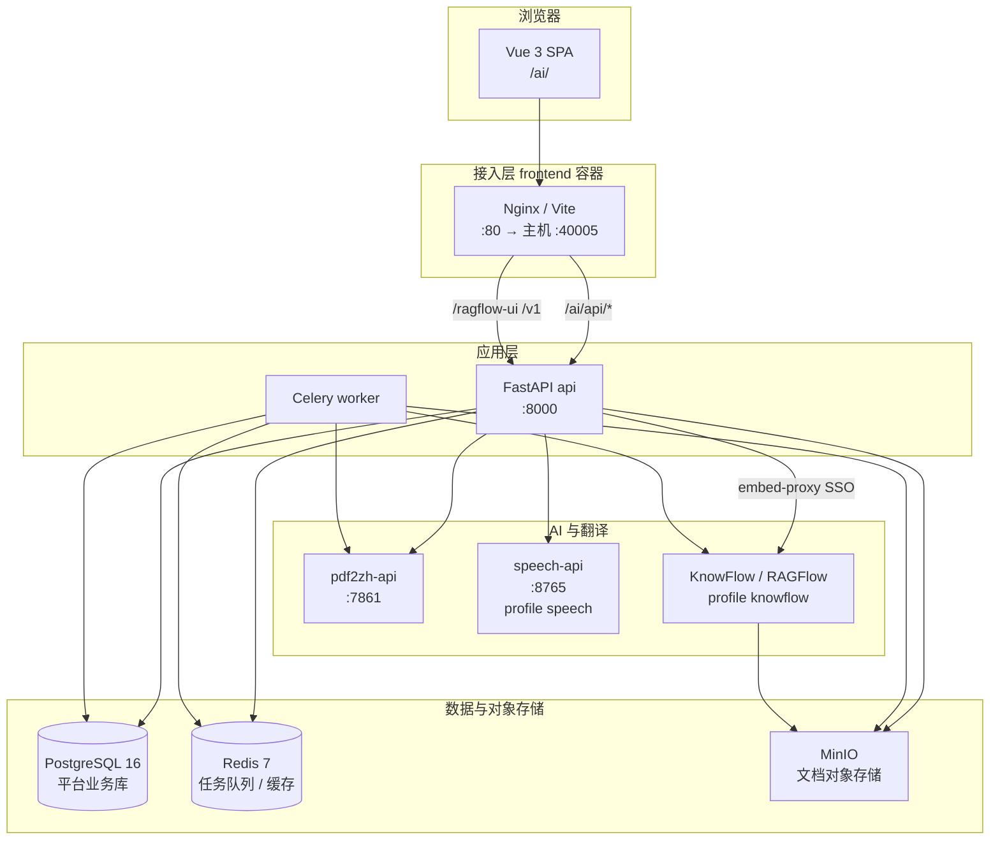
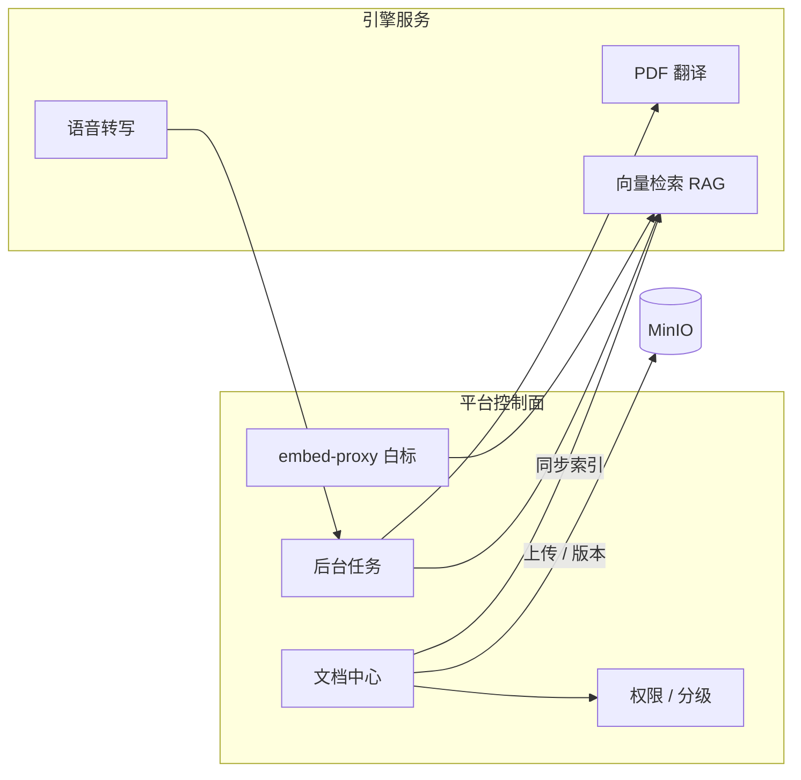
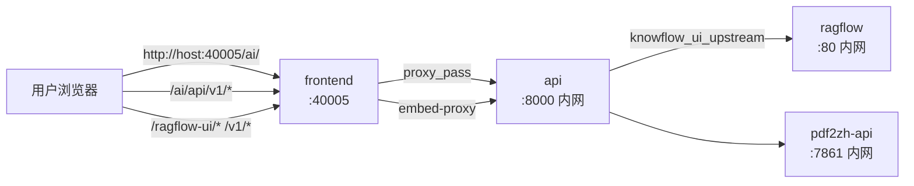
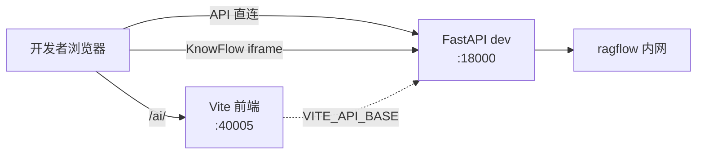
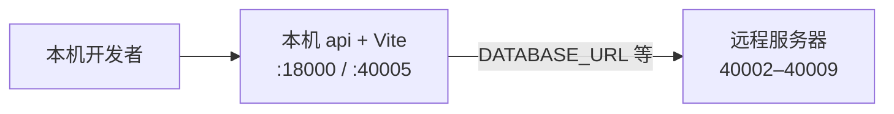

# 智碳平台 AI — 运维部署指南

> **当前版本：v3.9.3**（版本源：仓库根目录 `VERSION`）  
> 本文档位于项目根目录，汇总 **启动**、**部署**、**数据迁移** 及 **架构 / 网络 / 端口 / 组件** 说明。  
> 更细分的专题文档见 [`docs/zh/operations/`](docs/zh/operations/README.md)。

---

## 目录

1. [系统概述](#1-系统概述)
2. [系统架构图](#2-系统架构图)
3. [网络通信图](#3-网络通信图)
4. [端口一览](#4-端口一览)
5. [组件说明](#5-组件说明)
6. [启动项目](#6-启动项目)
7. [部署项目](#7-部署项目)
8. [数据迁移](#8-数据迁移)
9. [日常运维命令](#9-日常运维命令)
10. [故障排查](#10-故障排查)

---

## 1. 系统概述

智碳平台 AI 系统 = **企业文档与权限控制面** + **PDF 科学文献翻译（BabelDOC）** + **可插拔 AI 能力**（KnowFlow 知识库、会议转写、双碳工具等）。

| 设计原则 | 说明 |
|----------|------|
| 统一容器栈 | 根目录 `compose.yaml` + `scripts/stack.sh`，项目名 `zhitan` |
| 对外单端口 | 生产环境仅暴露 **40005**（Nginx 反代 SPA + API + KnowFlow iframe） |
| 多架构交付 | arm64 开发 / amd64 生产，镜像 `save/load` 推送 |
| 配置分层 | 栈级 `.env` + 业务 `platform/.env` |

### 仓库结构

```
pdf_trans/
├── VERSION                   # 单一版本源 → ZHITAN_VERSION 镜像 tag
├── compose.yaml              # 核心服务（postgres / redis / minio / api / worker / frontend …）
├── compose.dev.yaml          # 开发覆盖：API :18000 热重载、Vite 前端
├── compose.mirror.yaml       # 国内镜像 build args
├── compose.expose-deps.yaml  # 远程依赖开发：服务器暴露 40002–40009
├── deploy/knowflow.yml       # profile knowflow（MySQL / ES / RAGFlow / KnowFlow）
├── platform/                 # FastAPI + Celery 后端
├── platform-frontend/        # Vue 3 SPA + 生产 Nginx
├── pdf2zh_next/              # PDF 翻译核心
├── scripts/
│   ├── zhitan.sh             # 日常开发入口（推荐）
│   ├── stack.sh              # Docker 编排（build / up / backup …）
│   └── deploy.sh             # 远程镜像部署
└── data/                     # 持久化数据（DATA_ROOT，默认 ./data）
```

---

## 2. 系统架构图

### 2.1 逻辑分层



### 2.2 功能模块关系



---

## 3. 网络通信图

### 3.1 生产 / 本机 `stack up`（仅暴露 40005）



**Nginx 路由规则**（`platform-frontend/nginx.conf`）：

| 浏览器路径 | 转发目标 | 说明 |
|------------|----------|------|
| `/ai/` | SPA 静态资源 | Vue base path |
| `/ai/api/` | `http://api:8000/api/` | 平台 REST API |
| `/ragflow-ui/` | `api:8000/api/v1/embed-proxy/knowflow/` | KnowFlow UI + 白标注入 |
| `/v1/` | `api:8000/api/v1/embed-proxy/knowflow/v1/` | KnowFlow SPA 内 API |
| `/api/knowflow/` | 同上 knowflow 路径 | KnowFlow 管理 API |
| `/api/` | `api:8000` | 兼容旧直连 |

> **安全：** 生产环境 **不要** 将 8000、5432、9380、9200 等映射到公网；仅开放 `${FRONTEND_PORT:-40005}`。

### 3.2 开发模式（40005 + 18000）



| 流量 | 地址 |
|------|------|
| 平台 SPA | http://127.0.0.1:40005/ai/ |
| 平台 API | http://127.0.0.1:18000 |
| API 健康检查 | http://127.0.0.1:18000/health |
| KnowFlow iframe | http://127.0.0.1:18000/ragflow-ui/… |
| Swagger 文档 | http://127.0.0.1:18000/docs |

开发模式下 KnowFlow iframe 与 API **同源在 18000**，避免跨端口导致 SPA 内 `/v1` 404。

### 3.3 远程依赖开发（本机 UI + 服务器依赖）

本机跑前端与 API，数据库 / MinIO / KnowFlow 在远程服务器：



```bash
# 1. 服务器：暴露依赖端口
EXPOSE_DEPS=1 bash scripts/stack.sh up --profile knowflow --profile speech

# 2. 本机：生成 platform/.env
REMOTE_HOST=你的服务器IP bash scripts/zhitan.sh remote-dev

# 3. 本机：启动开发栈
bash scripts/zhitan.sh dev
```

### 3.4 容器内 DNS（Docker 网络 `zhitan`）

| 服务名 | 用途 |
|--------|------|
| `postgres` | 平台 PostgreSQL |
| `redis` | Redis |
| `minio` | MinIO 对象存储 |
| `pdf2zh-api` | PDF 翻译 API |
| `api` | 平台 FastAPI |
| `worker` | Celery Worker |
| `speech-api` | 语音转写（profile speech） |
| `ragflow` | RAGFlow Nginx 入口 |
| `knowflow-backend` | KnowFlow 管理 API |
| `mysql` / `es01` | KnowFlow MySQL / Elasticsearch 别名 |

容器间通信 **必须使用服务名**，勿写 `127.0.0.1`（浏览器地址如 `KNOWFLOW_UI_PUBLIC_URL` 除外）。

---

## 4. 端口一览

### 4.1 对外端口（宿主机）

| 端口 | 场景 | 服务 | 说明 |
|------|------|------|------|
| **40005** | 始终 | frontend | **唯一生产 Web 入口**（Nginx 或 Vite） |
| **18000** | 开发 | api | API 热重载直连（`compose.dev.yaml`） |
| 40002 | 远程依赖 | postgres | `compose.expose-deps.yaml` |
| 40003 | 远程依赖 | redis | 同上 |
| 40004 | 远程依赖 | minio | 同上 |
| 40005 | 远程依赖 | pdf2zh-api | 与 frontend 同端口时需分机器或改 `REMOTE_PDF2ZH_PORT` |
| 40006 | 远程依赖 | speech-api | 同上 |
| 40007 | 远程依赖 | ragflow | 同上 |
| 40008 | 远程依赖 | knowflow-backend | 同上 |
| 40009 | 远程依赖 | knowflow-mysql | 同上 |

### 4.2 容器内端口（默认不映射主机）

| 服务 | 容器端口 | 说明 |
|------|----------|------|
| postgres | 5432 | 平台业务库 |
| redis | 6379 | Celery broker |
| minio | 9000 / 9001 | S3 API / Console |
| pdf2zh-api | 7861 | BabelDOC 翻译 REST |
| api | 8000 | FastAPI |
| speech-api | 8765 | FunASR 转写 |
| ragflow | 80 | RAGFlow Web + 反代入口 |
| ragflow（内） | 9380 | RAGFlow 后端 API（容器内） |
| knowflow-backend | 5000 | KnowFlow 管理 API |
| knowflow-mysql | 3306 | RAGFlow 元数据 |
| knowflow-es | 9200 | Elasticsearch |
| knowflow-gotenberg | 3000 | Office → PDF |

---

## 5. 组件说明

### 5.1 核心服务（始终启动）

| 容器 | Compose 服务 | 镜像 | 职责 |
|------|--------------|------|------|
| `zhitan-postgres-1` | postgres | postgres:16-alpine | 用户、RBAC、文档元数据、任务、审计 |
| `zhitan-redis-1` | redis | redis:7-alpine | Celery 队列、缓存 |
| `zhitan-minio-1` | minio | minio/minio | 文档二进制与版本文件 |
| `zhitan-pdf2zh-api-1` | pdf2zh-api | zhitan-pdf2zh:${ZHITAN_VERSION} | PDF 科学文献翻译 |
| `zhitan-api-1` | api | zhitan-api:${ZHITAN_VERSION} | 鉴权、文档 API、插件、embed-proxy |
| `zhitan-worker-1` | worker | 同 api | 翻译、对比、KnowFlow 同步等长任务 |
| `zhitan-frontend-1` | frontend | zhitan-frontend 或 dev 时 node:22 | 对外 Web 入口 |

### 5.2 Profile：`knowflow`（知识库）

| 容器 | 镜像 | 职责 |
|------|------|------|
| `ragflow-mysql` | mysql:8.0.39 | RAGFlow / KnowFlow 元数据 |
| `ragflow-es-01` | elasticsearch:8.11.3 | 向量与全文索引 |
| `knowflow-gotenberg` | gotenberg/gotenberg:8 | 文档格式转换 |
| `ragflow-server` | knowflow-ragflow 或预构建镜像 | RAGFlow Web UI + API |
| `knowflow-backend` | knowflow-server | KnowFlow 管理 API、RBAC 扩展 |

**数据卷：** `${DATA_ROOT}/knowflow-mysql`、`knowflow-es`、`knowflow-logs`  
**依赖顺序：** MySQL / ES healthy → ragflow → knowflow-backend  
**首次启动：** ES/MySQL 就绪后 RAGFlow API 约 **1–2 分钟** 可用

### 5.3 Profile：`speech`（会议转写）

| 容器 | 镜像 | 职责 |
|------|------|------|
| `zhitan-speech-api-1` | zhitan-speech:${ZHITAN_VERSION} | FunASR 转写、说话人分离 |

模型目录：`${DATA_ROOT}/speech-models`（首次启动需下载，体积较大）

### 5.4 自有镜像清单

| 镜像 | 构建上下文 |
|------|------------|
| `zhitan-api:${ZHITAN_VERSION}` | `platform/` |
| `zhitan-frontend:${ZHITAN_VERSION}` | `platform-frontend/` |
| `zhitan-pdf2zh:${ZHITAN_VERSION}` | 仓库根 `Dockerfile` |
| `zhitan-speech:${ZHITAN_VERSION}` | `platform/speech-service/` |
| `knowflow-ragflow:source` | `platform/third_party/KnowFlow`（arm64 源码构建） |

---

## 6. 启动项目

### 6.1 前置条件

- Docker 24+、Docker Compose v2
- 磁盘：KnowFlow + 语音模型建议 **30GB+**
- arm64（Apple Silicon）：KnowFlow 需源码构建或 `save/load` 预构建镜像
- amd64 服务器：可使用 `deploy/knowflow.mirror.yaml` 预构建镜像

### 6.2 首次初始化

```bash
# 1. 复制配置模板
cp .env.stack.example .env
cp platform/.env.example platform/.env

# 2. 编辑 platform/.env：JWT_SECRET、DEEPSEEK_API_KEY、BOOTSTRAP_ADMIN_* 等
# 3. 合并栈配置（可选，自动将 platform/.env 合并到根 .env）
bash scripts/stack.sh init-env

# 4. 启用 KnowFlow（.env 中）
# KNOWFLOW_ENABLED=true
# STACK_PROFILES="knowflow speech"
```

### 6.3 开发模式（推荐）

热重载 API、Vite 前端、挂载源码：

```bash
bash scripts/zhitan.sh dev
# 等价于
bash scripts/stack.sh dev-up --profile knowflow --profile speech
```

| 项 | 值 |
|----|-----|
| Web | http://127.0.0.1:40005/ai/ |
| API | http://127.0.0.1:18000 |
| 热重载 | 修改 `platform/app`、`platform-frontend` 自动生效 |
| Worker 改代码 | `docker compose -p zhitan restart worker` |

停止：

```bash
bash scripts/zhitan.sh stop
# 或
bash scripts/stack.sh down
```

### 6.4 本机生产式（容器内 Nginx，无热重载）

```bash
bash scripts/stack.sh build --profile knowflow --profile speech
bash scripts/stack.sh up --profile knowflow --profile speech
```

访问：http://127.0.0.1:40005/ai/  
内网健康检查：`docker compose -p zhitan exec api curl -s localhost:8000/health`

### 6.5 远程依赖 + 本机开发

服务器运行依赖栈并暴露端口，本机只跑 UI 与 API：

```bash
# 服务器
EXPOSE_DEPS=1 bash scripts/stack.sh up --profile knowflow --profile speech

# 本机
REMOTE_HOST=172.19.134.45 bash scripts/zhitan.sh remote-dev
bash scripts/zhitan.sh dev
```

验证远程连通：

```bash
bash scripts/verify-remote-deps.sh
```

### 6.6 KnowFlow 源码构建（arm64 首次）

```bash
bash scripts/zhitan.sh knowflow setup    # 克隆 third_party/KnowFlow
bash scripts/zhitan.sh knowflow build    # 约 30–90 分钟
bash scripts/stack.sh build --profile knowflow
```

---

## 7. 部署项目

### 7.1 部署方式对比

| 场景 | 构建 | 启动 | 对外端口 | 适用 |
|------|------|------|----------|------|
| Mac / Linux 开发 | 可选 build | `dev-up` | 40005 + 18000 | 日常开发 |
| 本机生产式 | `stack build` | `stack up` | 40005 | 内网演示 |
| Linux amd64 服务器 | build + save | deploy stack push | 40005 | 生产交付 |
| Linux arm64 服务器 | build + save | deploy stack push | 40005 | ARM 服务器 |

### 7.2 服务器镜像交付（推荐，不 rsync 源码）

**本机构建并导出：**

```bash
export ZHITAN_VERSION=3.9.3

# amd64 服务器示例 .env 片段：
# RAGFLOW_PLATFORM=linux/amd64
# RAGFLOW_IMAGE=zxwei/knowflow:v2.1.8
# KNOWFLOW_SERVER_IMAGE=zxwei/knowflow-server:v2.1.8

bash scripts/stack.sh build --profile knowflow --profile speech
bash scripts/stack.sh save
# 输出：images/zhitan-3.9.3-amd64.tar.gz
```

**推送到远程：**

```bash
cp platform/deploy.target.example platform/deploy.target
# 编辑 DEPLOY_HOST、DEPLOY_PATH、DEPLOY_ARCH=amd64

bash scripts/deploy.sh stack push
```

远程自动执行 `stack load` + `stack up`。访问：**http://\<DEPLOY_HOST\>:40005/ai/**

### 7.3 目标机本地部署

已在服务器上有镜像 tar 和配置时：

```bash
bash scripts/deploy.sh local stack
bash scripts/stack.sh load images/zhitan-3.9.3-amd64.tar.gz
bash scripts/stack.sh up --profile knowflow
```

### 7.4 生产部署检查清单

- [ ] `.env` 中 `JWT_SECRET`、数据库密码已修改
- [ ] `KNOWFLOW_ENABLED=true` 且已启用 `--profile knowflow`
- [ ] 仅暴露 `FRONTEND_PORT`（40005），防火墙关闭其他端口
- [ ] 升级前已执行 `bash scripts/stack.sh backup`
- [ ] 冒烟：登录 → 上传文档 → 翻译 → 知识检索

### 7.5 已废弃方式（勿在新环境使用）

| 旧方式 | 替代 |
|--------|------|
| `platform/docker-compose*.yml` | `compose.yaml` + `stack.sh` |
| `bash scripts/deploy.sh full`（rsync 全仓库） | `stack save` + `deploy stack push` |
| `bash scripts/zhitan.sh legacy` | `zhitan.sh dev` |
| `merge-stack-env.sh` | `setup-stack-env.sh` |

---

## 8. 数据迁移

### 8.1 平台 PostgreSQL 自动迁移

平台 **不使用 Alembic 迁移目录**，采用启动时自动 schema 升级：

1. `Base.metadata.create_all()` — 创建新表  
2. `app/schema_migrate.py` — 增量 SQL 补丁（`ALTER TABLE … IF NOT EXISTS`）  
3. `schema_patches` 表记录已执行补丁，避免重复

**升级流程：**

```bash
git pull
# 合并 .env.stack.example 新增项到 .env

bash scripts/stack.sh backup          # 升级前必做
bash scripts/stack.sh build --profile knowflow
bash scripts/stack.sh down
bash scripts/stack.sh up --profile knowflow

# 观察迁移日志
docker compose -p zhitan logs api | head -80
```

api 容器启动时会自动执行 migrate，**无需手动跑 SQL**。

**开发注意：** 新增列请在 `platform/app/schema_migrate.py` 增加 `ensure_*` 函数并在 `app/main.py` lifespan 中调用。

### 8.2 逻辑备份与恢复

```bash
# 备份（postgres + minio；knowflow profile 时含 MySQL）
bash scripts/stack.sh backup
# 输出：backups/YYYYMMDD_HHMMSS/

# 恢复
bash scripts/stack.sh restore backups/20260101_120000
bash scripts/stack.sh up --profile knowflow
```

备份内容：

| 文件 | 内容 |
|------|------|
| `postgres.sql.gz` | 平台 PostgreSQL 逻辑 dump |
| `knowflow-mysql.sql.gz` | KnowFlow MySQL（profile 运行时） |
| `minio.tar.gz` | 文档对象存储 |
| `manifest.json` | 版本与时间戳 |

### 8.3 KnowFlow MySQL / Elasticsearch

| 数据 | 路径 | 说明 |
|------|------|------|
| MySQL | `${DATA_ROOT}/knowflow-mysql` | RAGFlow 元数据；首次空库加载 `deploy/knowflow/init.sql` |
| ES | `${DATA_ROOT}/knowflow-es` | 向量索引；**大版本升级需按 Elastic 官方迁移** |
| 日志 | `${DATA_ROOT}/knowflow-logs` | RAGFlow 运行日志 |

KnowFlow 镜像变更后：

```bash
docker compose -p zhitan restart ragflow-server knowflow-backend
```

### 8.4 从旧独立栈迁移

若曾使用 `platform/docker-compose` 独立 PostgreSQL：

```bash
# 1. 导出旧库
pg_dump -U platform -d platform > old_platform.sql

# 2. 启动新统一栈后导入
gzip -dc backups/xxx/postgres.sql.gz | docker compose -p zhitan exec -T postgres \
  psql -U platform -d platform

# 3. 确认 PostgreSQL 大版本一致（统一栈为 PG 16）
# 4. 复制 MinIO 数据卷到 ${DATA_ROOT}/minio
```

### 8.5 版本升级与回滚

**标准升级：**

```bash
git pull
bash scripts/stack.sh backup
bash scripts/stack.sh build --profile knowflow
bash scripts/stack.sh down && bash scripts/stack.sh up --profile knowflow
```

**回滚：**

1. 保留旧镜像：`images/zhitan-api-<旧版本>.tar.gz`
2. `docker load` 旧镜像
3. `.env` 改 `ZHITAN_VERSION=<旧版本>`
4. `stack up`；若 schema 已变更，需 `stack restore` 恢复备份

> **不支持** PostgreSQL 大版本降级；升级前务必备份。

---

## 9. 日常运维命令

```bash
# 状态与日志
bash scripts/stack.sh ps
bash scripts/stack.sh logs api
bash scripts/stack.sh logs worker
docker compose -p zhitan logs -f ragflow-server   # knowflow profile

# 重启单个服务
docker compose -p zhitan restart api worker

# 进入容器
docker compose -p zhitan exec api bash

# 平台测试（platform 目录，需 venv + 数据库）
cd platform && pytest tests/ -q

# 文档站预览
pip install -r docs/requirements-docs.txt && mkdocs serve
```

---

## 10. 故障排查

| 现象 | 排查 |
|------|------|
| 40005 无法访问 | `docker compose -p zhitan ps`；检查 frontend 容器 |
| API 500 / 数据库连接失败 | 检查 `DATABASE_URL`；远程开发确认 `verify-remote-deps.sh` |
| KnowFlow iframe 502 | ES/MySQL 未就绪；`docker restart ragflow-server`，等 1–2 分钟 |
| pdf2zh 启动慢 | 首次 BabelDOC warmup 约 3 分钟，查看 `logs pdf2zh-api` |
| 开发 API 热重载卡住 | 结束旧 uvicorn 进程后重启 `dev-up` |
| MinIO 认证失败 | 对齐 `.env` 与 KnowFlow 的 `MINIO_ROOT_*` |
| speech 模型下载失败 | 检查 `${DATA_ROOT}/speech-models` 磁盘空间 |

---

## 相关文档

| 文档 | 路径 |
|------|------|
| 运维手册索引 | [docs/zh/operations/README.md](docs/zh/operations/README.md) |
| 系统架构详解 | [docs/zh/operations/architecture.md](docs/zh/operations/architecture.md) |
| 网络拓扑 | [docs/zh/operations/network-topology.md](docs/zh/operations/network-topology.md) |
| Docker 容器说明 | [docs/zh/operations/docker-services.md](docs/zh/operations/docker-services.md) |
| 配置变量 | [docs/zh/operations/configuration.md](docs/zh/operations/configuration.md) |
| 数据库迁移专题 | [docs/zh/operations/database-migration.md](docs/zh/operations/database-migration.md) |
| 升级指南 | [docs/zh/operations/upgrade.md](docs/zh/operations/upgrade.md) |
| 脚本说明 | [scripts/README.md](scripts/README.md) |
| 快速开始 | [docs/zh/getting-started.md](docs/zh/getting-started.md) |
